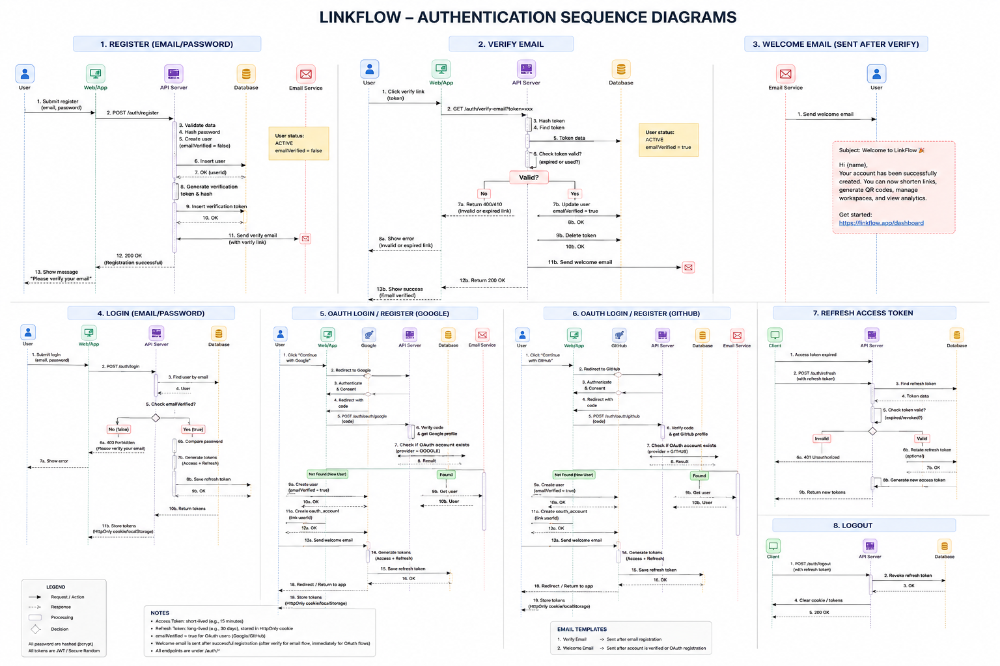
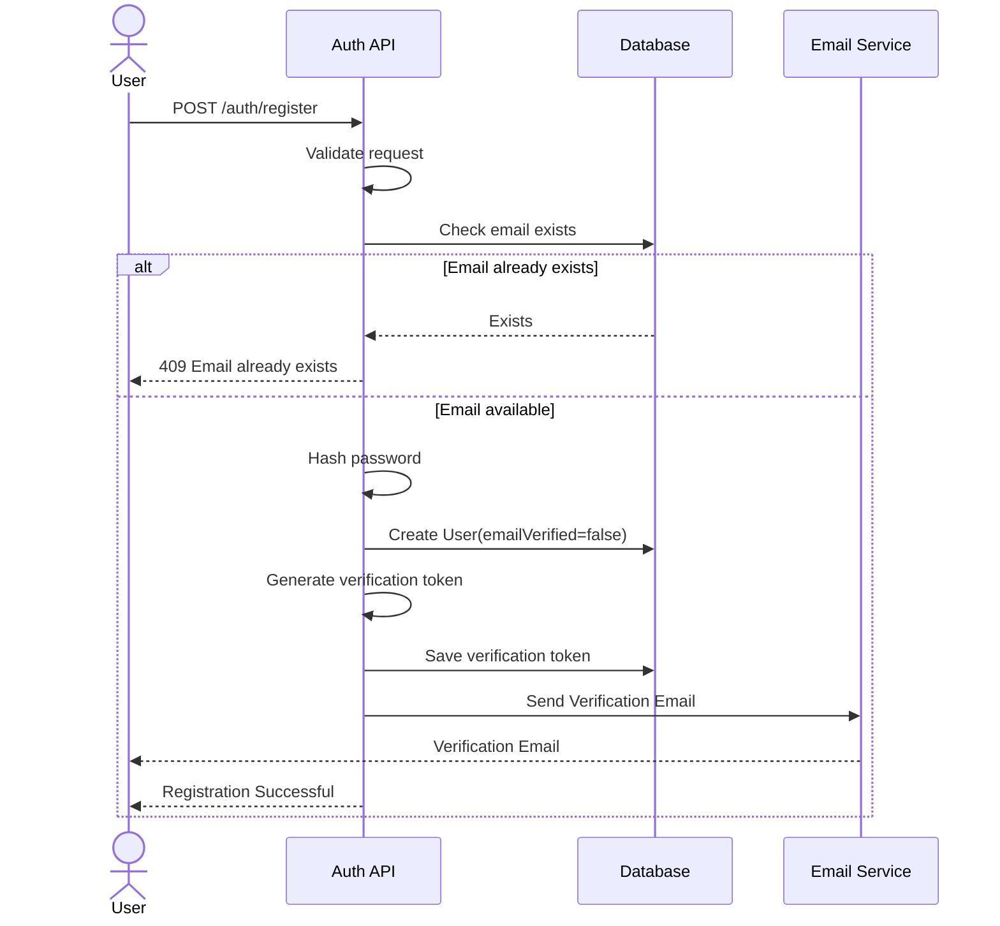
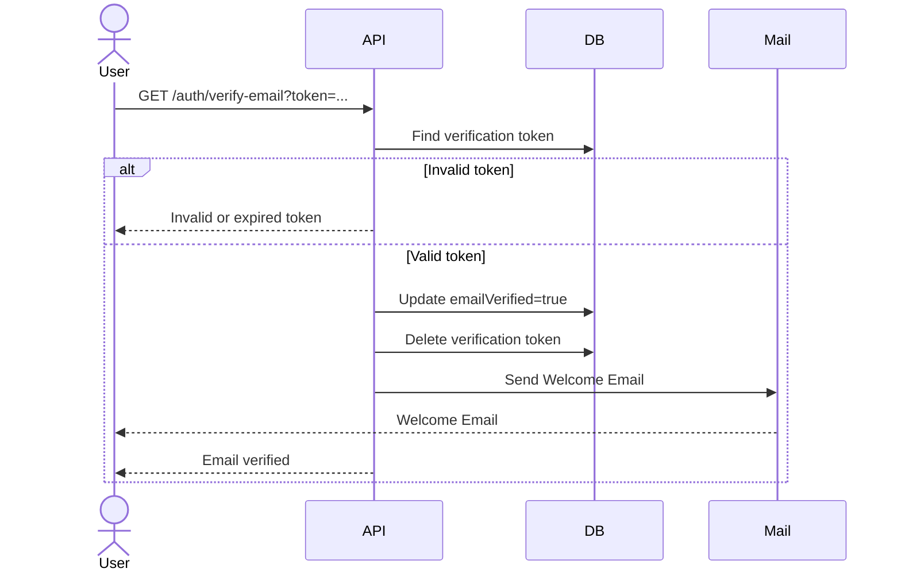
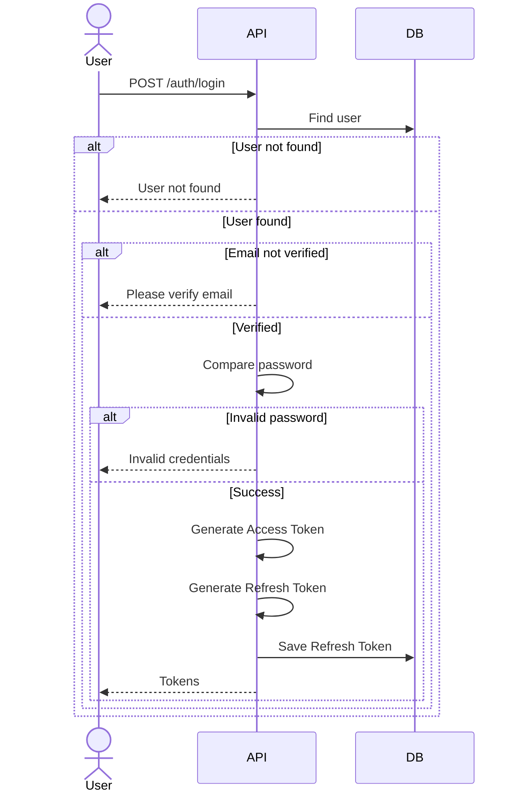
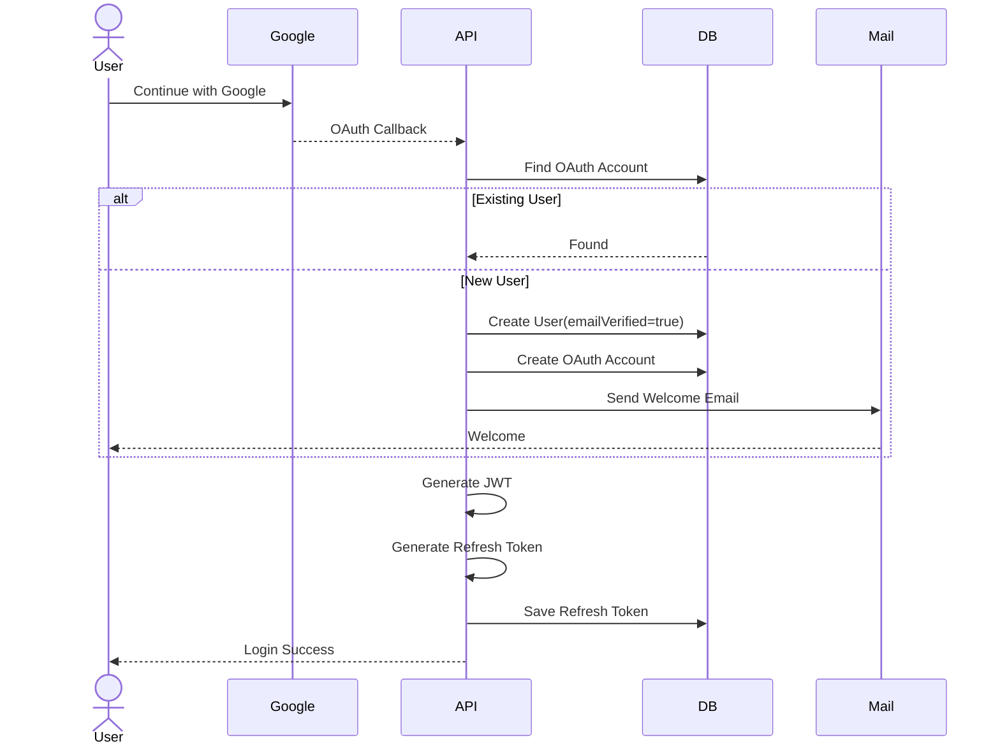
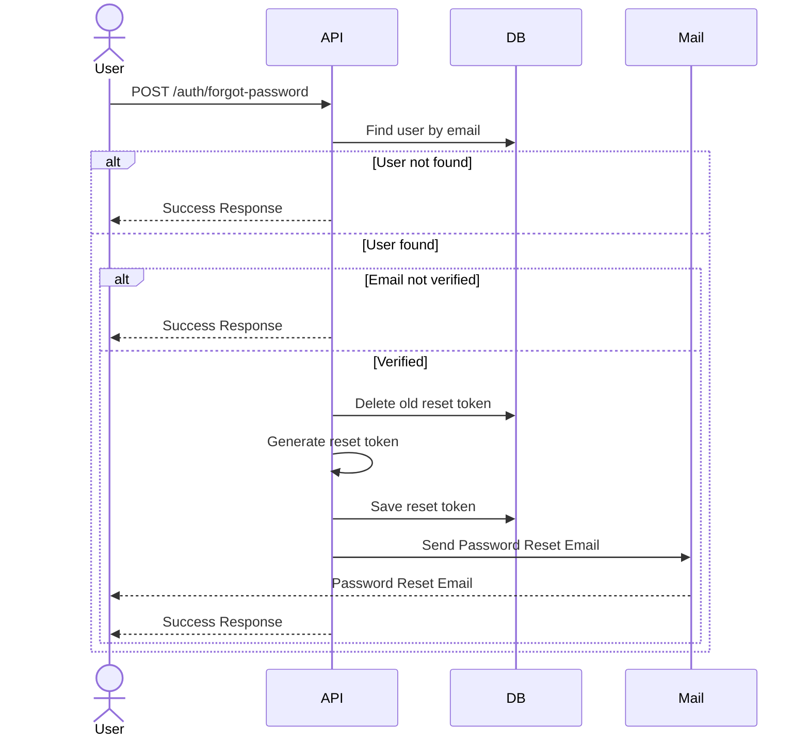
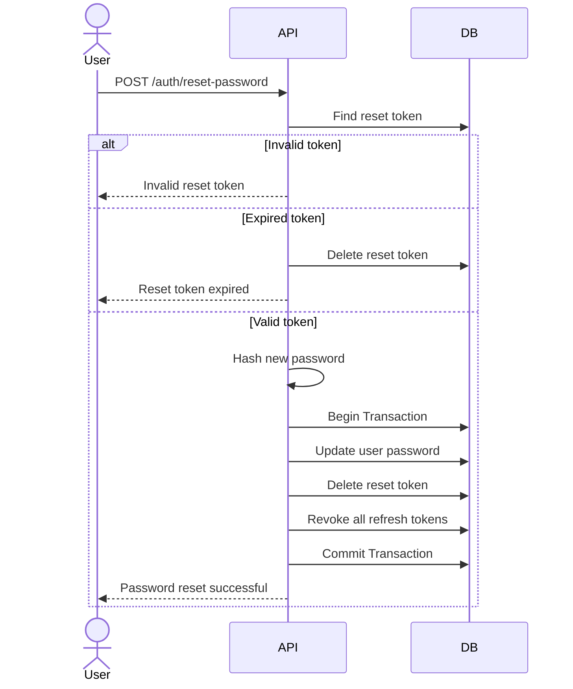
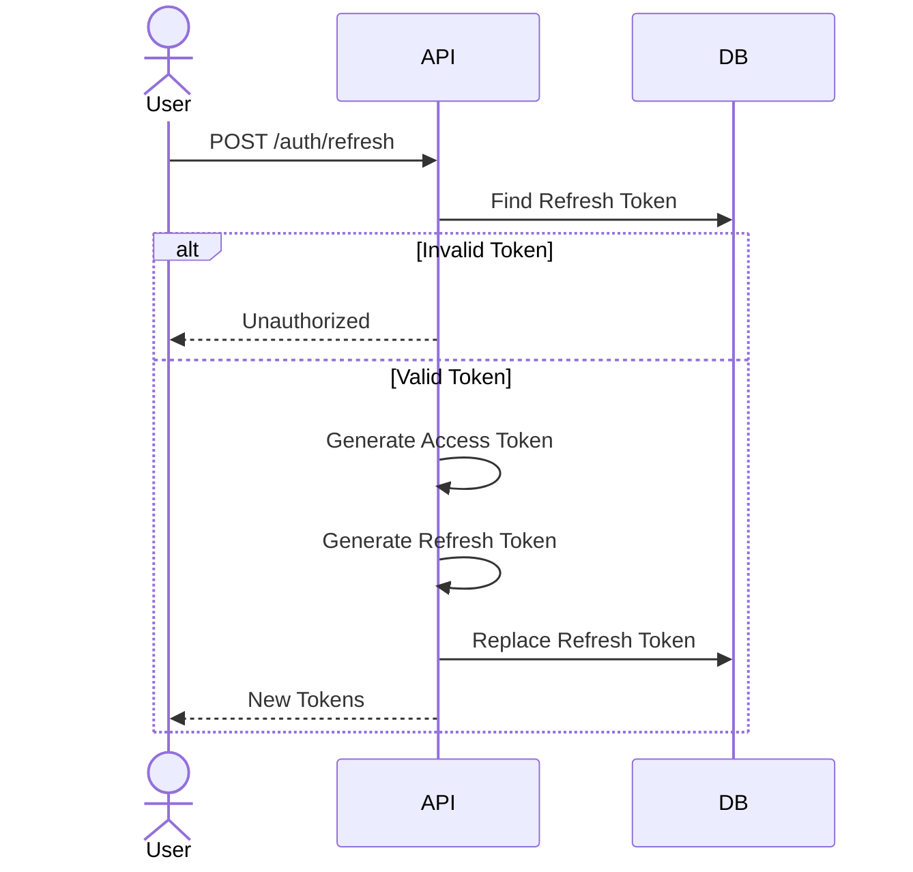
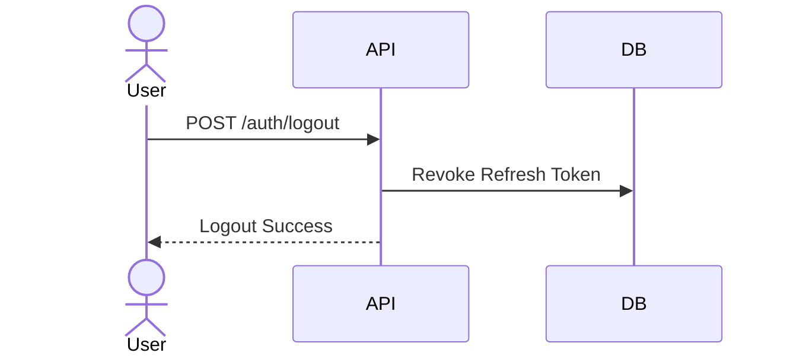

# Authentication Module Design

## Overview

LinkFlow supports two authentication methods:

- Email (Username) & Password
- Google OAuth

The authentication module is designed with the following goals:

- Secure authentication
- JWT-based authorization
- Refresh Token Rotation
- Email Verification
- OAuth Integration
- Role-Based Access Control (RBAC)
- Scalable architecture

---

# Authentication Flow

## Authentication Sequence



## Email Registration

### Description

Users register using their email and password.

New accounts are created with:

- emailVerified = false
- status = ACTIVE

A verification email will be sent immediately after registration.

Users cannot log in until their email has been verified.

### Sequence Diagram



---

## Email Verification

### Description

The user clicks the verification link sent via email.

If the token is valid:

- emailVerified becomes true
- verification token is removed
- Welcome Email is sent

### Sequence Diagram



---

## Email Login

### Description

Users can log in only after verifying their email.

### Sequence Diagram



---

# OAuth Authentication

OAuth registration does not require email verification because identity has already been verified by the provider.

A Welcome Email is sent only for newly created users.

---

## Google OAuth



---

# Forgot Password

## Description

Users who forget their password can request a password reset email.

For security reasons, the API always returns a success response regardless of whether the email exists in the system.

Only verified accounts can receive a password reset email.



---

# Reset Password

## Description

The user clicks the password reset link received by email and submits a new password.

If the reset token is valid:

- User password is updated
- Reset token is deleted
- All refresh tokens are revoked
- Existing sessions become invalid



---

# Refresh Token

## Description

Refresh Tokens are stored in the database.

Every refresh request rotates the refresh token.

Old refresh tokens are revoked immediately.



---

# Logout

## Description

Logout revokes the current refresh token.



---

# JWT Strategy

## Access Token

| Property   | Value             |
| ---------- | ----------------- |
| Algorithm  | HS256             |
| Expiration | 15 Minutes        |
| Storage    | Memory            |
| Purpose    | API Authorization |

### Payload

```json
{
  "sub": "userId",
  "email": "user@email.com",
  "workspaceId": "uuid",
  "role": "OWNER"
}
```

---

## Refresh Token

| Property   | Value           |
| ---------- | --------------- |
| Expiration | 30 Days         |
| Storage    | HttpOnly Cookie |
| Database   | refresh_tokens  |
| Rotation   | Enabled         |

---

# Email Strategy

## Verification Email

Sent when:

- Register via Email

Purpose:

Verify ownership of email address.

---

## Welcome Email

Sent when:

- Email verification succeeds
- Google registration
- GitHub registration

Purpose:

Welcome users to LinkFlow.

---

# RBAC

## Roles

- OWNER
- ADMIN
- MEMBER

---

## OWNER

Permissions

- Manage Workspace
- Invite Members
- Delete Workspace
- Manage Billing
- Manage API Keys

---

## ADMIN

Permissions

- Manage Links
- Manage Tags
- Manage Members
- View Analytics

---

## MEMBER

Permissions

- Create Links
- Edit Own Links
- View Analytics

---

# Security

- Password hashed using bcrypt
- JWT authentication
- Refresh Token Rotation
- Email Verification
- OAuth 2.0
- HttpOnly Refresh Token
- HTTPS Only Cookies
- CSRF Protection
- Rate Limiting
- Audit Logging

---

# Authentication Flow Summary

| Flow               | Verify Email | Welcome Email         |
| ------------------ | ------------ | --------------------- |
| Email Registration | ✅           | ✅ After Verification |
| Google OAuth       | ❌           | ✅                    |
