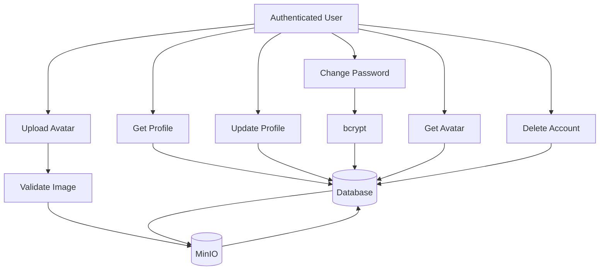
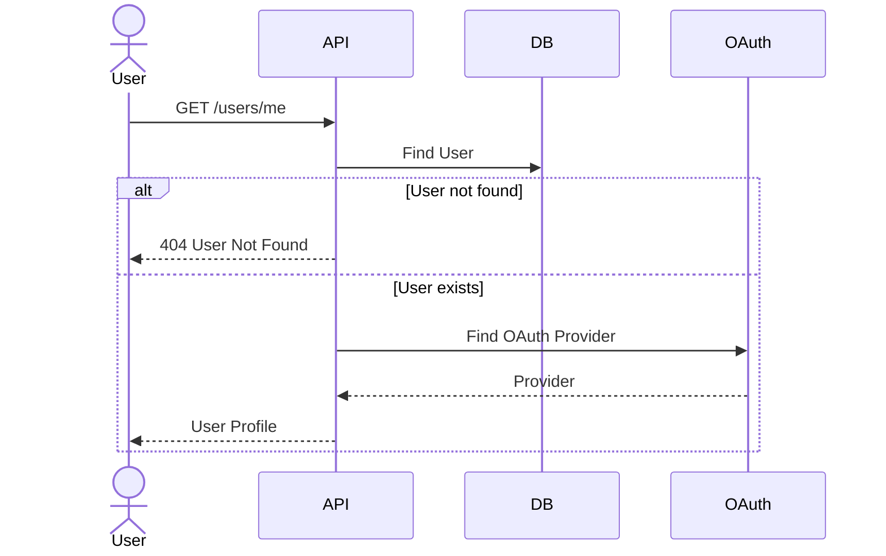
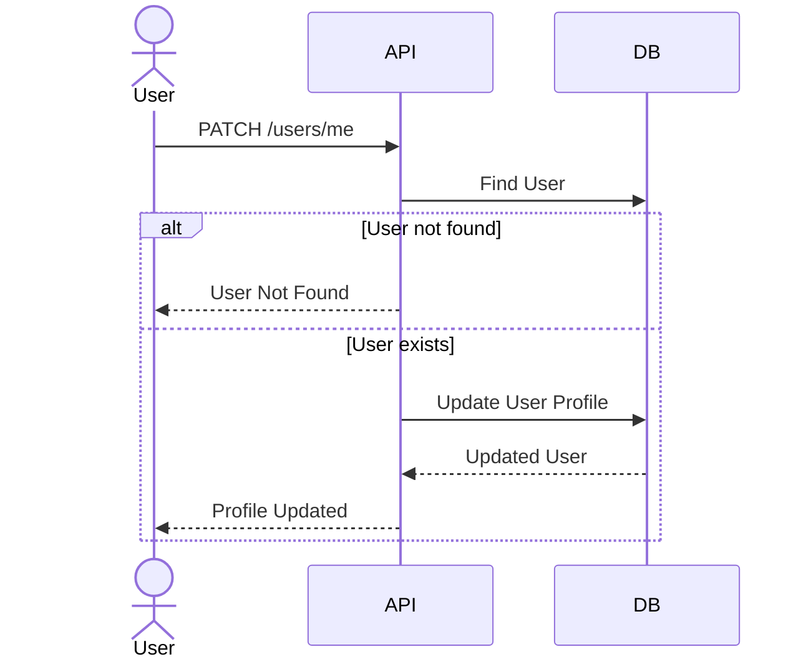
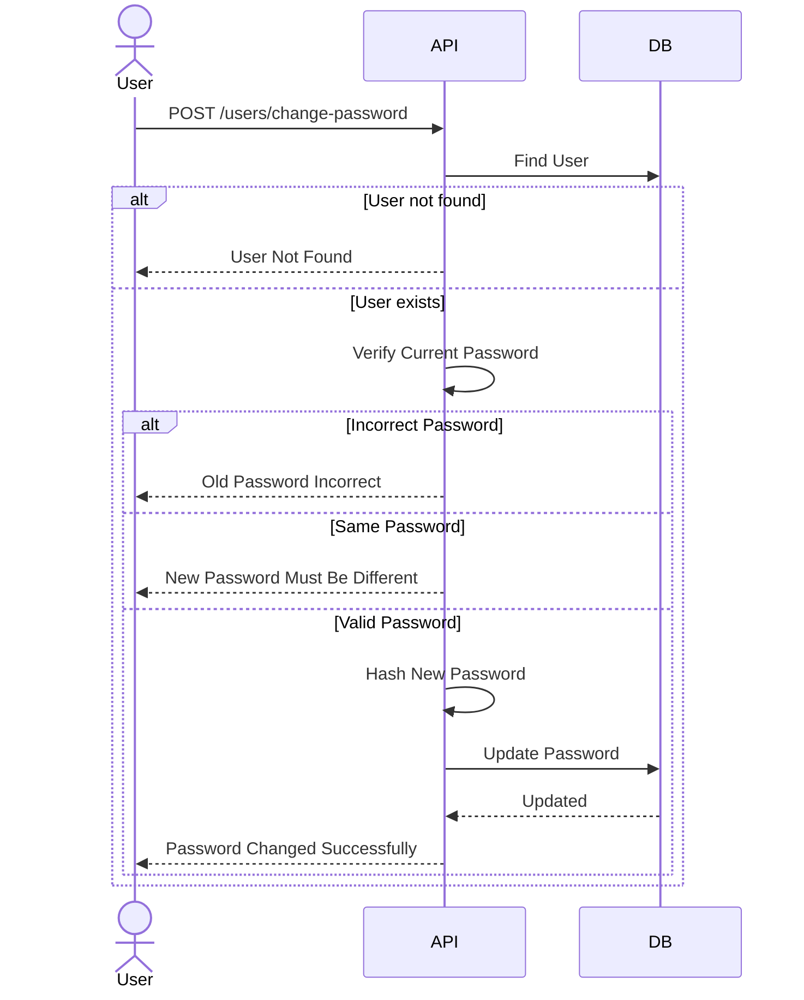
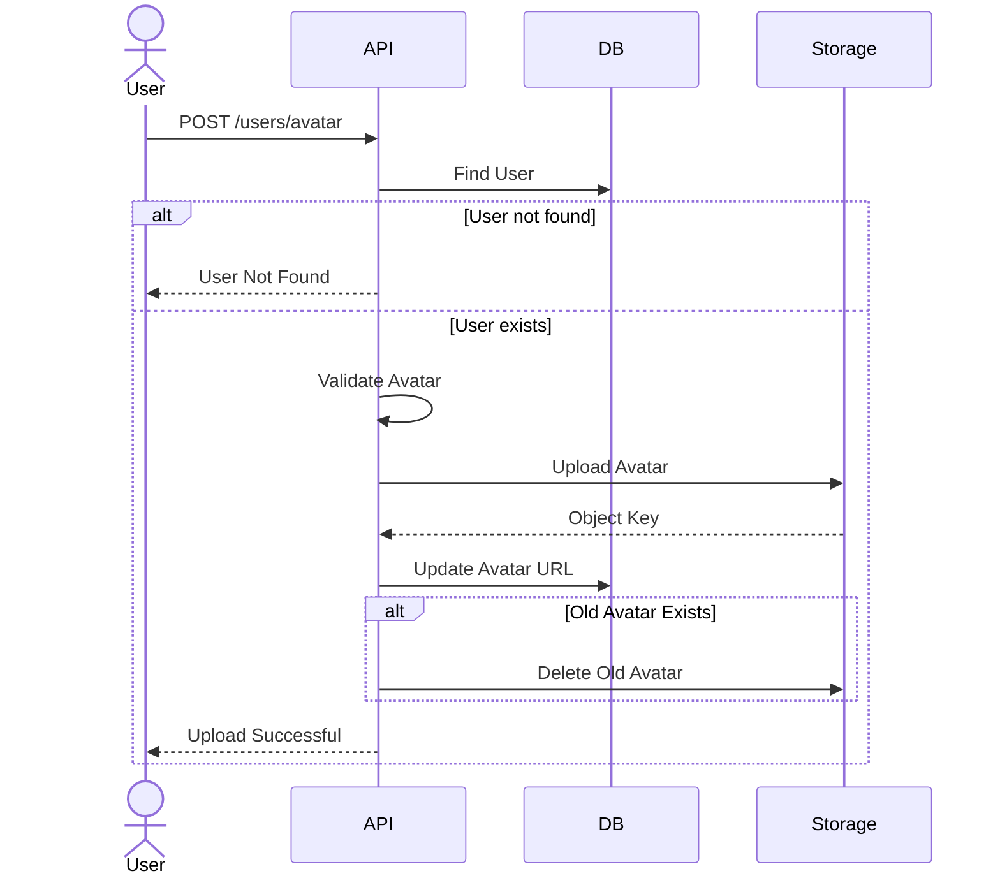
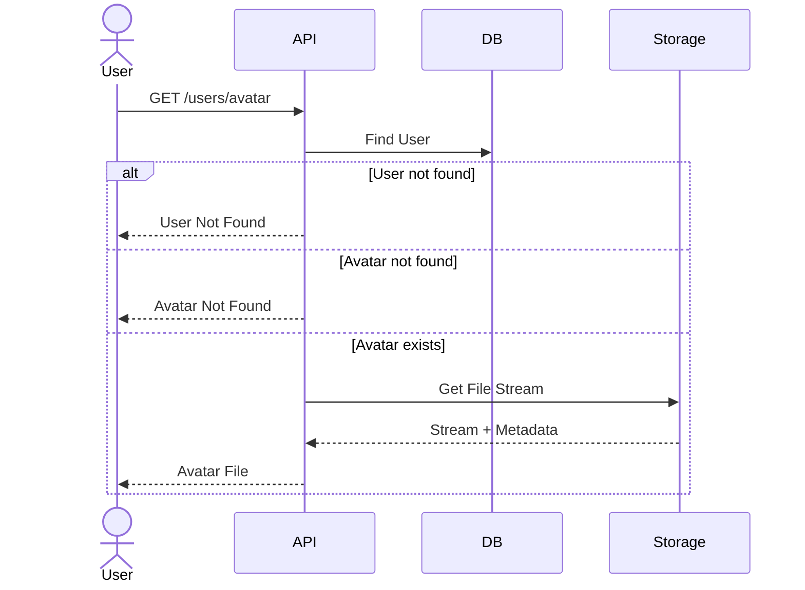
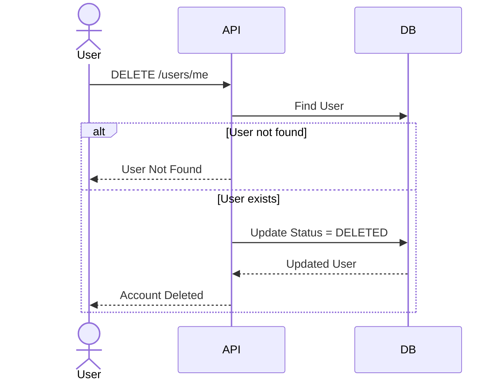

# User Module Design

## Overview

The User module is responsible for managing authenticated users' profile information.

Supported features:

- Get current user profile
- Update profile
- Change password
- Upload avatar
- Get avatar
- Delete account

All endpoints require authentication.

---

# User Flow

## User Sequence



---

# Get My Profile

## Description

Returns the authenticated user's profile information.

The response also includes the authentication provider.

Supported providers:

- LOCAL
- GOOGLE

### Sequence Diagram



---

# Update Profile

## Description

Updates the authenticated user's profile information.

Editable fields depend on business requirements.

Email and authentication provider cannot be changed.

### Sequence Diagram



---

# Change Password

## Description

Allows authenticated users to change their password.

Requirements:

- User must exist.
- Current password must be correct.
- New password must be different from the current password.

### Sequence Diagram



---

# Upload Avatar

## Description

Uploads a new avatar for the authenticated user.

Business rules:

- Validate image format.
- Validate image size.
- Upload image to MinIO.
- Save object key to database.
- Delete previous avatar if it exists.

### Sequence Diagram



---

# Get Avatar

## Description

Returns the authenticated user's avatar.

If no avatar exists, the API returns Not Found.

### Sequence Diagram



---

# Delete My Account

## Description

Deletes the authenticated user's account.

Instead of permanently removing the record, the account is soft deleted.

Changes:

- status = DELETED
- deletedAt = Current Timestamp

### Sequence Diagram



---

# Avatar Storage Strategy

Uploaded avatars are stored in MinIO.

Folder structure:

```
avatars/{userId}/{uuid}.png
```

The database stores only the object key.

When uploading a new avatar:

- Upload new file
- Update database
- Delete previous avatar

---

# User Information

| Field     | Description       |
| --------- | ----------------- |
| id        | User identifier   |
| email     | Email address     |
| fullName  | User display name |
| avatarUrl | Avatar object key |
| status    | ACTIVE / DELETED  |
| provider  | LOCAL / GOOGLE    |
| createdAt | Creation time     |
| updatedAt | Last updated time |

---

# Security

- JWT Authentication Required
- Password hashed using bcrypt
- Avatar validation
- Soft Delete
- MinIO Object Storage

---

# User Flow Summary

| Feature         | Authentication Required |
| --------------- | ----------------------- |
| Get Profile     | ✅                      |
| Update Profile  | ✅                      |
| Change Password | ✅                      |
| Upload Avatar   | ✅                      |
| Get Avatar      | ✅                      |
| Delete Account  | ✅                      |
