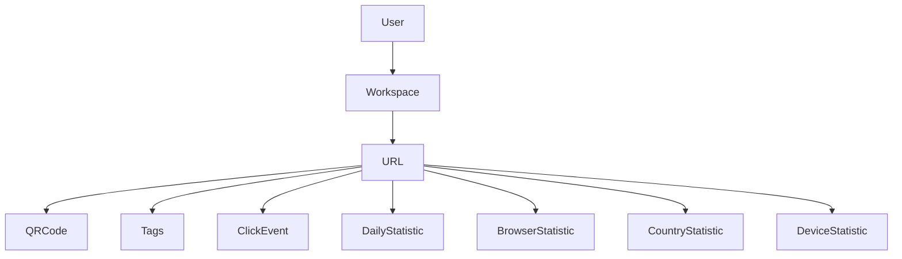
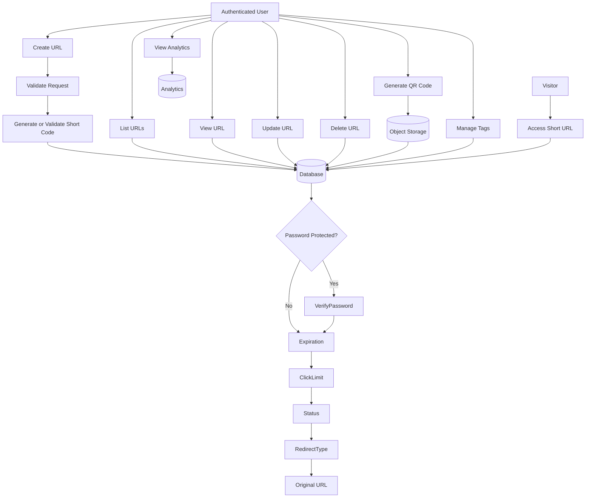
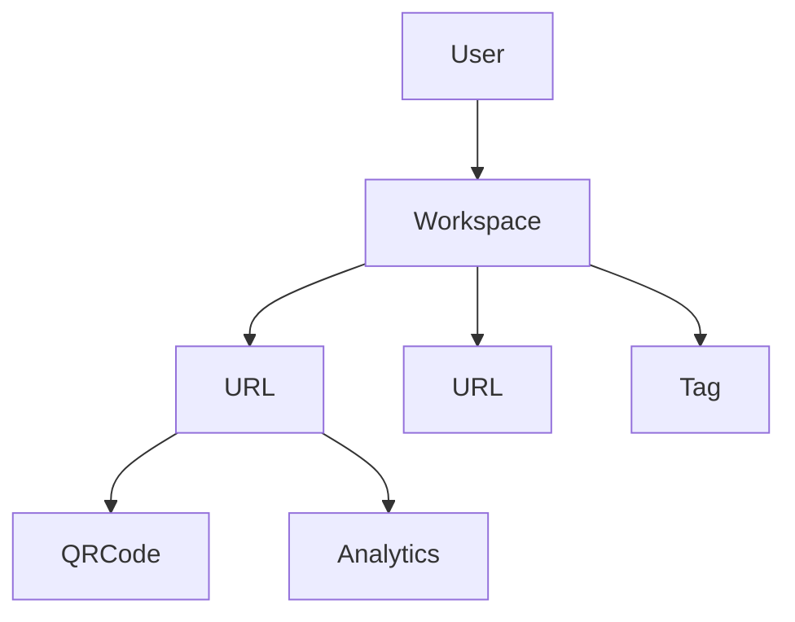

# URL Module Design

## Overview

The URL module is responsible for creating, managing, and tracking shortened URLs within a workspace.

Each URL belongs to a workspace and is created by a user. The module supports custom short codes, password protection, expiration, click limits, QR code generation, tagging, and detailed analytics.

Supported features:

- Create Short URL
- List URLs
- Get URL Details
- Update URL
- Delete URL
- Redirect Short URL
- Generate QR Code
- Manage Tags
- View Analytics

All management endpoints require authentication.

The redirect endpoint is publicly accessible.

---

# Module Architecture



---

# URL Flow

## URL Management Flow



---

# URL Ownership



Business Rules:

- A user can own multiple workspaces.
- A workspace can have multiple members.
- A workspace can contain multiple URLs.
- A URL belongs to exactly one workspace.
- Every URL records its creator.
- Users can only manage URLs within workspaces where they are members.

---

# URL Structure

A shortened URL consists of two parts.

```
https://{domain}/{shortCode}
```

Examples:

```
https://lf.io/openai

https://lf.io/github

https://lf.io/A82KxP
```

---

# URL Features

## Generated Short Code

The system automatically generates a unique short code.

Example

```
https://lf.io/A82KxP
```

---

## Custom Short Code

Users may specify their own short code.

Example

```
https://lf.io/docs
```

Requirements

- Unique
- Valid format
- Not reserved

---

## Password Protection

A URL may be protected by a password.

When enabled:

```
Visitor

↓

Enter Password

↓

Verify Password

↓

Redirect
```

Passwords are stored as hashed values.

---

## Expiration

URLs may expire at a specified date.

```
Current Time >= expiresAt

↓

URL becomes unavailable.
```

---

## Click Limit

URLs may define a maximum number of redirects.

Example

```
maxClicks = 100
```

When

```
clickCount >= maxClicks
```

the URL can no longer be redirected.

---

## QR Code

Each URL may have one QR Code.

The QR Code always contains the shortened URL.

Example

```
https://lf.io/docs
```

QR Code images are stored in Object Storage.

---

## Tags

URLs can be categorized using tags.

Example

```
Marketing

Promotion

Internal

Social
```

Tags are unique within a workspace.

---

# Analytics

Every successful redirect may generate analytics data.

The system stores:

- Click Event
- Daily Statistics
- Browser Statistics
- Country Statistics
- Device Statistics

Analytics are generated automatically during redirect.

---

# Redirect Strategy

Supported redirect types

| Type | Description        |
| ---- | ------------------ |
| 301  | Permanent Redirect |
| 302  | Temporary Redirect |

The redirect type is configurable for each URL.

---

# URL Validation

The following validations are performed during URL creation.

## Original URL

- Must be a valid URL
- HTTPS recommended
- Maximum length determined by system configuration

---

## Short Code

Requirements

- Unique
- Configurable length
- Supports

```
A-Z

a-z

0-9

-

_
```

Reserved words cannot be used.

Examples

```
admin

login

api

health

docs
```

---

# URL Information

| Field        | Description                 |
| ------------ | --------------------------- |
| id           | URL identifier              |
| workspaceId  | Workspace owner             |
| userId       | URL creator                 |
| shortCode    | Unique short code           |
| originalUrl  | Original destination        |
| title        | Website title               |
| description  | Website description         |
| faviconUrl   | Website favicon             |
| passwordHash | Hashed password             |
| expiresAt    | Expiration time             |
| maxClicks    | Maximum redirects           |
| clickCount   | Current redirects           |
| status       | ACTIVE / DISABLED / EXPIRED |
| createdAt    | Creation timestamp          |
| updatedAt    | Last updated                |
| deletedAt    | Soft delete timestamp       |

---

# Security

- JWT Authentication
- Workspace permission validation
- Password hashing
- URL validation
- Short code validation
- Soft Delete
- Input sanitization
- Rate limiting
- Analytics collection

---

# Future Enhancements

Possible future improvements include:

- Custom Domains
- Scheduled Activation
- Scheduled Expiration
- Bulk URL Import
- Team Sharing
- Public API
- URL Templates
- UTM Builder
- Webhooks
- AI Generated Short Codes

---

# Module Summary

| Feature          | Authentication Required |
| ---------------- | ----------------------- |
| Create URL       | ✅                      |
| List URLs        | ✅                      |
| Get URL Details  | ✅                      |
| Update URL       | ✅                      |
| Delete URL       | ✅                      |
| Generate QR Code | ✅                      |
| Manage Tags      | ✅                      |
| View Analytics   | ✅                      |
| Redirect URL     | ❌                      |
