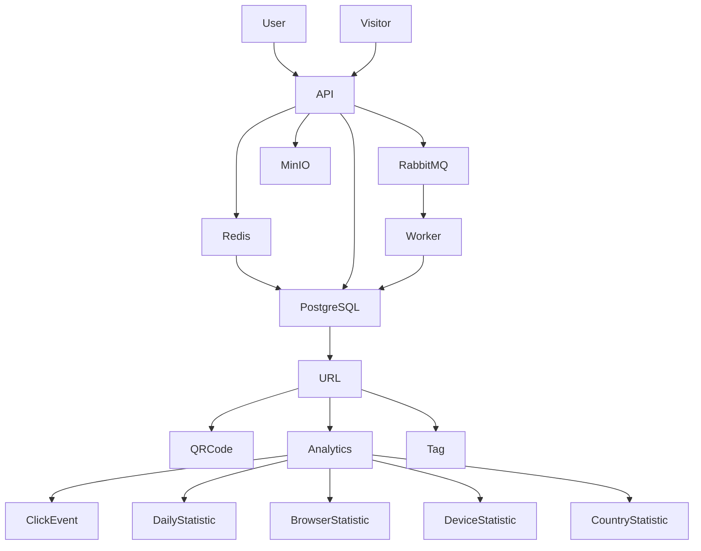
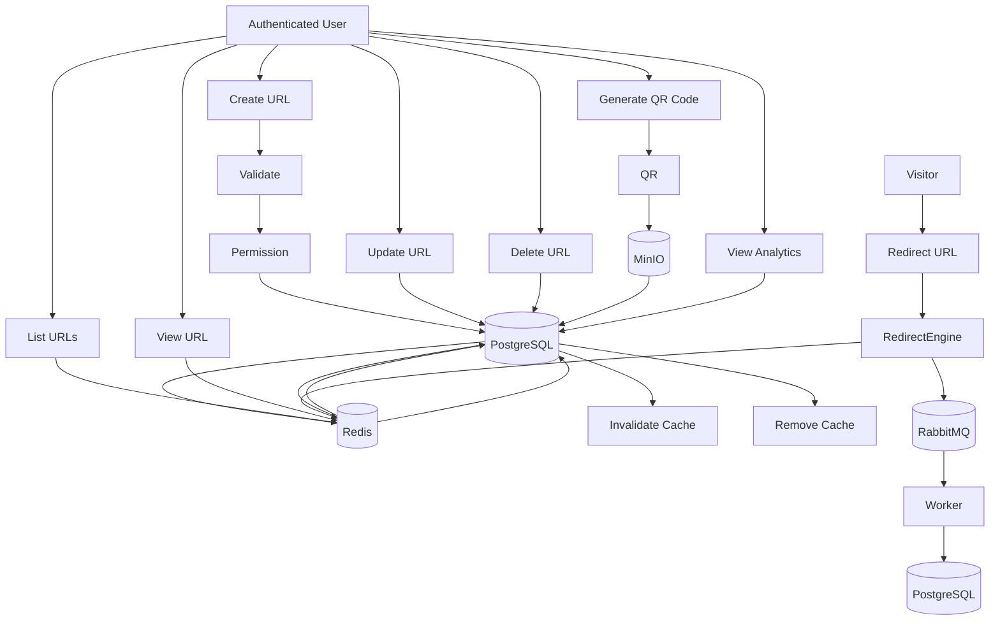

# URL Management Module Design

## Overview

The URL Management module is the core feature of LinkFlow.

It enables workspace members to create, organize, update, and manage shortened URLs within their workspaces. Every URL belongs to exactly one workspace and can be associated with tags, QR codes, analytics, and access restrictions.

The module is designed for high performance and scalability by leveraging Redis for caching, RabbitMQ for asynchronous processing, MinIO for object storage, and PostgreSQL as the primary database.

Workspace isolation ensures that members can only access URLs belonging to workspaces they are authorized to use.

Supported features:

- Create Short URL
- List URLs
- Get URL Details
- Update URL
- Delete URL
- Redirect URL
- Generate QR Code
- View Analytics

All management endpoints require authentication, while URL redirection is publicly accessible.

---

# Module Architecture


```mermaid
flowchart TD

User

User --> API

Visitor --> API

API --> Redis

Redis --> PostgreSQL

API --> PostgreSQL

API --> RabbitMQ

RabbitMQ --> Worker

Worker --> PostgreSQL

API --> MinIO

PostgreSQL --> URL

URL --> QRCode

URL --> Analytics

Analytics --> ClickEvent

Analytics --> DailyStatistic

Analytics --> BrowserStatistic

Analytics --> DeviceStatistic

Analytics --> CountryStatistic

URL --> Tag
```

---

# URL Management Flow

## URL Management


```mermaid
flowchart TD

A[Authenticated User]

A --> B[Create URL]

A --> C[List URLs]

A --> D[View URL]

A --> E[Update URL]

A --> F[Delete URL]

A --> G[Generate QR Code]

A --> H[View Analytics]

Visitor[Visitor]

Visitor --> I[Redirect URL]

B --> Validate

Validate --> Permission

Permission --> DB[(PostgreSQL)]

DB --> Cache[(Redis)]

C --> Cache

Cache --> DB

D --> Cache

Cache --> DB

E --> DB

DB --> InvalidateCache[Invalidate Cache]

F --> DB

DB --> RemoveCache[Remove Cache]

G --> QR

QR --> Storage[(MinIO)]

Storage --> DB

I --> RedirectEngine

RedirectEngine --> Cache

Cache --> DB

RedirectEngine --> Queue[(RabbitMQ)]

Queue --> Worker

Worker --> AnalyticsDB[(PostgreSQL)]

H --> DB
```

---

# URL Structure

Each URL belongs to exactly one workspace.

```
Workspace

├── URLs

│   ├── QR Code

│   ├── Analytics

│   └── Tags
```

A URL cannot exist without its parent workspace.

---

# URL Features

## URL Creation

Workspace members can create shortened URLs.

Supported options include:

- Custom short code
- Auto-generated short code
- Expiration date
- Maximum click limit
- Password protection
- Tags

New URLs are stored in PostgreSQL and cached in Redis for faster access.

---

## URL Management

Authorized workspace members can:

- View URLs
- Update URL information
- Delete URLs
- Generate QR Codes
- View Analytics

Whenever a URL is updated or deleted, related Redis cache entries are invalidated automatically.

---

## URL Redirection

Visitors access shortened URLs through the public redirect endpoint.

The redirect engine performs the following validation:

- URL exists
- Not deleted
- Active status
- Not expired
- Maximum click limit not exceeded
- Password validation (optional)

The redirect engine first attempts to retrieve the URL from Redis.

```
Redis

↓

Cache Hit

↓

Redirect
```

If the cache is missed:

```
Redis

↓

PostgreSQL

↓

Redis

↓

Redirect
```

After a successful redirect:

- Click counter is updated
- Analytics event is published to RabbitMQ
- Worker persists analytics asynchronously

This minimizes redirect latency while keeping analytics accurate.

---

## QR Code

Each URL may have one generated QR Code.

Generation flow:

```
URL

↓

QR Generator

↓

MinIO

↓

PostgreSQL
```

The QR image is stored in MinIO while metadata is stored in PostgreSQL.

---

## Analytics

Analytics are generated asynchronously.

Collected statistics include:

- Total Clicks
- Daily Statistics
- Browser Statistics
- Device Statistics
- Country Statistics
- Referrer Statistics (future)

RabbitMQ decouples redirect traffic from analytics processing.

---

# Cache Strategy

Redis is used to improve performance and reduce database load.

Cached resources include:

- URL by short code
- Workspace permissions
- Workspace information
- Click counters

Cache is automatically invalidated whenever URL information changes.

---

# Background Processing

RabbitMQ is responsible for asynchronous processing.

Current background jobs include:

- Record click events
- Update analytics
- Aggregate statistics
- Send notifications (future)

Workers consume queue messages independently from API requests.

---

# Workspace Isolation

URLs are isolated by workspace.

```
Workspace A

├── URL A

├── URL B


Workspace B

├── URL C
```

Members can only manage URLs within workspaces they belong to.

---

# URL Validation

The following validations are performed during URL creation and updates.

## Original URL

Requirements

- Required
- Valid HTTP or HTTPS URL

---

## Short Code

Requirements

- Globally unique
- URL-safe
- Supports

```
a-z

A-Z

0-9

-

_
```

Reserved short codes cannot be used.

---

# URL Information

| Field | Description |
|--------|-------------|
| id | URL identifier |
| workspaceId | Parent workspace |
| originalUrl | Destination URL |
| shortCode | Unique short code |
| title | URL title |
| description | URL description |
| status | Current status |
| clickCount | Total redirects |
| expiresAt | Expiration date |
| maxClicks | Maximum redirects |
| createdAt | Creation timestamp |
| updatedAt | Last update |

---

# Security

The URL module includes multiple security layers.

- JWT Authentication
- Workspace membership validation
- Permission validation
- Short code uniqueness validation
- Input sanitization
- Password-protected URLs
- Rate limiting

Public redirect endpoints do not require authentication.

---

# Future Enhancements

Possible future improvements include:

- Bulk URL import/export
- Custom domains
- Smart redirects
- UTM Builder
- A/B testing
- Link scheduling
- Link archive
- Link restoration
- AI-generated short codes
- Geo-based redirects
- Device-based redirects

---

# Module Summary

| Feature | Authentication | Infrastructure |
|----------|----------------|----------------|
| Create URL | ✅ | PostgreSQL + Redis |
| List URLs | ✅ | Redis + PostgreSQL |
| Get URL Details | ✅ | Redis + PostgreSQL |
| Update URL | ✅ | PostgreSQL + Redis |
| Delete URL | ✅ | PostgreSQL + Redis |
| Redirect URL | ❌ | Redis + PostgreSQL + RabbitMQ |
| Generate QR Code | ✅ | MinIO + PostgreSQL |
| View Analytics | ✅ | PostgreSQL |