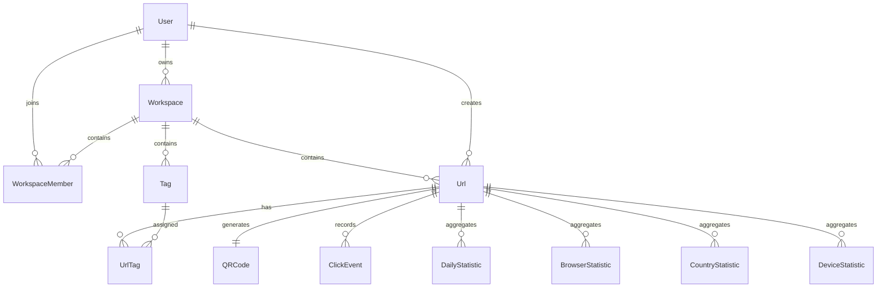

# URL Database Design

## Overview

The URL module is designed using a relational database model to support URL management, workspace collaboration, tagging, QR code generation, and analytics collection.

Each URL belongs to a workspace and is created by a user. Related entities are connected through foreign key constraints to ensure data consistency and integrity.

---

# Entity Relationship Diagram



---

# Relationship Overview

## User → Workspace

Relationship

```
One-to-Many
```

A user can own multiple workspaces.

Each workspace has exactly one owner.

---

## Workspace → URL

Relationship

```
One-to-Many
```

A workspace may contain multiple shortened URLs.

Each URL belongs to exactly one workspace.

---

## User → URL

Relationship

```
One-to-Many
```

Each URL stores the user who created it.

This relationship supports:

- Audit history
- Ownership tracking
- Permission checking

---

## Workspace → Tag

Relationship

```
One-to-Many
```

Each workspace manages its own tag collection.

Tag names must be unique within the same workspace.

---

## URL ↔ Tag

Relationship

```
Many-to-Many
```

Implemented through the UrlTag table.

Example

```
Marketing

↓

Spring Campaign

↓

Black Friday
```

can all be assigned to the same URL.

---

## URL → QR Code

Relationship

```
One-to-One
```

Each URL may have one generated QR Code.

A QR Code cannot exist without a URL.

---

## URL → ClickEvent

Relationship

```
One-to-Many
```

Every redirect creates a click event.

Each click event stores detailed visitor information.

Examples

- Browser
- Device
- Country
- City
- Referrer
- User Agent

---

## URL → DailyStatistic

Relationship

```
One-to-Many
```

Stores aggregated click statistics by date.

Used for dashboard visualization.

---

## URL → BrowserStatistic

Relationship

```
One-to-Many
```

Aggregated clicks grouped by browser.

Example

```
Chrome

Firefox

Safari

Edge
```

---

## URL → CountryStatistic

Relationship

```
One-to-Many
```

Aggregated clicks grouped by country.

---

## URL → DeviceStatistic

Relationship

```
One-to-Many
```

Aggregated clicks grouped by device type.

Example

```
Desktop

Mobile

Tablet
```

---

# Database Tables

## Workspace

Purpose

Stores workspace information.

Primary Key

```
id
```

Relations

- Owner
- Members
- URLs
- Tags
- API Keys

---

## URL

Purpose

Stores shortened URLs.

Primary Key

```
id
```

Important Fields

- shortCode
- originalUrl
- passwordHash
- expiresAt
- maxClicks
- clickCount
- status
- deletedAt

Relations

- Workspace
- Creator
- QR Code
- Tags
- Analytics

---

## QRCode

Purpose

Stores generated QR Code metadata.

Primary Key

```
id
```

Foreign Key

```
urlId
```

Relationship

```
1 : 1
```

---

## Tag

Purpose

Categorizes URLs inside a workspace.

Unique Constraint

```
(workspaceId, name)
```

---

## UrlTag

Purpose

Many-to-many bridge table.

Composite Key

```
(urlId, tagId)
```

---

## ClickEvent

Purpose

Stores every redirect event.

Contains

- IP Address
- Country
- City
- Browser
- Device
- Referrer
- User Agent
- Timestamp

---

## DailyStatistic

Purpose

Stores daily aggregated analytics.

Unique Constraint

```
(urlId, date)
```

---

## BrowserStatistic

Purpose

Stores aggregated browser statistics.

Unique Constraint

```
(urlId, browser)
```

---

## CountryStatistic

Purpose

Stores aggregated country statistics.

Unique Constraint

```
(urlId, country)
```

---

## DeviceStatistic

Purpose

Stores aggregated device statistics.

Unique Constraint

```
(urlId, device)
```

---

# Foreign Key Strategy

| Child Table | Parent Table | Delete Strategy |
|-------------|--------------|-----------------|
| Workspace | User | Cascade |
| WorkspaceMember | Workspace | Cascade |
| WorkspaceMember | User | Cascade |
| URL | Workspace | Cascade |
| URL | User | Cascade |
| QRCode | URL | Cascade |
| UrlTag | URL | Cascade |
| UrlTag | Tag | Cascade |
| ClickEvent | URL | Cascade |
| DailyStatistic | URL | Cascade |
| BrowserStatistic | URL | Cascade |
| CountryStatistic | URL | Cascade |
| DeviceStatistic | URL | Cascade |

---

# Index Strategy

## URL

Indexes

- workspaceId
- userId
- shortCode

Purpose

- Fast workspace filtering
- Fast creator filtering
- Fast redirect lookup

---

## Tag

Indexes

- workspaceId

Purpose

Fast tag listing.

---

## ClickEvent

Indexes

- urlId
- clickedAt
- country

Purpose

- Analytics queries
- Timeline reports
- Geographic reports

---

## Statistics Tables

Indexes

```
urlId
```

Purpose

Fast aggregation queries.

---

# Soft Delete Strategy

The URL table implements soft delete.

```
deletedAt IS NULL
```

↓

Visible

```
deletedAt IS NOT NULL
```

↓

Hidden

Benefits

- Preserve analytics
- Audit history
- Recovery support
- Historical reporting

---

# Design Decisions

## Analytics Normalization

Instead of storing all analytics in a single table, the system separates:

- Click events
- Daily statistics
- Browser statistics
- Country statistics
- Device statistics

Benefits

- Faster reporting
- Smaller aggregation queries
- Better scalability

---

## Workspace Isolation

Every URL belongs to a workspace.

Benefits

- Multi-tenancy support
- Team collaboration
- Permission isolation

---

## Creator Tracking

Each URL stores both

- workspaceId
- userId

This allows the system to distinguish between:

- Workspace owner
- URL creator

---

# Summary

The database design follows a normalized relational model with clear ownership, efficient analytics storage, and scalable relationships. Foreign keys, indexes, and soft deletion strategies are used to maintain consistency, improve query performance, and support future expansion of the URL management platform.