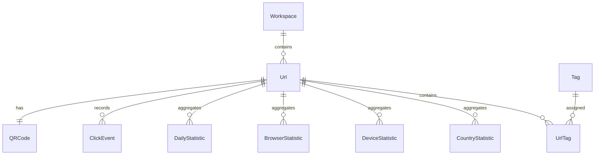

# URL Database Design

## Overview

The URL module is the core business component of LinkFlow.

It stores shortened URLs created by workspace members and manages their lifecycle, access rules, analytics, QR codes, and tags.

Every URL belongs to exactly one workspace and is isolated from URLs in other workspaces.

The database design focuses on scalability, high-performance lookups, and efficient redirection.

---

# Entity Relationship Diagram


```mermaid
erDiagram

    Workspace ||--o{ Url : contains

    Url ||--|| QRCode : has

    Url ||--o{ ClickEvent : records

    Url ||--o{ DailyStatistic : aggregates

    Url ||--o{ BrowserStatistic : aggregates

    Url ||--o{ DeviceStatistic : aggregates

    Url ||--o{ CountryStatistic : aggregates

    Url ||--o{ UrlTag : contains

    Tag ||--o{ UrlTag : assigned
```

---

# Relationship Overview

## Workspace → URL

Relationship

```
One-to-Many
```

A workspace may contain multiple URLs.

Every URL belongs to exactly one workspace.

Purpose

- Multi-tenant isolation
- Permission validation
- Workspace organization

---

## URL → QRCode

Relationship

```
One-to-One
```

Each URL may have one QR Code.

The QR code references the URL and stores its generated image location.

---

## URL → ClickEvent

Relationship

```
One-to-Many
```

Each successful redirect creates one click event.

Click events are immutable.

Purpose

- Analytics
- Reporting
- Historical tracking

---

## URL → Statistics

Relationship

```
One-to-Many
```

Statistics are pre-aggregated for fast dashboard queries.

Supported tables

- DailyStatistic
- BrowserStatistic
- DeviceStatistic
- CountryStatistic

---

## URL → Tag

Relationship

```
Many-to-Many
```

Implemented through

```
UrlTag
```

A URL may have multiple tags.

A tag may belong to multiple URLs within the same workspace.

---

# Database Tables

## Url

Purpose

Stores shortened URLs.

Primary Key

```
id
```

Important Fields

- workspaceId
- originalUrl
- shortCode
- title
- description
- expiresAt
- passwordHash
- maxClicks
- clickCount
- status

Relations

- Workspace
- QRCode
- UrlTag
- ClickEvent
- Statistics

---

## QRCode

Purpose

Stores generated QR Codes.

Primary Key

```
id
```

Important Fields

- urlId
- imageUrl

---

## ClickEvent

Purpose

Stores every redirect event.

Primary Key

```
id
```

Important Fields

- urlId
- ipAddress
- browser
- device
- country
- referer
- clickedAt

---

# Foreign Key Strategy

| Child Table | Parent Table | Delete Strategy |
|-------------|--------------|-----------------|
| Url | Workspace | Cascade |
| QRCode | Url | Cascade |
| UrlTag | Url | Cascade |
| ClickEvent | Url | Cascade |
| DailyStatistic | Url | Cascade |
| BrowserStatistic | Url | Cascade |
| DeviceStatistic | Url | Cascade |
| CountryStatistic | Url | Cascade |

Benefits

- Automatic cleanup
- Referential integrity
- No orphan records

---

# Constraint Strategy

## Url

Unique Constraint

```
shortCode
```

Every short code must be globally unique.

---

## UrlTag

Composite Unique Constraint

```
(urlId, tagId)
```

Prevents duplicate tag assignments.

---

# Index Strategy

## Url

Indexes

- workspaceId
- shortCode
- status
- expiresAt

Purpose

- Fast redirect lookup
- Workspace listing
- Expiration checks

---

## ClickEvent

Indexes

- urlId
- clickedAt

Purpose

- Analytics queries
- Timeline reports

---

## Statistics

Indexes

- urlId
- date

Purpose

- Dashboard performance
- Time-series aggregation

---

# Redis Strategy

Redis is used as a caching layer to reduce database load during URL redirection.

## Cached Data

```
shortCode

↓

URL Metadata
```

Example

```
abc123

↓

{
  originalUrl,
  status,
  expiresAt,
  maxClicks,
  passwordHash
}
```

---

## Cache Flow

```
Visitor

↓

Redis Lookup

↓

Cache Hit

↓

Redirect
```

or

```
Visitor

↓

Redis Miss

↓

PostgreSQL

↓

Redis Cache

↓

Redirect
```

---

## Cache Invalidation

Redis cache is invalidated when:

- URL updated
- URL deleted
- URL disabled
- Expiration changed
- Password changed

---

# Workspace Isolation

Every URL belongs to exactly one workspace.

```
Workspace A

├── URL A

├── URL B


Workspace B

├── URL C
```

Members cannot access URLs outside their workspaces.

---

# Authorization Strategy

Permissions are determined by:

```
Workspace

↓

WorkspaceMember

↓

Role

↓

Permission
```

Typical permissions

- url.create
- url.read
- url.update
- url.delete
- analytics.read

---

# Design Decisions

## Workspace Isolation

URLs always belong to one workspace.

Benefits

- Multi-tenant architecture
- Resource isolation
- Secure authorization

---

## Global Short Code

Short codes are globally unique.

Benefits

- Faster lookup
- Simpler redirect logic
- No workspace lookup required

Example

```
https://lf.io/abc123
```

---

## Redis First

Redirection reads Redis before PostgreSQL.

Benefits

- Low latency
- Reduced database load
- High scalability

---

## Event-Based Analytics

Every redirect creates a ClickEvent.

Statistics are generated asynchronously by background workers.

Benefits

- Fast redirects
- Scalable analytics
- Better reporting performance

---

# Summary

The URL database design provides a scalable foundation for LinkFlow's URL shortening service. URLs are isolated by workspace, identified by globally unique short codes, and accelerated through Redis caching. Click events are stored for historical tracking while aggregated statistics enable efficient analytics dashboards. Foreign keys, indexes, and cascade deletion ensure consistency, performance, and maintainability.