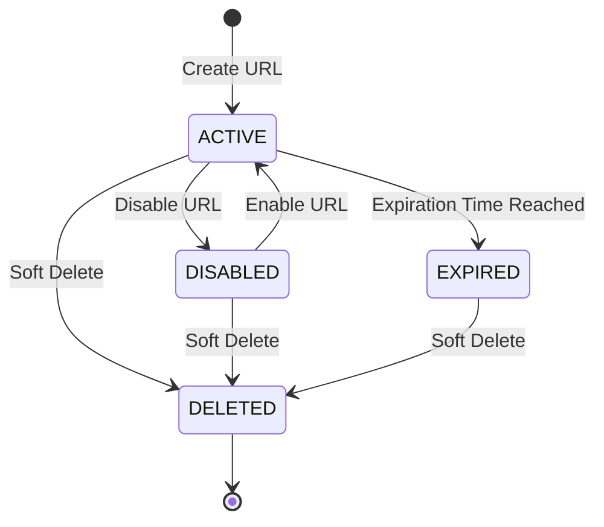

# URL Lifecycle Design

## Overview

The URL lifecycle defines the state transitions of a shortened URL throughout its lifetime.

A URL begins in the ACTIVE state after creation and may become DISABLED, EXPIRED, or be soft deleted depending on user actions or system conditions.

The lifecycle ensures consistent behavior for redirection, analytics collection, QR code availability, and URL management.

---

# Lifecycle State Diagram



---

# URL States

## ACTIVE

The URL is available for normal use.

Characteristics

- Redirect is allowed.
- Analytics are recorded.
- Click count increases.
- QR Code is accessible.
- URL settings can be updated.
- Tags can be managed.

---

## DISABLED

The URL exists but cannot be redirected.

Characteristics

- Redirect is denied.
- Analytics are no longer recorded.
- QR Code still exists.
- URL may be re-enabled.
- URL information can still be edited.

Typical use cases

- Temporarily disable a campaign.
- Security reasons.
- Administrative action.

---

## EXPIRED

The URL has reached its expiration time.

Expiration occurs automatically.

Condition

```
Current Time >= expiresAt
```

Characteristics

- Redirect is denied.
- Analytics stop recording.
- QR Code remains available but redirect will fail.
- Expiration date may be updated if business rules allow.

---

## DELETED

The URL is soft deleted.

Deletion is implemented using the deletedAt field instead of UrlStatus.

Changes

```
deletedAt = Current Timestamp
```

Characteristics

- Redirect is denied.
- URL is hidden from normal queries.
- Analytics remain for historical purposes.
- QR Code is inaccessible.
- Data remains in the database.

---

# Lifecycle Events

## Create URL

```
Request

↓

Validate

↓

Generate Short Code

↓

ACTIVE
```

Conditions

- Workspace exists.
- User has permission.
- Original URL is valid.
- Short code is unique.

---

## Disable URL

```
ACTIVE

↓

DISABLED
```

Trigger

User manually disables the URL.

Effects

- Redirect blocked.
- Analytics stop recording.
- URL remains editable.

---

## Enable URL

```
DISABLED

↓

ACTIVE
```

Conditions

- URL is not expired.
- URL has not been deleted.

---

## URL Expiration

```
ACTIVE

↓

EXPIRED
```

Trigger

System checks expiration during redirect or scheduled background jobs.

Condition

```
Current Time >= expiresAt
```

---

## Maximum Click Limit

A URL may define a maximum number of allowed redirects.

Condition

```
clickCount >= maxClicks
```

Behavior

- New redirect requests are rejected.
- Click count no longer increases.

Business Note

The URL status does not automatically change to another state.
The redirect endpoint simply rejects further requests.

---

## Password Verification

If password protection is enabled

```
Visitor

↓

Enter Password

↓

Verify Password

↓

Redirect
```

Incorrect password

↓

Redirect denied.

Password verification does not change the lifecycle state.

---

## Soft Delete

```
ACTIVE

↓

DELETED
```

or

```
DISABLED

↓

DELETED
```

or

```
EXPIRED

↓

DELETED
```

Trigger

User deletes the URL.

Effects

- Set deletedAt.
- URL disappears from normal listing.
- Redirect becomes unavailable.

---

# Redirect Behavior

| State | Redirect |
|---------|----------|
| ACTIVE | ✅ |
| DISABLED | ❌ |
| EXPIRED | ❌ |
| DELETED | ❌ |

Additional validations

- Password verification
- Maximum click limit
- Soft delete check

All validations must pass before redirecting.

---

# Analytics Behavior

Analytics are recorded only after a successful redirect.

Requirements

- URL is ACTIVE.
- Password verification succeeds (if enabled).
- URL has not expired.
- Maximum click limit has not been reached.

Generated data

- ClickEvent
- DailyStatistic
- BrowserStatistic
- CountryStatistic
- DeviceStatistic

---

# QR Code Behavior

QR Codes always point to the shortened URL.

Availability

| State | QR Code |
|---------|----------|
| ACTIVE | ✅ |
| DISABLED | ✅ |
| EXPIRED | ✅ |
| DELETED | ❌ |

Scanning a QR Code follows the same redirect validation as visiting the short URL directly.

---

# Update Behavior

| State | Editable |
|---------|----------|
| ACTIVE | ✅ |
| DISABLED | ✅ |
| EXPIRED | ✅ |
| DELETED | ❌ |

Editable fields may include

- Original URL
- Title
- Description
- Password
- Expiration
- Maximum Clicks
- Tags

---

# Soft Delete Strategy

Instead of removing the record from the database, the system marks it as deleted.

Changes

```
deletedAt = Current Timestamp
```

Benefits

- Preserve analytics.
- Maintain audit history.
- Prevent accidental data loss.
- Support future recovery features.

---

# Lifecycle Summary

| State | Redirect | Analytics | Editable | QR Code |
|---------|----------|-----------|----------|----------|
| ACTIVE | ✅ | ✅ | ✅ | ✅ |
| DISABLED | ❌ | ❌ | ✅ | ✅ |
| EXPIRED | ❌ | ❌ | ✅ | ✅ |
| DELETED | ❌ | ❌ | ❌ | ❌ |

---

# Future Enhancements

Possible future lifecycle extensions include

- Scheduled activation
- One-time URLs
- Automatic archival
- Auto-disable after inactivity
- Maximum lifetime
- Restore deleted URL