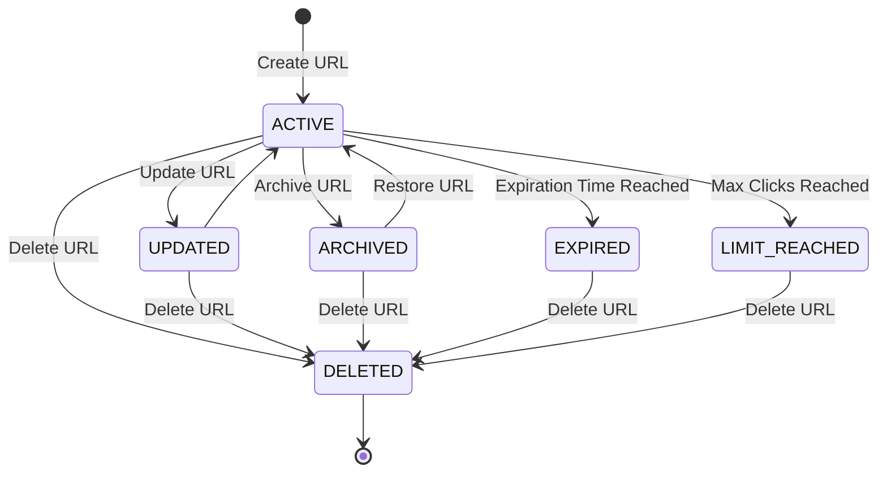

# URL Management Lifecycle Design

## Overview

The URL lifecycle defines the state transitions of a shortened URL throughout its lifetime.

A URL is created by an authorized workspace member and remains active until it expires, reaches its click limit, is archived, or is deleted. During its lifetime, the URL can be updated, redirected, analyzed, and associated with QR codes and tags.

The lifecycle ensures that only valid URLs are accessible while maintaining accurate analytics and consistent data management.

---

# Lifecycle State Diagram


```mermaid
stateDiagram-v2

[*] --> ACTIVE : Create URL

ACTIVE --> UPDATED : Update URL
UPDATED --> ACTIVE

ACTIVE --> EXPIRED : Expiration Time Reached

ACTIVE --> LIMIT_REACHED : Max Clicks Reached

ACTIVE --> ARCHIVED : Archive URL

ARCHIVED --> ACTIVE : Restore URL

ACTIVE --> DELETED : Delete URL
UPDATED --> DELETED : Delete URL
ARCHIVED --> DELETED : Delete URL

EXPIRED --> DELETED : Delete URL
LIMIT_REACHED --> DELETED : Delete URL

DELETED --> [*]
```

---

# URL States

## ACTIVE

The URL is available for public access.

Characteristics

- Publicly accessible.
- Redirects visitors successfully.
- Analytics are collected.
- QR Code remains available.
- URL information can be updated.

---

## UPDATED

The URL configuration has been modified.

Typical changes

- Original URL
- Title
- Description
- Expiration Date
- Maximum Clicks
- Password Protection
- Tags

After the update completes successfully, the URL returns to the ACTIVE state.

---

## EXPIRED

The expiration date has passed.

Characteristics

- Redirects are blocked.
- Analytics are no longer collected.
- QR Code remains available.
- URL information may still be viewed by workspace members.

---

## LIMIT_REACHED

The maximum click limit has been reached.

Characteristics

- Redirects are blocked.
- Analytics stop increasing.
- URL configuration can still be updated.

---

## ARCHIVED

The URL has been manually archived.

Characteristics

- Redirects are disabled.
- Analytics remain available.
- URL can be restored.

---

## DELETED

The URL has been permanently removed.

Characteristics

- Redirect endpoint no longer exists.
- QR Code is removed.
- Analytics are deleted.
- Cache is invalidated.
- Associated tags are detached.

---

# Lifecycle Events

## Create URL

```
Request

↓

Validate Workspace

↓

Validate Permission

↓

Validate Original URL

↓

Generate or Validate Short Code

↓

Create URL

↓

Cache URL

↓

ACTIVE
```

Conditions

- Workspace exists.
- User has permission.
- Original URL is valid.
- Short code is unique.

---

## Update URL

```
ACTIVE

↓

UPDATED

↓

Refresh Cache

↓

ACTIVE
```

Trigger

Workspace member updates URL information.

Editable Fields

- Original URL
- Title
- Description
- Expiration Date
- Maximum Clicks
- Password
- Tags

---

## Redirect URL

```
Visitor

↓

Lookup URL

↓

Validate Status

↓

Record Analytics

↓

Increase Click Count

↓

Redirect
```

Validation

- URL exists.
- URL is active.
- URL has not expired.
- Click limit has not been reached.
- Password validation succeeds (if enabled).

---

## Expire URL

```
ACTIVE

↓

EXPIRED
```

Trigger

Current time exceeds

```
expiresAt
```

Effects

- Redirect disabled.
- Analytics stop increasing.

---

## Reach Click Limit

```
ACTIVE

↓

LIMIT_REACHED
```

Trigger

```
clickCount >= maxClicks
```

Effects

- Redirect disabled.
- Statistics remain available.

---

## Archive URL

```
ACTIVE

↓

ARCHIVED
```

Trigger

Workspace member archives the URL.

Effects

- Redirect disabled.
- Analytics preserved.

---

## Restore URL

```
ARCHIVED

↓

ACTIVE
```

Trigger

Workspace member restores the URL.

Conditions

- URL has not expired.
- Click limit has not been reached.

---

## Delete URL

```
ACTIVE

↓

DELETED
```

Trigger

Workspace member deletes the URL.

Effects

- Remove QR Code.
- Remove analytics.
- Remove cache.
- Remove tag mappings.

Deletion is performed through cascading relationships.

---

# QR Code Lifecycle

```
URL Created

↓

Generate QR Code

↓

QRCode Available

↓

Delete URL

↓

QRCode Deleted
```

Each URL owns at most one QR Code.

---

# Analytics Lifecycle

```
Redirect

↓

Click Event

↓

Queue

↓

Worker

↓

Aggregate Statistics

↓

Dashboard
```

Analytics are generated asynchronously to minimize redirect latency.

---

# Cache Lifecycle

Redis is used to accelerate URL lookups.

```
Create URL

↓

Cache URL

↓

Redirect

↓

Read Redis

↓

Update/Delete URL

↓

Invalidate Cache

↓

Next Redirect

↓

Reload Cache
```

---

# Access Behavior

| State | Public Redirect | Editable |
|---------|:---------------:|:--------:|
| ACTIVE | ✅ | ✅ |
| UPDATED | ✅ | ✅ |
| EXPIRED | ❌ | ✅ |
| LIMIT_REACHED | ❌ | ✅ |
| ARCHIVED | ❌ | ✅ |
| DELETED | ❌ | ❌ |

---

# Resource Lifecycle

A URL owns several dependent resources.

```
URL

├── QR Code

├── Click Events

├── Daily Statistics

├── Browser Statistics

├── Device Statistics

├── Country Statistics

└── Tags
```

Deleting the URL automatically removes all owned resources.

---

# Lifecycle Summary

| State | Redirect | Editable | Analytics |
|---------|:--------:|:--------:|:----------:|
| ACTIVE | ✅ | ✅ | ✅ |
| UPDATED | ✅ | ✅ | ✅ |
| EXPIRED | ❌ | ✅ | View Only |
| LIMIT_REACHED | ❌ | ✅ | View Only |
| ARCHIVED | ❌ | ✅ | View Only |
| DELETED | ❌ | ❌ | ❌ |

---

# Future Enhancements

Possible future lifecycle extensions include

- Soft Delete
- Scheduled Publishing
- Temporary Disable
- Link Versioning
- A/B Testing
- Custom Domains
- Link Approval Workflow
- Restore Deleted URL
- Automatic Expiration Notification
- Automatic Cache Warm-up