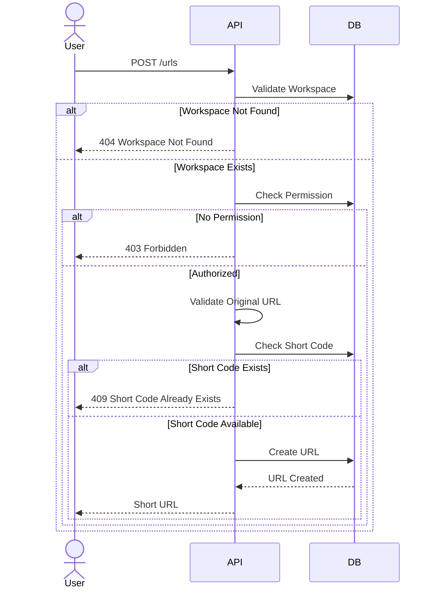
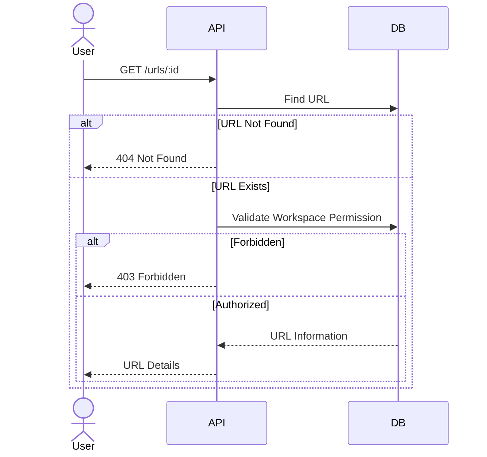
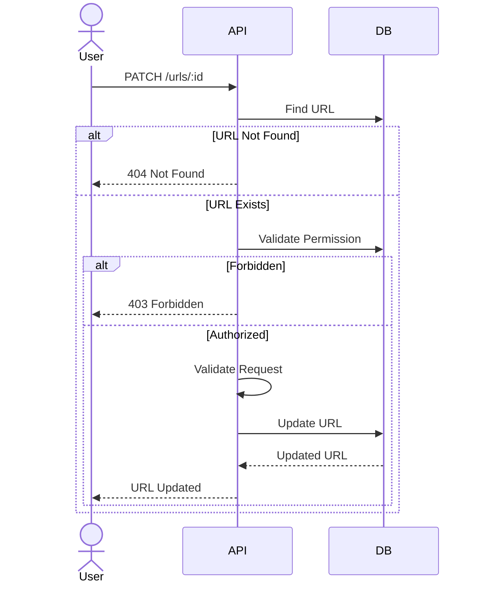
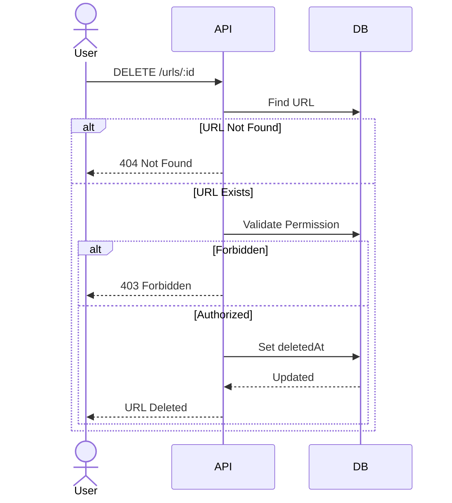
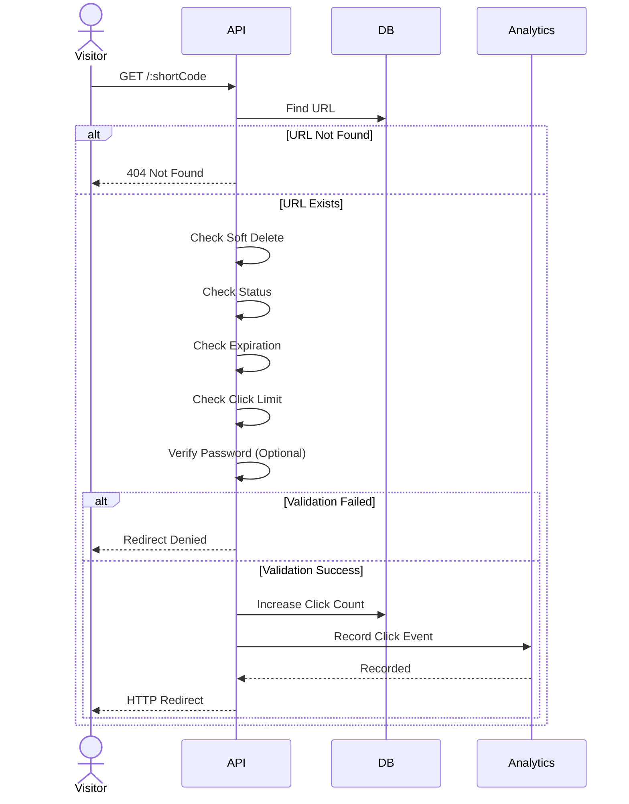
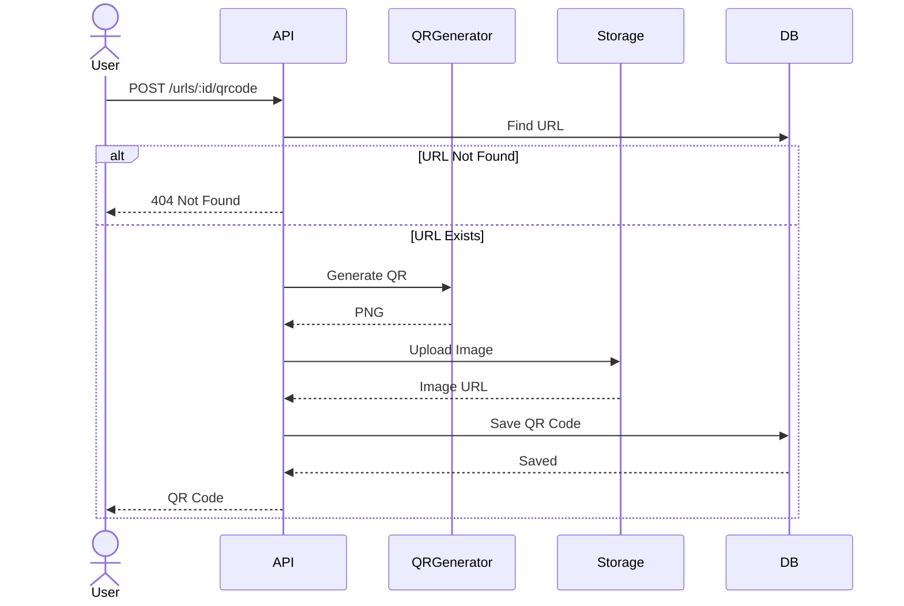
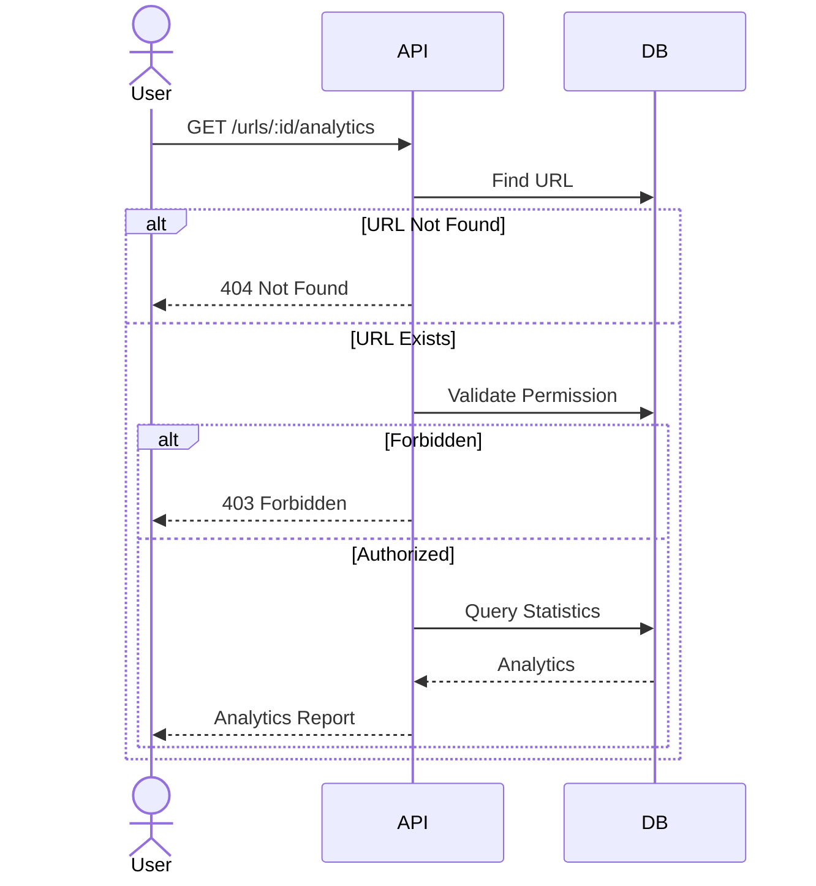

# URL Sequence Design

## Overview

This document describes the interaction flow between clients, backend services, database, object storage, and analytics components in the URL module.

The sequence diagrams illustrate how requests are processed from start to finish for each feature.

---

# Create Short URL

## Description

Creates a new shortened URL inside a workspace.

### Sequence Diagram

---

# Get URL Details

## Description

Returns information about a URL.

### Sequence Diagram

---

# Update URL

## Description

Updates an existing shortened URL.

### Sequence Diagram

---

# Delete URL

## Description

Soft deletes a URL.

### Sequence Diagram

---

# Redirect URL

## Description

Redirects visitors from the shortened URL to the original destination.

### Sequence Diagram

---

# Generate QR Code

## Description

Generates a QR Code for a shortened URL.

### Sequence Diagram

---

# Get Analytics

## Description

Returns analytics for a URL.

### Sequence Diagram

---

# Sequence Summary

| Feature | Main Components |
|----------|-----------------|
| Create URL | API → Database |
| Get URL | API → Database |
| Update URL | API → Database |
| Delete URL | API → Database |
| Redirect URL | API → Database → Analytics |
| Generate QR Code | API → QR Generator → Storage → Database |
| Get Analytics | API → Database |