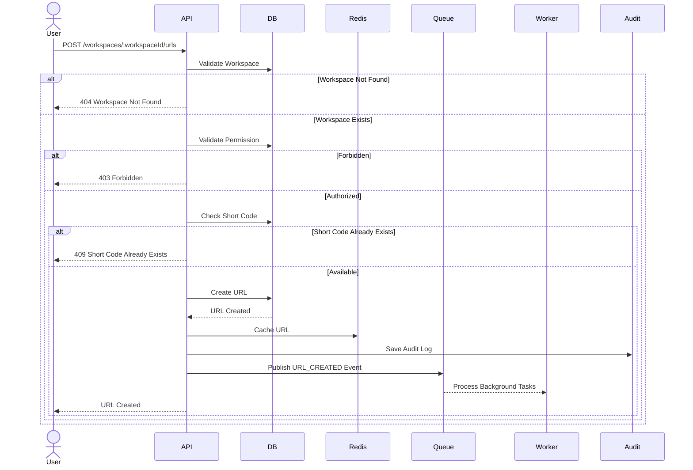
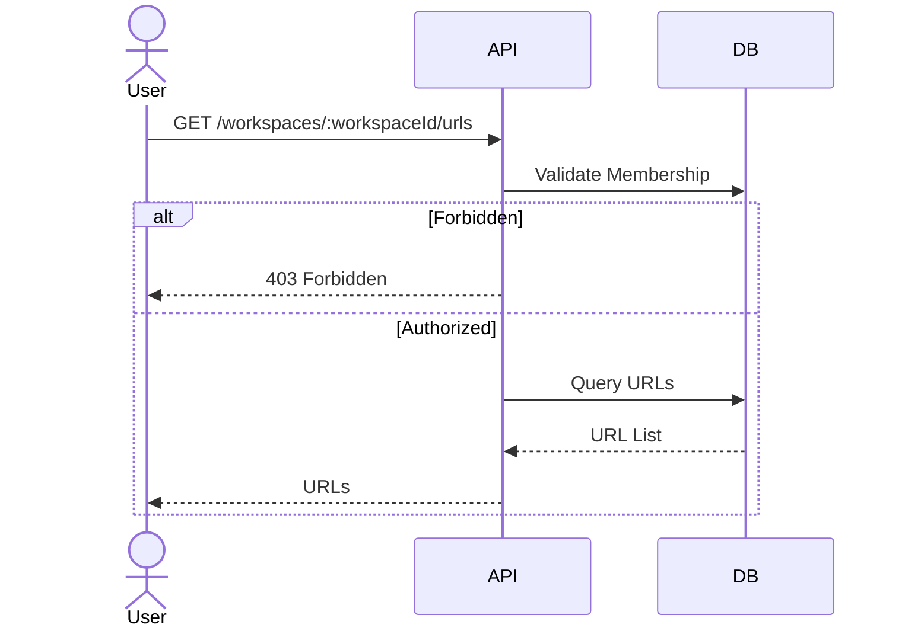
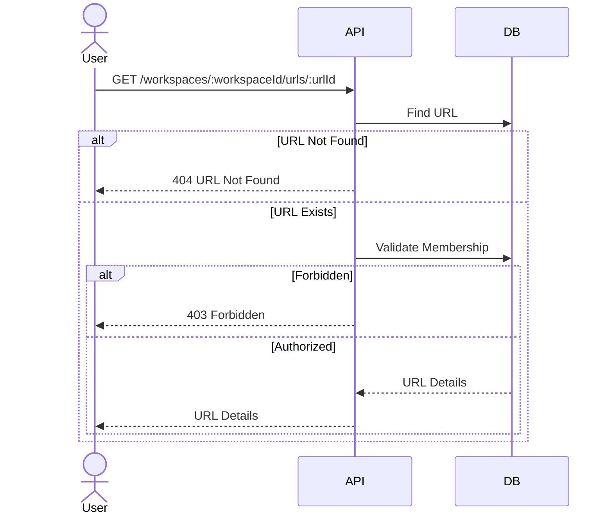
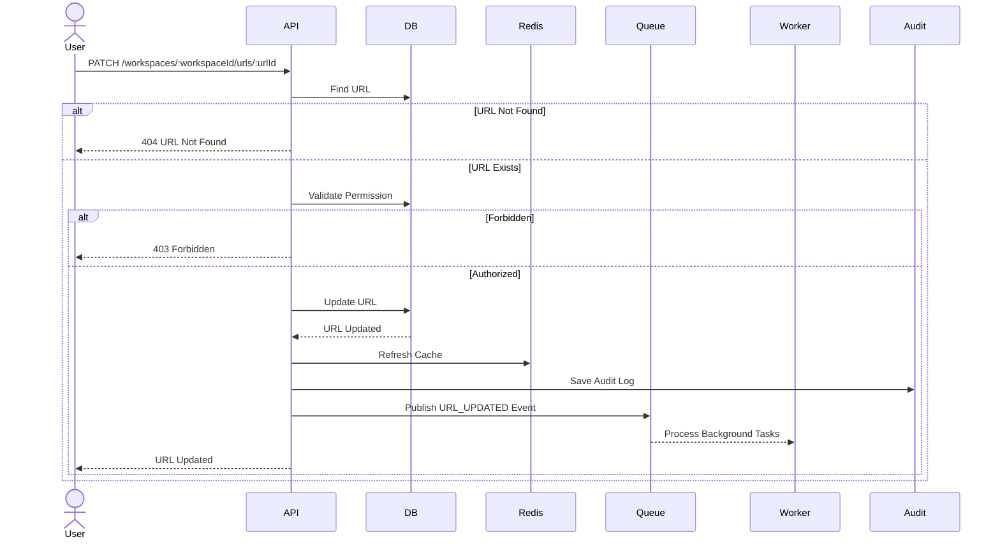
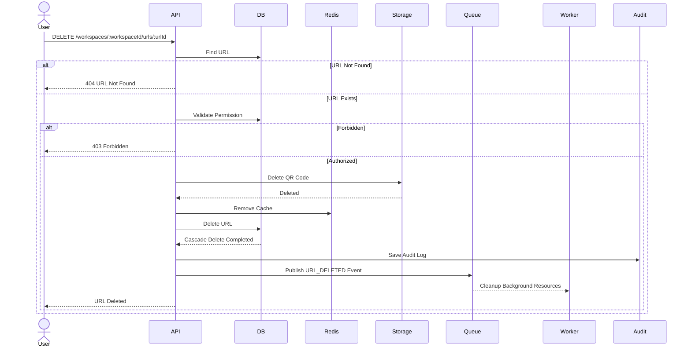
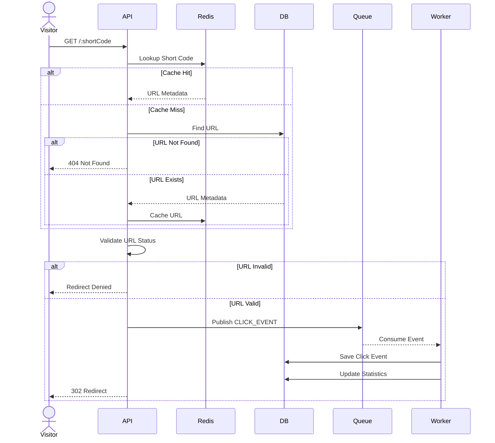
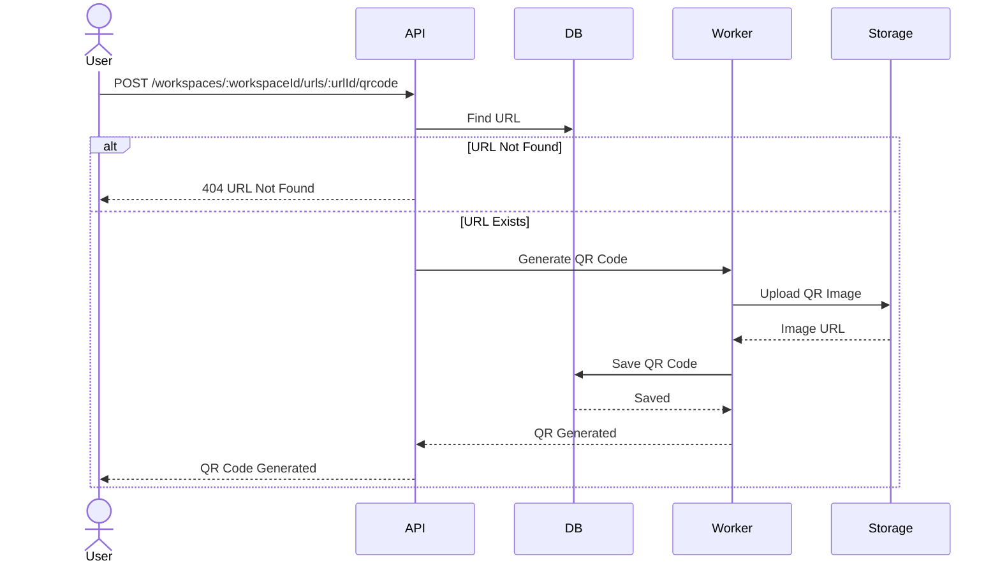
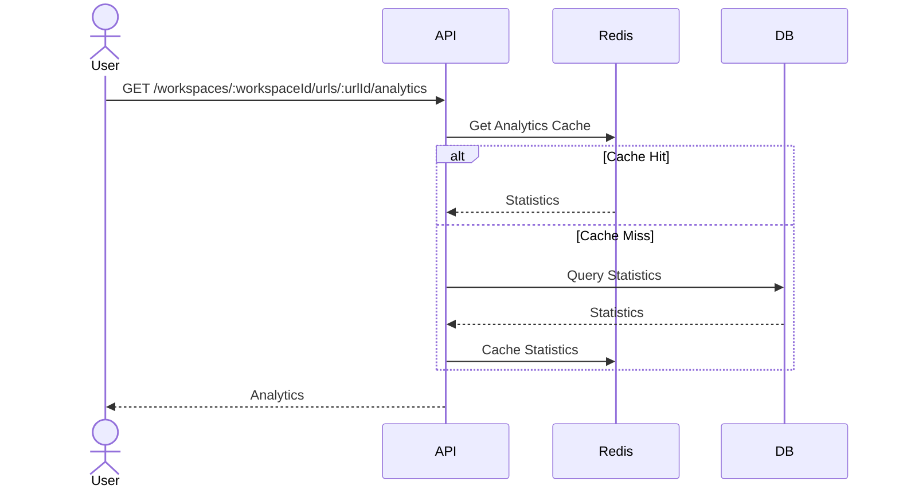

# URL Management Sequence Design

## Overview

This document describes the interaction flow between clients, backend services, infrastructure components, and the database for the URL Management module.

The sequence diagrams illustrate how URL requests are processed throughout their lifecycle. To improve scalability and performance, LinkFlow utilizes Redis for caching, RabbitMQ for asynchronous messaging, background workers for analytics processing, MinIO for object storage, and Audit Logs for tracking important operations.

---

# Create Short URL

## Description

Creates a new shortened URL within a workspace.

The requester must have permission to create URLs.

After the URL is created, it is cached in Redis, an audit log is recorded, and a background event is published for additional processing.

### Sequence Diagram

```mermaid
sequenceDiagram

    actor User

    participant API
    participant DB
    participant Redis
    participant Queue
    participant Worker
    participant Audit

    User->>API: POST /workspaces/:workspaceId/urls

    API->>DB: Validate Workspace

    alt Workspace Not Found

        API-->>User: 404 Workspace Not Found

    else Workspace Exists

        API->>DB: Validate Permission

        alt Forbidden

            API-->>User: 403 Forbidden

        else Authorized

            API->>DB: Check Short Code

            alt Short Code Already Exists

                API-->>User: 409 Short Code Already Exists

            else Available

                API->>DB: Create URL

                DB-->>API: URL Created

                API->>Redis: Cache URL

                API->>Audit: Save Audit Log

                API->>Queue: Publish URL_CREATED Event

                Queue-->>Worker: Process Background Tasks

                API-->>User: URL Created

            end

        end

    end
```

---

# List URLs

## Description

Returns all URLs within a workspace.

### Sequence Diagram

```mermaid
sequenceDiagram

    actor User

    participant API
    participant DB

    User->>API: GET /workspaces/:workspaceId/urls

    API->>DB: Validate Membership

    alt Forbidden

        API-->>User: 403 Forbidden

    else Authorized

        API->>DB: Query URLs

        DB-->>API: URL List

        API-->>User: URLs

    end
```

---

# Get URL Details

## Description

Returns detailed information about a shortened URL.

### Sequence Diagram

```mermaid
sequenceDiagram

    actor User

    participant API
    participant DB

    User->>API: GET /workspaces/:workspaceId/urls/:urlId

    API->>DB: Find URL

    alt URL Not Found

        API-->>User: 404 URL Not Found

    else URL Exists

        API->>DB: Validate Membership

        alt Forbidden

            API-->>User: 403 Forbidden

        else Authorized

            DB-->>API: URL Details

            API-->>User: URL Details

        end

    end
```

---

# Update URL

## Description

Updates URL information.

After a successful update, the Redis cache is refreshed, an audit log is created, and a background event is published.

### Sequence Diagram

```mermaid
sequenceDiagram

    actor User

    participant API
    participant DB
    participant Redis
    participant Queue
    participant Worker
    participant Audit

    User->>API: PATCH /workspaces/:workspaceId/urls/:urlId

    API->>DB: Find URL

    alt URL Not Found

        API-->>User: 404 URL Not Found

    else URL Exists

        API->>DB: Validate Permission

        alt Forbidden

            API-->>User: 403 Forbidden

        else Authorized

            API->>DB: Update URL

            DB-->>API: URL Updated

            API->>Redis: Refresh Cache

            API->>Audit: Save Audit Log

            API->>Queue: Publish URL_UPDATED Event

            Queue-->>Worker: Process Background Tasks

            API-->>User: URL Updated

        end

    end
```

---

# Delete URL

## Description

Deletes a shortened URL and all related resources.

The QR Code is removed from object storage, Redis cache is invalidated, and an audit log is recorded.

### Sequence Diagram

```mermaid
sequenceDiagram

    actor User

    participant API
    participant DB
    participant Redis
    participant Storage
    participant Queue
    participant Worker
    participant Audit

    User->>API: DELETE /workspaces/:workspaceId/urls/:urlId

    API->>DB: Find URL

    alt URL Not Found

        API-->>User: 404 URL Not Found

    else URL Exists

        API->>DB: Validate Permission

        alt Forbidden

            API-->>User: 403 Forbidden

        else Authorized

            API->>Storage: Delete QR Code

            Storage-->>API: Deleted

            API->>Redis: Remove Cache

            API->>DB: Delete URL

            DB-->>API: Cascade Delete Completed

            API->>Audit: Save Audit Log

            API->>Queue: Publish URL_DELETED Event

            Queue-->>Worker: Cleanup Background Resources

            API-->>User: URL Deleted

        end

    end
```

---

# Redirect URL

## Description

Redirects visitors to the original destination.

Redis is checked before querying the database. Analytics are processed asynchronously through RabbitMQ and background workers.

### Sequence Diagram

```mermaid
sequenceDiagram

    actor Visitor

    participant API
    participant Redis
    participant DB
    participant Queue
    participant Worker

    Visitor->>API: GET /:shortCode

    API->>Redis: Lookup Short Code

    alt Cache Hit

        Redis-->>API: URL Metadata

    else Cache Miss

        API->>DB: Find URL

        alt URL Not Found

            API-->>Visitor: 404 Not Found

        else URL Exists

            DB-->>API: URL Metadata

            API->>Redis: Cache URL

        end

    end

    API->>API: Validate URL Status

    alt URL Invalid

        API-->>Visitor: Redirect Denied

    else URL Valid

        API->>Queue: Publish CLICK_EVENT

        Queue-->>Worker: Consume Event

        Worker->>DB: Save Click Event

        Worker->>DB: Update Statistics

        API-->>Visitor: 302 Redirect

    end
```

---

# Generate QR Code

## Description

Generates or regenerates a QR Code for a shortened URL.

The QR image is uploaded to object storage before being saved in the database.

### Sequence Diagram

```mermaid
sequenceDiagram

    actor User

    participant API
    participant DB
    participant Worker
    participant Storage

    User->>API: POST /workspaces/:workspaceId/urls/:urlId/qrcode

    API->>DB: Find URL

    alt URL Not Found

        API-->>User: 404 URL Not Found

    else URL Exists

        API->>Worker: Generate QR Code

        Worker->>Storage: Upload QR Image

        Storage-->>Worker: Image URL

        Worker->>DB: Save QR Code

        DB-->>Worker: Saved

        Worker-->>API: QR Generated

        API-->>User: QR Code Generated

    end
```

---

# View Analytics

## Description

Returns analytics for a shortened URL.

Statistics are retrieved from Redis whenever possible to reduce database load.

### Sequence Diagram

```mermaid
sequenceDiagram

    actor User

    participant API
    participant Redis
    participant DB

    User->>API: GET /workspaces/:workspaceId/urls/:urlId/analytics

    API->>Redis: Get Analytics Cache

    alt Cache Hit

        Redis-->>API: Statistics

    else Cache Miss

        API->>DB: Query Statistics

        DB-->>API: Statistics

        API->>Redis: Cache Statistics

    end

    API-->>User: Analytics
```

---

# Sequence Summary

| Feature | Main Components |
|----------|-----------------|
| Create Short URL | API → Database → Redis → Audit → RabbitMQ → Worker |
| List URLs | API → Database |
| Get URL Details | API → Database |
| Update URL | API → Database → Redis → Audit → RabbitMQ → Worker |
| Delete URL | API → MinIO → Redis → Database → Audit → RabbitMQ → Worker |
| Redirect URL | API → Redis → Database → RabbitMQ → Worker |
| Generate QR Code | API → Worker → MinIO → Database |
| View Analytics | API → Redis → Database |