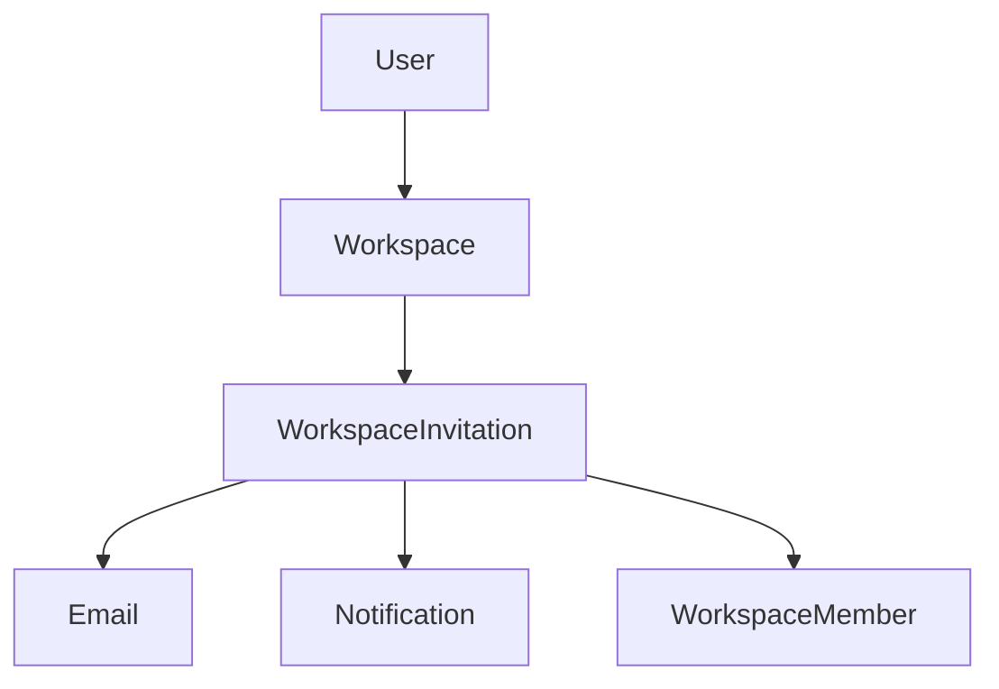
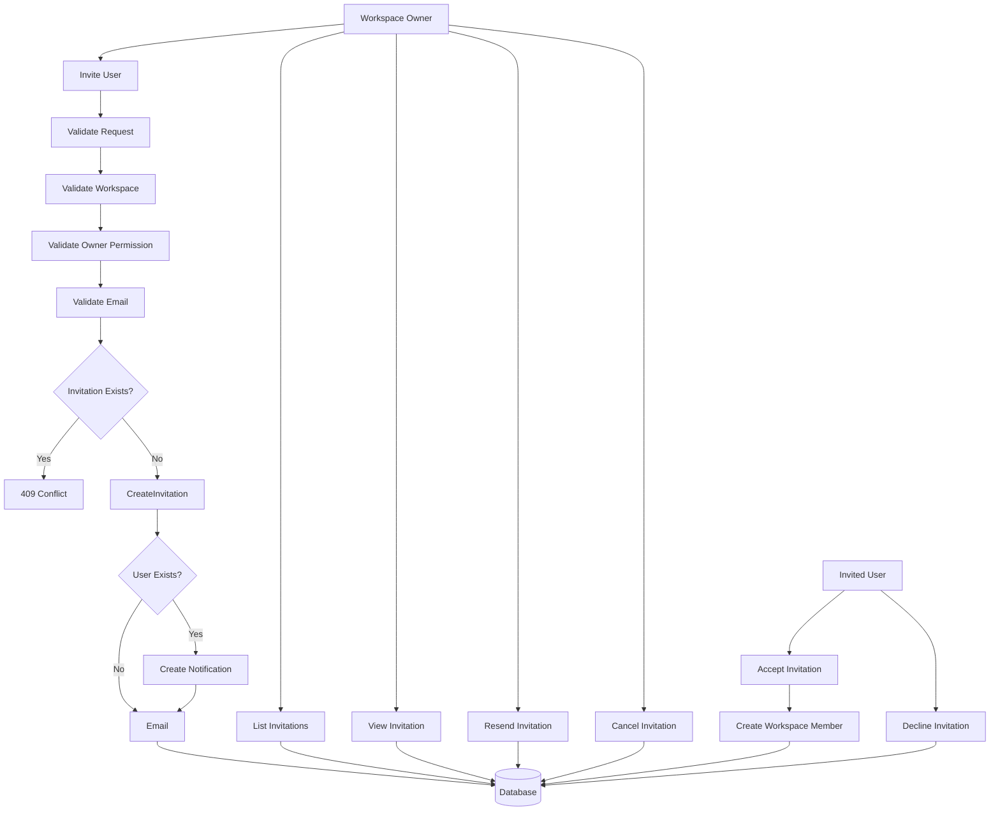
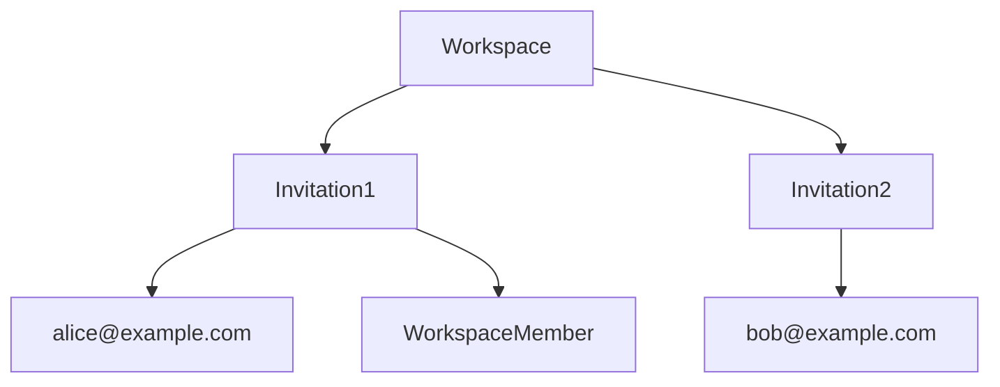

# Workspace Invitation Module Design

## Overview

The Workspace Invitation module manages the process of inviting users to join a workspace.

It allows workspace owners to invite both existing and new users using their email address. Invitations remain pending until they are accepted, declined, expired, or cancelled.

Once an invitation is accepted, the system creates a WorkspaceMember record and grants access to the workspace.

Supported features:

- Invite User
- List Invitations
- Get Invitation Details
- Resend Invitation
- Cancel Invitation
- Accept Invitation
- Decline Invitation

All management endpoints require authentication.

Accept Invitation may be accessed through a secure invitation link.

---

# Module Architecture



---

# Invitation Flow

## Invitation Management Flow



---

# Invitation Ownership



Business Rules

- A workspace can have multiple invitations.
- Each invitation belongs to exactly one workspace.
- Each invitation is created by one workspace owner.
- Invitations are identified by a secure token.
- Invitations do not grant workspace access until accepted.
- Accepting an invitation creates a WorkspaceMember.
- A pending invitation cannot be duplicated for the same email.

---

# Invitation Structure

Each invitation contains:

```
Workspace

↓

Invitation

↓

Email

↓

Secure Token

↓

Expiration

↓

Status
```

Example invitation link

```
https://app.linkflow.io/invitations/{token}
```

---

# Invitation Features

## Invite Existing User

If the email belongs to an existing account:

```
Create Invitation

↓

Create Notification

↓

Send Email
```

The user receives:

- In-app notification
- Invitation email

---

## Invite New User

If the email has not been registered:

```
Create Invitation

↓

Send Email
```

The invitation remains pending until the user registers and accepts it.

---

## Accept Invitation

Accepting an invitation performs the following actions:

```
Validate Token

↓

Validate Invitation

↓

Create Workspace Member

↓

Update Invitation Status
```

Workspace access is granted immediately after acceptance.

---

## Decline Invitation

Users may decline an invitation.

```
Invitation

↓

DECLINED
```

No membership is created.

---

## Resend Invitation

Workspace owners may resend pending invitations.

The system:

- Generates a new expiration time (optional)
- Sends another invitation email
- Does not create a duplicate invitation

---

## Cancel Invitation

Workspace owners may cancel pending invitations.

Cancelled invitations cannot be accepted.

---

# Invitation Status

Supported statuses

```
PENDING

ACCEPTED

DECLINED

EXPIRED

CANCELLED
```

Only invitations in the **PENDING** state may be accepted.

---

# Invitation Validation

The following validations are performed during invitation creation.

## Workspace

- Workspace must exist.
- Requester must be the workspace owner.

---

## Email

- Required
- Valid email format
- Cannot invite the workspace owner.
- Cannot invite an existing active member.
- Cannot have another pending invitation.

---

## Token

Requirements

- Secure
- Unique
- Randomly generated
- Time-limited

---

# Invitation Information

| Field       | Description                  |
| ----------- | ---------------------------- |
| id          | Invitation identifier        |
| workspaceId | Target workspace             |
| invitedBy   | User who sent the invitation |
| userId      | Invited user (nullable)      |
| email       | Invited email                |
| role        | Assigned role                |
| token       | Invitation token             |
| status      | Invitation status            |
| expiresAt   | Expiration timestamp         |
| acceptedAt  | Acceptance timestamp         |
| createdAt   | Creation timestamp           |
| updatedAt   | Last updated                 |

---

# Security

- JWT Authentication
- Workspace ownership validation
- Invitation token validation
- Email validation
- Duplicate invitation validation
- Expiration validation
- Notification generation
- Email delivery
- Input sanitization

---

# Future Enhancements

Possible future improvements include:

- Invitation Reminder
- Bulk Invitations
- Invitation Expiration Configuration
- Invitation Revocation
- Custom Invitation Message
- QR Code Invitation
- Domain-Based Auto Join
- Organization Invitations
- Audit Logs
- Approval Workflow

---

# Module Summary

| Feature                | Authentication Required |
| ---------------------- | ----------------------- |
| Invite User            | ✅                      |
| List Invitations       | ✅                      |
| Get Invitation Details | ✅                      |
| Resend Invitation      | ✅                      |
| Cancel Invitation      | ✅                      |
| Accept Invitation      | ❌ _(Token Required)_   |
| Decline Invitation     | ❌ _(Token Required)_   |
