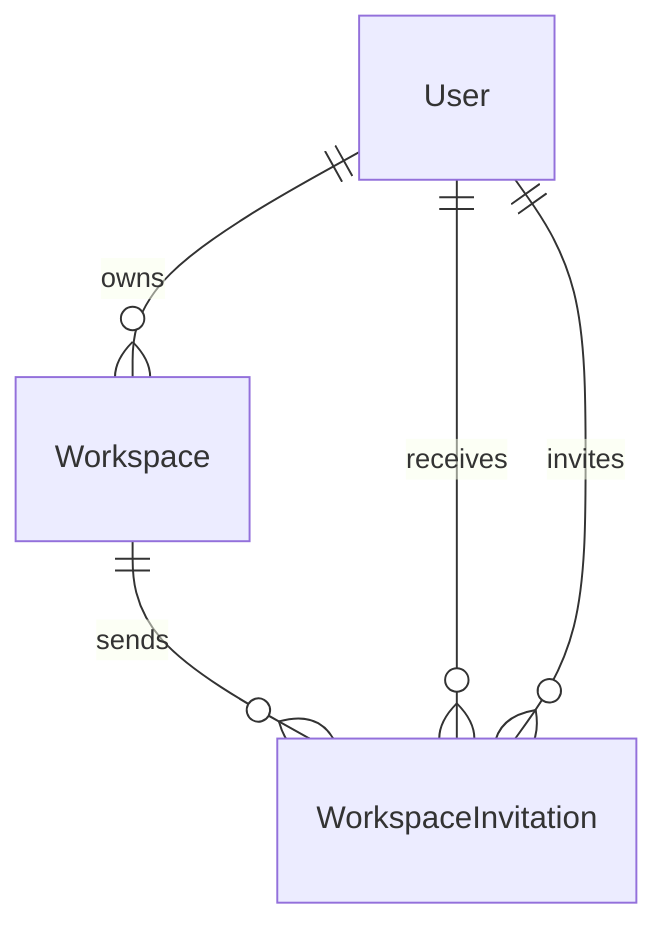

# Workspace Invitation Database Design

## Overview

The Workspace Invitation module manages invitations sent to users to join a workspace.

An invitation allows a workspace owner to invite either an existing LinkFlow user or an external user via email.

Each invitation belongs to exactly one workspace and records the invitation lifecycle until it is accepted, rejected, expired, or revoked.

This module separates invitation management from active workspace membership, simplifying authorization and supporting future invitation workflows.

---

# Entity Relationship Diagram



---

# Relationship Overview

## Workspace → WorkspaceInvitation

Relationship

```
One-to-Many
```

A workspace can create multiple invitations.

Each invitation belongs to exactly one workspace.

Purpose

- Invite tracking
- Membership onboarding
- Collaboration

---

## User (Inviter) → WorkspaceInvitation

Relationship

```
One-to-Many
```

The inviter records who created the invitation.

Only workspace owners can create invitations.

Purpose

- Audit history
- Permission verification

---

## User (Invitee) → WorkspaceInvitation

Relationship

```
Optional One-to-Many
```

An invitation may reference an existing LinkFlow user.

If the invited email does not belong to an existing account, this relationship remains null until registration.

Purpose

- In-app notifications
- Invitation acceptance
- Account linking

---

# Database Tables

## WorkspaceInvitation

Purpose

Stores pending and historical workspace invitations.

Primary Key

```
id
```

Important Fields

- workspaceId
- inviterId
- inviteeId (nullable)
- email
- role
- token
- status
- expiresAt
- acceptedAt
- rejectedAt

Relations

- Workspace
- Inviter
- Invitee

---

# Foreign Key Strategy

| Child Table                   | Parent Table | Delete Strategy |
| ----------------------------- | ------------ | --------------- |
| WorkspaceInvitation           | Workspace    | Cascade         |
| WorkspaceInvitation.inviterId | User         | Restrict        |
| WorkspaceInvitation.inviteeId | User         | Set Null        |

### Benefits

- Invitations are automatically removed when a workspace is deleted.
- Historical invitations remain valid even if an invited user account is deleted.
- Prevents orphan invitation records.

---

# Constraint Strategy

## Invitation Token

Unique Constraint

```
token
```

Ensures every invitation link is unique.

---

## Pending Invitation

Composite Unique Constraint

```
(workspaceId, email, status)
```

Business Rule

Only one pending invitation may exist for the same email within a workspace.

Accepted, rejected, revoked, or expired invitations do not affect future invitations.

---

# Index Strategy

## WorkspaceInvitation

Indexes

- workspaceId
- email
- inviteeId
- inviterId
- status
- token
- expiresAt

Purpose

- Fast invitation lookup
- Email-based invitation search
- Token validation
- Pending invitation queries
- Automatic expiration cleanup

---

# Invitation Strategy

Each invitation represents a request to join a workspace.

```
Workspace

↓

Workspace Invitation

↓

Email

↓

(Optional) User
```

An invitation does not grant workspace access until accepted.

---

# Invitation Status

Current supported statuses

```
PENDING

ACCEPTED

REJECTED

REVOKED

EXPIRED
```

Examples

```
PENDING
```

Invitation has been sent and is waiting for a response.

```
ACCEPTED
```

The invitation has been accepted and a WorkspaceMember record has been created.

```
REJECTED
```

The recipient declined the invitation.

```
REVOKED
```

The workspace owner cancelled the invitation.

```
EXPIRED
```

The invitation expired before being accepted.

---

# Invitation Types

The system supports two invitation methods.

## Existing User Invitation

```
Owner

↓

Invite Existing User

↓

Workspace Invitation

↓

Email Notification

+

In-App Notification
```

The invitation references the existing user through `inviteeId`.

---

## Email Invitation

```
Owner

↓

Invite by Email

↓

Workspace Invitation

↓

Email Notification
```

No user account is required.

After registration, the invitation can be accepted.

---

# Authorization Strategy

Workspace invitations are managed independently from workspace memberships.

Authorization flow

```
Workspace

↓

Workspace Owner

↓

Workspace Invitation

↓

Invitation Status
```

Workspace access is only granted after a successful invitation acceptance.

---

# Cascade Delete Strategy

Deleting a workspace automatically removes all associated invitations.

```
Workspace

↓

Workspace Invitations
```

Benefits

- No orphan invitations
- Consistent workspace cleanup
- Simplified maintenance

---

# Design Decisions

## Separate Invitation Entity

Invitations are stored separately from `WorkspaceMember`.

Benefits

- Members always represent active access.
- Invitations represent pending access.
- Simpler authorization logic.
- Easier invitation lifecycle management.

---

## Dual Invitation Support

The system supports invitations for both registered and unregistered users.

Benefits

- Existing users receive email and in-app notifications.
- New users receive email invitations.
- No duplicate invitation workflow.

---

## Token-Based Acceptance

Each invitation contains a unique token.

Benefits

- Secure invitation links
- Easy validation
- Supports future public invitation pages
