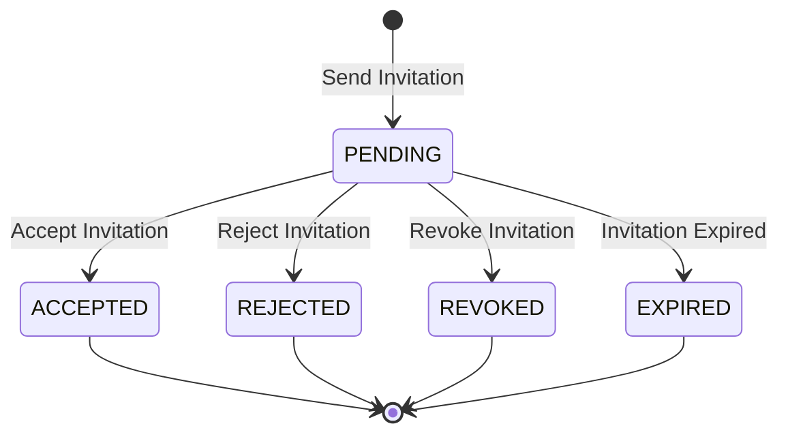

# Workspace Invitation Lifecycle Design

## Overview

The Workspace Invitation lifecycle defines the state transitions of an invitation from creation until completion.

An invitation is created by a workspace owner and remains in the `PENDING` state until it is accepted, rejected, revoked, or expired.

Only accepted invitations result in the creation of a `WorkspaceMember` record. Invitations themselves never grant workspace access.

---

# Lifecycle State Diagram



---

# Invitation States

## PENDING

The invitation has been created and is awaiting a response.

Characteristics

- Invitation email has been sent.
- Existing users receive an in-app notification.
- Workspace access has not been granted.
- Invitation may be accepted, rejected, revoked, or expired.

---

## ACCEPTED

The recipient has accepted the invitation.

Characteristics

- A WorkspaceMember record is created.
- Workspace access is granted.
- Invitation becomes read-only.
- The invitation cannot be accepted again.

---

## REJECTED

The recipient has declined the invitation.

Characteristics

- No workspace membership is created.
- Workspace access is denied.
- The invitation is closed permanently.

---

## REVOKED

The workspace owner has cancelled the invitation before it was accepted.

Characteristics

- Invitation becomes invalid immediately.
- The recipient can no longer join using the invitation.
- No workspace membership is created.

---

## EXPIRED

The invitation has expired before being accepted.

Characteristics

- Invitation becomes invalid.
- A new invitation must be created.
- No workspace membership is created.

---

# Lifecycle Events

## Send Invitation

```
Request

↓

Validate Workspace

↓

Validate Owner Permission

↓

Validate Email

↓

Check Existing Invitation

↓

Generate Invitation Token

↓

Create Workspace Invitation

↓

Send Email

↓

(Optional) Create In-App Notification

↓

PENDING
```

Conditions

- Workspace exists.
- Requester is the workspace owner.
- Email is valid.
- No active invitation already exists for the same email.

---

## Accept Invitation

```
PENDING

↓

Validate Token

↓

Validate Expiration

↓

Create WorkspaceMember

↓

Update Invitation Status

↓

ACCEPTED
```

Changes

```
status = ACCEPTED

acceptedAt = Current Timestamp
```

If the recipient does not yet have an account, they must register before accepting the invitation.

---

## Reject Invitation

```
PENDING

↓

REJECTED
```

Changes

```
status = REJECTED

rejectedAt = Current Timestamp
```

No membership is created.

---

## Revoke Invitation

```
PENDING

↓

REVOKED
```

Trigger

Workspace owner revokes the invitation.

Effects

- Invitation becomes unusable.
- Invitation link is invalidated.

---

## Expire Invitation

```
PENDING

↓

EXPIRED
```

Trigger

Current time exceeds

```
expiresAt
```

Effects

- Invitation automatically becomes invalid.
- A new invitation must be issued.

---

# Invitation Types

## Existing User Invitation

```
Workspace Owner

↓

Invite Existing User

↓

Email Notification

+

In-App Notification

↓

PENDING
```

When accepted

```
WorkspaceMember Created

↓

Workspace Access Granted
```

---

## Email Invitation

```
Workspace Owner

↓

Invite Email Address

↓

Email Notification

↓

PENDING
```

If the recipient registers later

```
Register Account

↓

Accept Invitation

↓

WorkspaceMember Created
```

---

# Membership Creation

A WorkspaceMember record is created only after an invitation is accepted.

```
Workspace Invitation

↓

ACCEPTED

↓

WorkspaceMember

↓

Workspace Access
```

This separation ensures pending invitations never grant permissions.

---

# Access Behavior

| State | Workspace Access |
|---------|:---------------:|
| PENDING | ❌ |
| ACCEPTED | ✅ |
| REJECTED | ❌ |
| REVOKED | ❌ |
| EXPIRED | ❌ |

---

# Notification Behavior

| Event | Email | In-App Notification |
|---------|:-----:|:-------------------:|
| Send Invitation (Existing User) | ✅ | ✅ |
| Send Invitation (Email Only) | ✅ | ❌ |
| Accept Invitation | ✅ | ✅ |
| Reject Invitation | ✅ | ✅ |
| Revoke Invitation | ✅ | ✅ |
| Expire Invitation | ❌ | ❌ |

---

# Invitation Expiration

Each invitation contains an expiration timestamp.

```
expiresAt
```

Once expired:

- The invitation token is invalid.
- The invitation cannot be accepted.
- The owner must create a new invitation.

---

# Lifecycle Summary

| State | Valid | Workspace Access | Editable |
|---------|:-----:|:----------------:|:--------:|
| PENDING | ✅ | ❌ | ✅ |
| ACCEPTED | ❌ | ✅ | ❌ |
| REJECTED | ❌ | ❌ | ❌ |
| REVOKED | ❌ | ❌ | ❌ |
| EXPIRED | ❌ | ❌ | ❌ |

---

# Future Enhancements

Possible future lifecycle extensions include

- Invitation Reminder Emails
- Invitation Resend
- Bulk Invitations
- Invitation Audit Logs
- Invitation Templates
- Invitation Cancellation Reason
- Invitation Acceptance History
- Domain-Based Auto Join