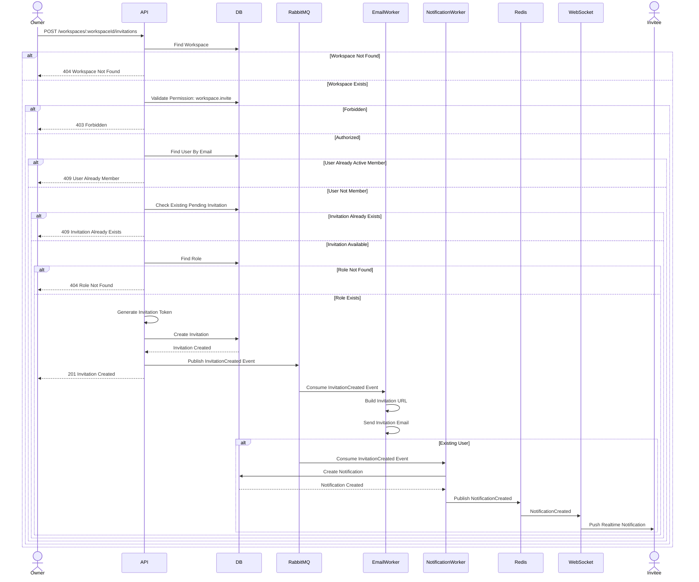
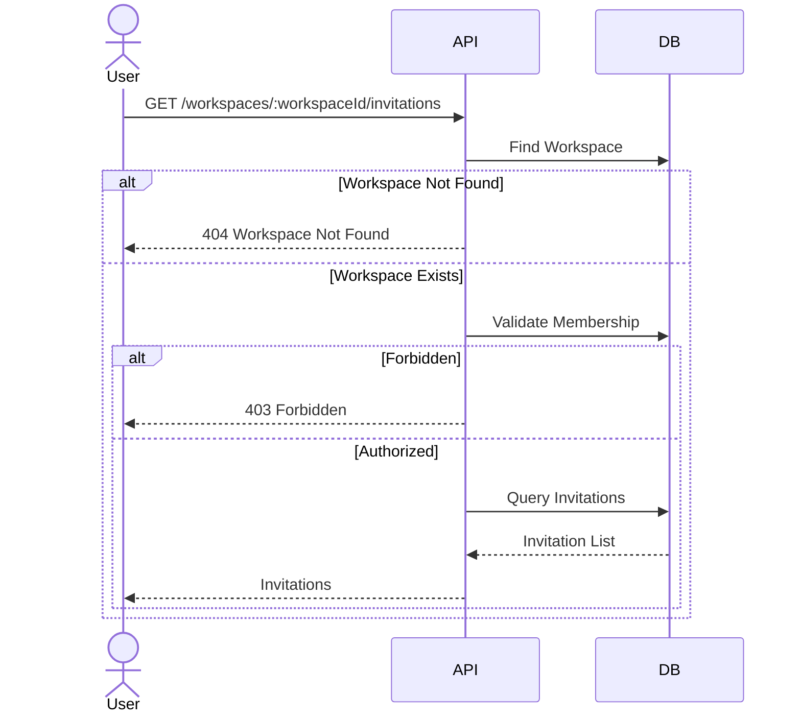
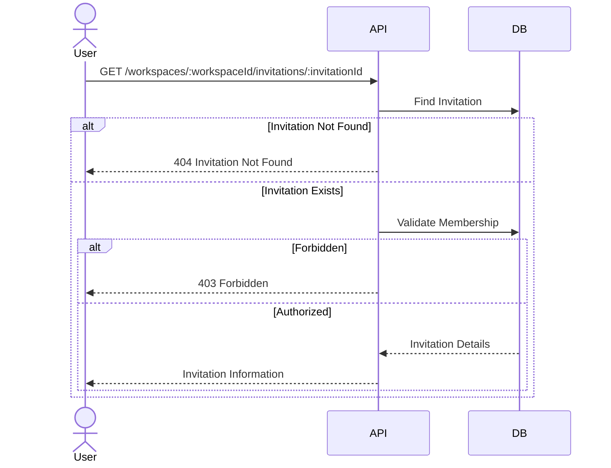
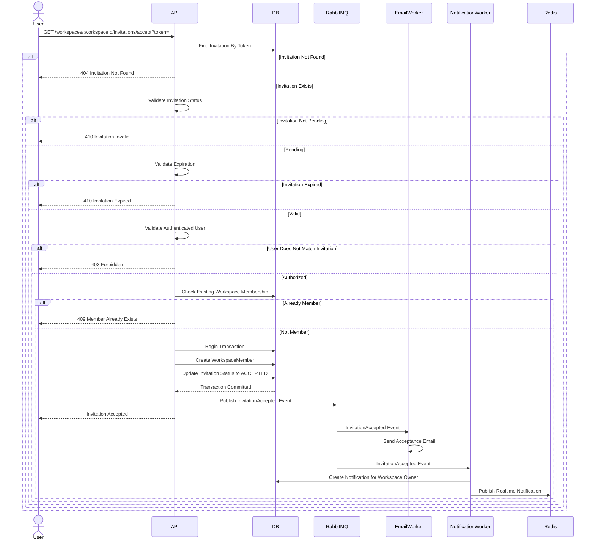
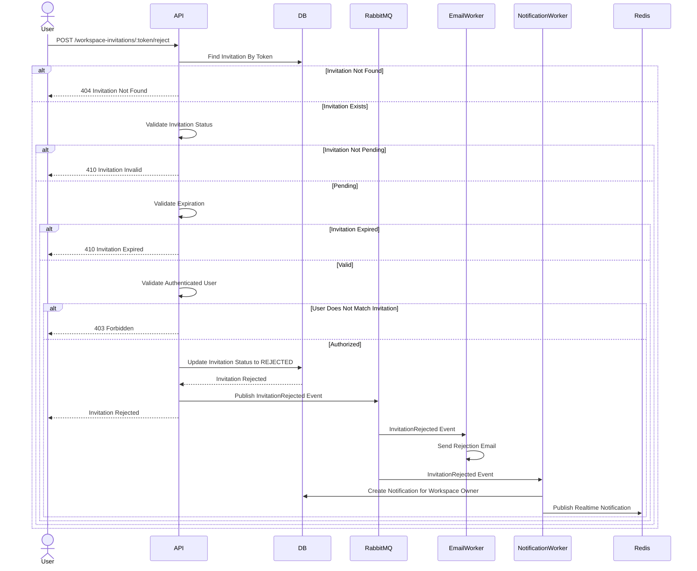
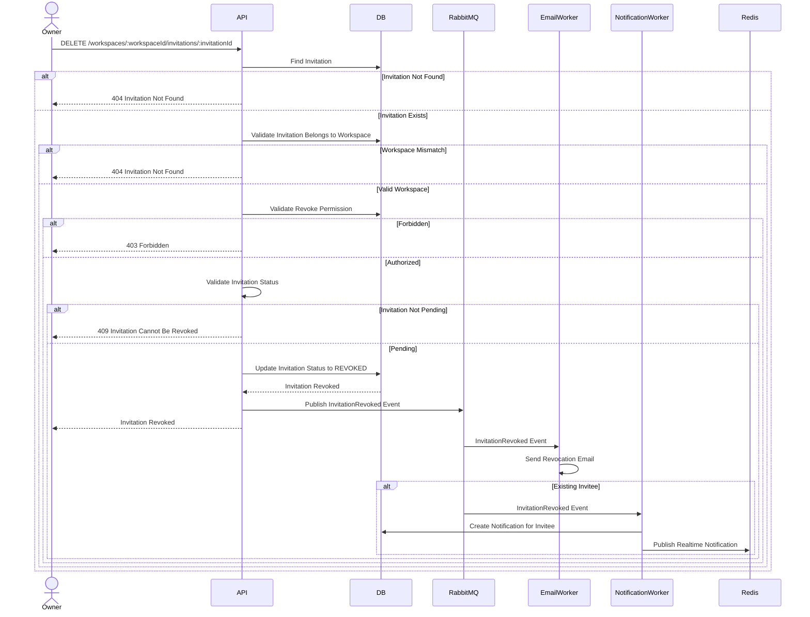
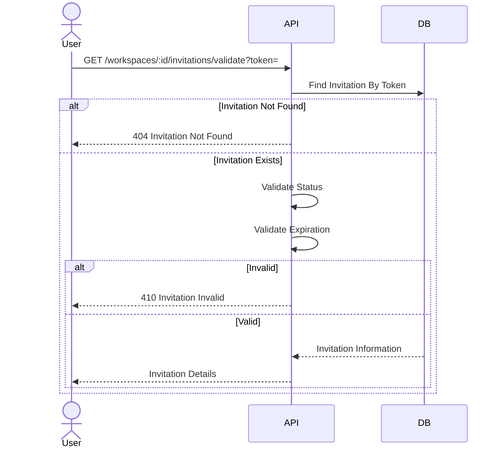

# Workspace Invitation Sequence Design

## Overview

This document describes the interaction flow between clients, backend services, notification services, and the database for the Workspace Invitation module.

The sequence diagrams illustrate how workspace invitations are created, delivered, accepted, rejected, revoked, and validated.

---

# Send Invitation

## Description

Creates a new workspace invitation.

The workspace owner may invite either an existing LinkFlow user or an external email address.

Existing users receive both an email and an in-app notification.

External users receive an email invitation only.

### Sequence Diagram

---

# List Invitations

## Description

Returns all invitations for a workspace.

Only workspace members can view invitations.

### Sequence Diagram

---

# Get Invitation Details

## Description

Returns details of a workspace invitation.

Only workspace members can access invitation details.

### Sequence Diagram

---

# Accept Invitation

## Description

Accepts a workspace invitation.

The invitation token must be valid and not expired.

A WorkspaceMember record is created after acceptance.

### Sequence Diagram

---

# Reject Invitation

## Description

Rejects a workspace invitation.

The invitation is permanently closed.

### Sequence Diagram

---

# Revoke Invitation

## Description

Cancels a pending invitation.

Only the workspace owner may revoke invitations.

### Sequence Diagram

---

# Validate Invitation

## Description

Validates an invitation token before it is accepted.

### Sequence Diagram

---

# Sequence Summary

| Feature | Main Components |
|----------|-----------------|
| Send Invitation | API → Database → Mail → Notification |
| List Invitations | API → Database |
| Get Invitation Details | API → Database |
| Accept Invitation | API → Database → Mail → Notification |
| Reject Invitation | API → Database → Mail → Notification |
| Revoke Invitation | API → Database → Mail → Notification |
| Validate Invitation | API → Database |
