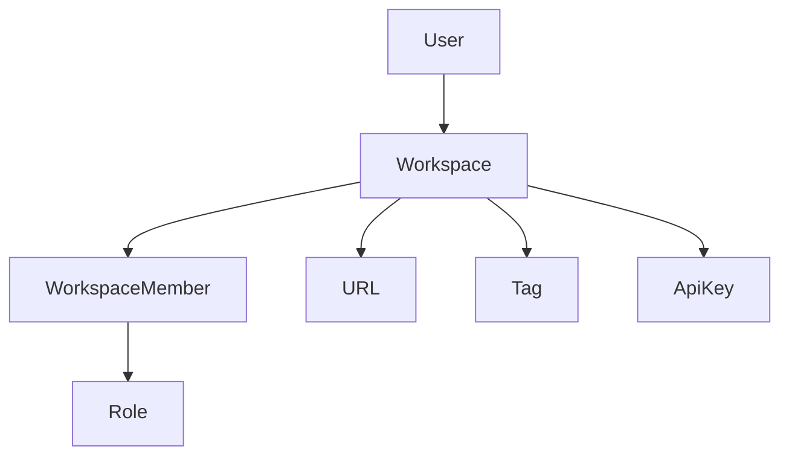
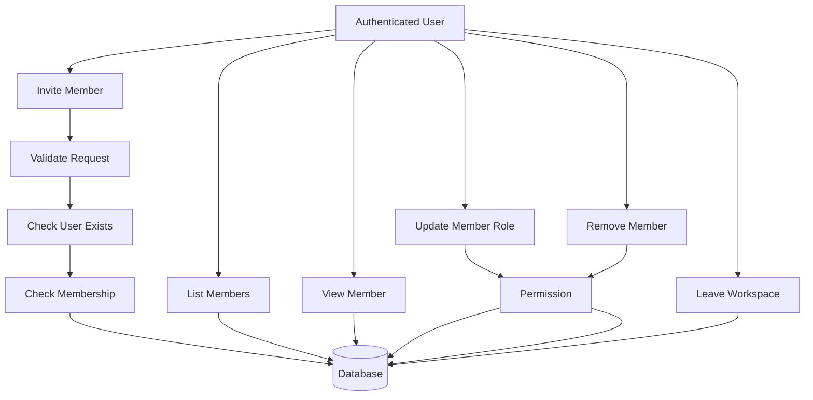
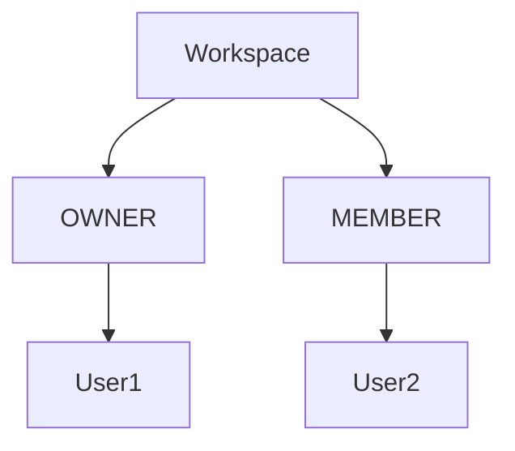

# Workspace Member Module Design

## Overview

The Workspace Member module is responsible for managing user membership within a workspace.

It controls who can access a workspace, what role each member has, and who is authorized to manage workspace resources.

Every member belongs to exactly one workspace and references exactly one user.

Supported features:

- Invite Member
- List Members
- Get Member Details
- Update Member Role
- Remove Member
- Leave Workspace

All endpoints require authentication.

---

# Module Architecture



---

# Workspace Member Flow

## Member Management Flow



---

# Membership Structure



Business Rules

- A workspace has exactly one owner.
- A workspace can have multiple members.
- A user can join multiple workspaces.
- A user cannot join the same workspace more than once.
- Every member has exactly one role.
- Every member references one user.

---

# Membership Lifecycle

```
User

↓

Invited

↓

Joined Workspace

↓

Member

↓

Role Updated (Optional)

↓

Removed
```

---

# Member Roles

Current roles

```
OWNER

MEMBER
```

Responsibilities

### OWNER

- Manage workspace
- Invite members
- Remove members
- Update member roles
- Delete workspace

### MEMBER

- Access workspace
- Create and manage URLs
- View analytics
- Manage tags (subject to future permissions)

---

# Member Invitation

A workspace owner can invite an existing user into the workspace.

```
Owner

↓

Invite User

↓

Validate User

↓

Create WorkspaceMember

↓

User Becomes Member
```

A user cannot be invited twice to the same workspace.

---

# Workspace Isolation

Membership is isolated by workspace.

```
Workspace A

├── Alice
├── Bob


Workspace B

├── Charlie
├── David
```

Users can only access workspaces where they are members.

---

# Permission Model

Only workspace owners can:

- Invite members
- Remove members
- Change member roles

All members can:

- View workspace members
- Leave the workspace (except the owner)

---

# Membership Validation

The following validations are performed during member management.

## User

- User must exist.
- User must not already belong to the workspace.

---

## Workspace

- Workspace must exist.
- User must have permission.

---

## Role

Supported roles

```
OWNER

MEMBER
```

---

# Membership Information

| Field | Description |
|---------|-----------------------------|
| id | Membership identifier |
| workspaceId | Workspace |
| userId | User |
| role | Member role |
| invitedAt | Invitation timestamp |
| joinedAt | Join timestamp |

---

# Security

- JWT Authentication
- Workspace membership validation
- Workspace ownership validation
- Duplicate membership validation
- Role validation
- Input sanitization

---

# Future Enhancements

Possible future improvements include:

- Email Invitations
- Invitation Tokens
- Pending Invitations
- Invitation Expiration
- Role-Based Access Control (RBAC)
- Admin Role
- Viewer Role
- Activity Logs
- Transfer Workspace Ownership

---

# Module Summary

| Feature | Authentication Required |
|----------------------|-------------------------|
| Invite Member | ✅ |
| List Members | ✅ |
| Get Member Details | ✅ |
| Update Member Role | ✅ |
| Remove Member | ✅ |
| Leave Workspace | ✅ |