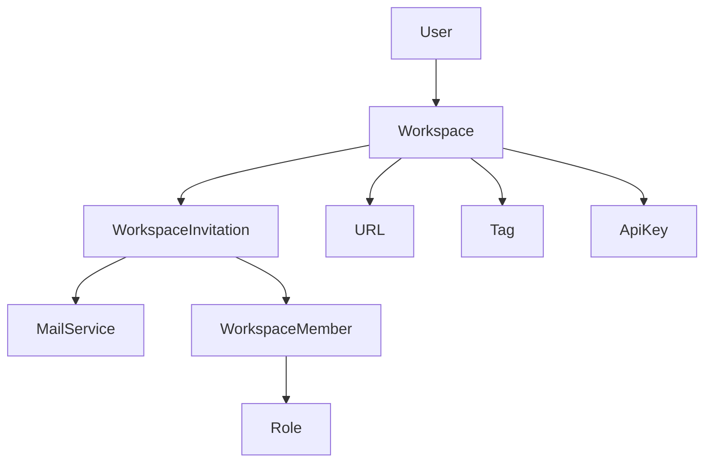
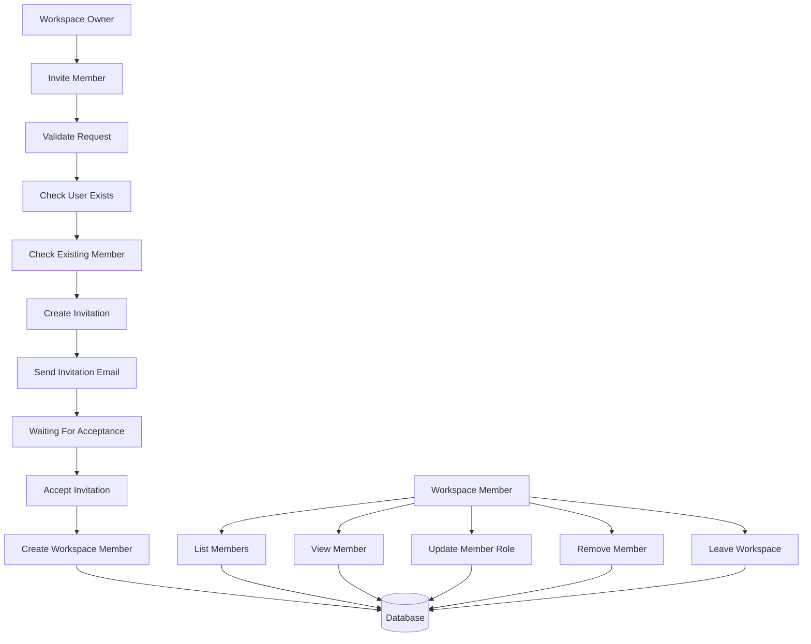
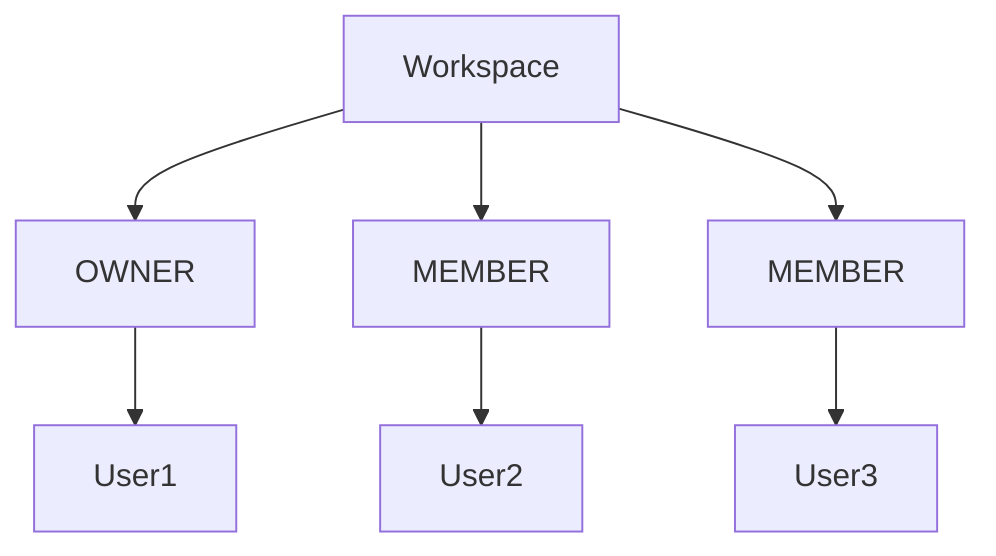

# Workspace Member Module Design

## Overview

The Workspace Member module is responsible for managing workspace membership and access control.

It allows workspace owners to invite users, manage member roles, and remove members, while allowing members to access workspace resources and leave the workspace.

Users join a workspace only after accepting an invitation sent via email.

Supported features:

- Invite Member
- Accept Invitation
- List Members
- Get Member Details
- Update Member Role
- Remove Member
- Leave Workspace

All endpoints require authentication, except invitation acceptance when using an invitation token.

---

# Module Architecture



---

# Workspace Member Flow

## Member Management Flow



---

# Membership Structure



Business Rules

- A workspace has exactly one owner.
- A workspace can have multiple members.
- A user can belong to multiple workspaces.
- A user cannot belong to the same workspace more than once.
- Membership is created only after an invitation is accepted.
- Every member has exactly one role.

---

# Membership Lifecycle

```
Owner

↓

Invite User

↓

Invitation Email Sent

↓

User Accepts Invitation

↓

Workspace Member Created

↓

Active Member

↓

Role Updated (Optional)

↓

Leave Workspace

or

Removed By Owner
```

---

# Member Roles

Current roles

```
OWNER

MEMBER
```

### OWNER

Responsibilities

- Manage workspace
- Invite members
- Update member roles
- Remove members
- Delete workspace
- Transfer workspace ownership

---

### MEMBER

Responsibilities

- Access workspace
- Create and manage URLs
- View analytics
- Leave workspace

---

# Invitation Flow

A workspace owner invites an existing user by email.

```
Owner

↓

Validate User

↓

Create Invitation

↓

Send Invitation Email

↓

User Accepts Invitation

↓

Create Workspace Member
```

A user cannot:

- Receive duplicate pending invitations.
- Join the same workspace multiple times.

---

# Workspace Isolation

Membership is isolated by workspace.

```
Workspace A

├── Alice
├── Bob


Workspace B

├── Charlie
├── David
```

Users can only access workspaces where they are active members.

---

# Permission Model

Workspace owners can:

- Invite members
- Update member roles
- Remove members
- Transfer ownership

Workspace members can:

- View members
- Leave the workspace

---

# Membership Validation

## User

- User must exist.
- User must not already belong to the workspace.
- User must not have a pending invitation.

---

## Workspace

- Workspace must exist.
- Requester must have permission.

---

## Role

Supported roles

```
OWNER

MEMBER
```

---

# Membership Information

| Field | Description |
|---------|-----------------------------|
| id | Membership identifier |
| workspaceId | Workspace identifier |
| userId | Member identifier |
| role | Workspace role |
| joinedAt | Join timestamp |

> Invitation information is stored separately in the Workspace Invitation module.

---

# Security

- JWT Authentication
- Workspace membership validation
- Workspace ownership validation
- Invitation token validation
- Duplicate membership validation
- Duplicate invitation validation
- Role validation
- Input sanitization

---

# Future Enhancements

Possible future improvements include:

- Invitation Expiration
- Invitation Cancellation
- Invitation Resend
- Email Verification
- Role-Based Access Control (RBAC)
- Admin Role
- Viewer Role
- Audit Logs
- Member Activity History

---

# Module Summary

| Feature | Authentication Required |
|----------------------|-------------------------|
| Invite Member | ✅ |
| Accept Invitation | ❌* |
| List Members | ✅ |
| Get Member Details | ✅ |
| Update Member Role | ✅ |
| Remove Member | ✅ |
| Leave Workspace | ✅ |

\* Invitation acceptance may use a secure invitation token instead of JWT authentication.