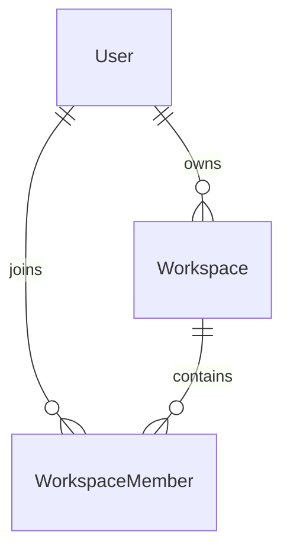

# Workspace Member Database Design

## Overview

The Workspace Member module manages the relationship between users and workspaces.

It determines which users belong to a workspace and defines their role within that workspace.

Each membership represents a single user participating in a single workspace.

The module is the foundation of LinkFlow's authorization model.

---

# Entity Relationship Diagram



---

# Relationship Overview

## User → WorkspaceMember

Relationship

```
One-to-Many
```

A user can belong to multiple workspaces.

Each membership belongs to exactly one user.

Purpose

- Workspace access
- Permission management
- Team collaboration

---

## Workspace → WorkspaceMember

Relationship

```
One-to-Many
```

A workspace can contain multiple members.

Each membership belongs to exactly one workspace.

Every workspace must have one owner.

---

## User → Workspace

Relationship

```
One-to-Many
```

A user can own multiple workspaces.

Ownership is stored separately from membership.

The owner is also represented as a WorkspaceMember with the OWNER role.

---

# Database Tables

## WorkspaceMember

Purpose

Stores workspace membership.

Primary Key

```
id
```

Important Fields

- workspaceId
- userId
- role
- invitedAt
- joinedAt

Relations

- Workspace
- User

---

# Foreign Key Strategy

| Child Table | Parent Table | Delete Strategy |
|-------------|--------------|-----------------|
| WorkspaceMember | Workspace | Cascade |
| WorkspaceMember | User | Cascade |

Benefits

- No orphan memberships
- Automatic cleanup
- Referential integrity

---

# Constraint Strategy

## WorkspaceMember

Composite Unique Constraint

```
(workspaceId, userId)
```

Ensures a user cannot join the same workspace more than once.

---

# Index Strategy

## WorkspaceMember

Indexes

- workspaceId
- userId

Purpose

- Fast member listing
- Fast permission validation
- Fast workspace lookup
- Efficient authorization checks

---

# Membership Strategy

Each membership connects one user with one workspace.

```
Workspace

↓

WorkspaceMember

↓

User
```

A user may participate in multiple workspaces.

A workspace may contain multiple users.

---

# Role Strategy

Current roles

```
OWNER

MEMBER
```

The role determines the user's permissions inside the workspace.

Examples

```
Workspace

├── Alice (OWNER)

├── Bob (MEMBER)

└── Charlie (MEMBER)
```

Future roles may include

```
ADMIN

EDITOR

VIEWER
```

---

# Invitation Strategy

Membership records support invitation tracking.

```
invitedAt
```

Stores the time when the invitation was created.

```
joinedAt
```

Stores the time when the member joined the workspace.

Examples

Invited

```
invitedAt != null

joinedAt == null
```

Joined

```
invitedAt != null

joinedAt != null
```

---

# Authorization Strategy

Permissions are determined using three values.

```
Workspace

+

User

+

Role
```

Authorization flow

```
Workspace

↓

WorkspaceMember

↓

Role

↓

Permission
```

This avoids checking ownership directly for every request.

---

# Cascade Delete Strategy

Deleting a workspace automatically removes all memberships.

```
Workspace

↓

Workspace Members
```

Deleting a user automatically removes all associated memberships.

Benefits

- No orphan records
- Simplified cleanup
- Consistent authorization data

---

# Design Decisions

## Membership-Based Authorization

Permissions are determined through WorkspaceMember rather than the Workspace table.

Benefits

- Flexible permission model
- Supports future RBAC
- Simpler authorization checks

---

## Separate Ownership

Workspace ownership is stored separately.

```
Workspace.ownerId
```

while permission management is handled through

```
WorkspaceMember.role
```

Benefits

- Clear ownership
- Flexible role management
- Easier ownership transfer

---

## Composite Unique Constraint

```
(workspaceId, userId)
```

Benefits

- Prevent duplicate memberships
- Simplify invitation logic
- Guarantee data consistency

---

# Summary

The Workspace Member database design establishes the relationship between users and workspaces. It provides the foundation for authentication, authorization, and collaboration by using membership records, role-based permissions, foreign key constraints, indexes, and cascade deletion to ensure consistency, scalability, and maintainability.