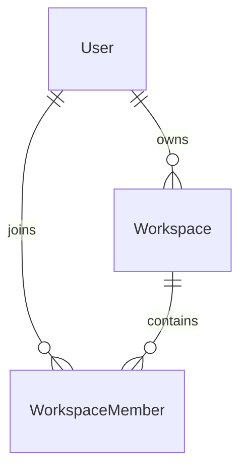

# Workspace Member Database Design

## Overview

The Workspace Member module manages the relationship between users and workspaces.

It determines which users have access to a workspace and defines their role within that workspace.

A membership record is created only after a user successfully joins a workspace.

Invitation management is handled separately by the Workspace Invitation module.

The Workspace Member module serves as the foundation of LinkFlow's authorization model.

---

# Entity Relationship Diagram



---

# Relationship Overview

## User → WorkspaceMember

Relationship

```
One-to-Many
```

A user can belong to multiple workspaces.

Each membership belongs to exactly one user.

Purpose

- Workspace access
- Permission management
- Team collaboration

---

## Workspace → WorkspaceMember

Relationship

```
One-to-Many
```

A workspace can contain multiple members.

Each membership belongs to exactly one workspace.

Every workspace has exactly one owner.

---

## User → Workspace

Relationship

```
One-to-Many
```

A user can own multiple workspaces.

Ownership is stored separately from membership.

The workspace owner is also represented as a WorkspaceMember with the OWNER role.

---

# Database Tables

## WorkspaceMember

Purpose

Stores active workspace memberships.

Primary Key

```
id
```

Important Fields

- workspaceId
- userId
- role
- joinedAt

Relations

- Workspace
- User

---

# Foreign Key Strategy

| Child Table     | Parent Table | Delete Strategy |
| --------------- | ------------ | --------------- |
| WorkspaceMember | Workspace    | Cascade         |
| WorkspaceMember | User         | Cascade         |

Benefits

- No orphan memberships
- Automatic cleanup
- Referential integrity

---

# Constraint Strategy

## WorkspaceMember

Composite Unique Constraint

```
(workspaceId, userId)
```

Ensures a user cannot join the same workspace more than once.

---

# Index Strategy

## WorkspaceMember

Indexes

- workspaceId
- userId

Purpose

- Fast member listing
- Fast permission validation
- Fast workspace lookup
- Efficient authorization checks

---

# Membership Strategy

Each membership connects one user with one workspace.

```
Workspace

↓

WorkspaceMember

↓

User
```

A user may participate in multiple workspaces.

A workspace may contain multiple members.

Only active members are stored in the WorkspaceMember table.

---

# Role Strategy

Current roles

```
OWNER

MEMBER
```

The role determines the user's permissions inside the workspace.

Examples

```
Workspace

├── Alice (OWNER)

├── Bob (MEMBER)

└── Charlie (MEMBER)
```

Future roles may include

```
ADMIN

EDITOR

VIEWER
```

---

# Join Strategy

A membership is created only after the user successfully joins the workspace.

```
User

↓

Accept Invitation
or
Create Workspace

↓

Create WorkspaceMember

↓

joinedAt = Current Timestamp
```

Users who have only been invited are not stored in this table.

---

# Authorization Strategy

Permissions are determined using three values.

```
Workspace

+

User

+

Role
```

Authorization flow

```
Workspace

↓

WorkspaceMember

↓

Role

↓

Permission
```

Only active memberships are considered during authorization.

---

# Cascade Delete Strategy

Deleting a workspace automatically removes all memberships.

```
Workspace

↓

Workspace Members
```

Deleting a user automatically removes all associated memberships.

Benefits

- No orphan records
- Simplified cleanup
- Consistent authorization data

---

# Design Decisions

## Membership-Based Authorization

Permissions are determined through WorkspaceMember rather than the Workspace table.

Benefits

- Flexible permission model
- Supports future RBAC
- Simple authorization checks

---

## Active Membership Only

WorkspaceMember stores only users who have already joined the workspace.

Pending invitations are managed separately by the Workspace Invitation module.

Benefits

- Cleaner data model
- Simpler permission validation
- Faster member queries
- Easier invitation management

---

## Separate Ownership

Workspace ownership is stored separately.

```
Workspace.ownerId
```

while permission management is handled through

```
WorkspaceMember.role
```

Benefits

- Clear ownership
- Flexible role management
- Easier ownership transfer

---

## Composite Unique Constraint

```
(workspaceId, userId)
```

Benefits

- Prevent duplicate memberships
- Guarantee data consistency
- Simplify authorization logic

---

# Summary

The Workspace Member database design manages active memberships between users and workspaces. It provides the foundation for LinkFlow's authorization model by storing only joined members, while invitation management is delegated to the Workspace Invitation module. Foreign keys, composite constraints, indexes, and role-based permissions ensure data consistency, efficient authorization, and future scalability.
