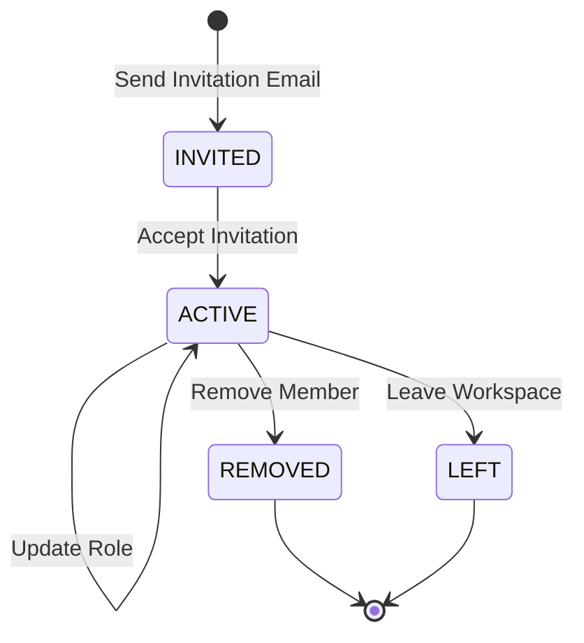

# Workspace Member Lifecycle Design

## Overview

The Workspace Member lifecycle defines the state transitions of a workspace member after an invitation has been accepted.

A workspace member is created only when an invited user accepts the invitation. The member remains active until leaving the workspace or being removed by the workspace owner.

The lifecycle ensures consistent permission management and workspace access.

---

# Lifecycle State Diagram



---

# Member States

## INVITED

The user has received a workspace invitation.

Characteristics

- Invitation email has been sent.
- User has not accepted the invitation.
- Workspace membership does not yet exist.
- Workspace access is denied.

Business Note

This state belongs to the Workspace Invitation, not the WorkspaceMember record.

---

## ACTIVE

The invitation has been accepted and the user has joined the workspace.

Characteristics

- Workspace access granted.
- Permissions determined by role.
- Member can access workspace resources.
- Member may leave the workspace.
- Workspace owner may update the member's role.

---

## REMOVED

The member has been removed from the workspace.

Characteristics

- Membership deleted.
- Workspace access revoked immediately.
- User must receive a new invitation to rejoin.

---

## LEFT

The member voluntarily leaves the workspace.

Characteristics

- Membership deleted.
- Workspace access revoked.
- User may be invited again in the future.

The workspace owner must transfer ownership before leaving.

---

# Lifecycle Events

## Invite Member

```
Request

↓

Validate Workspace

↓

Validate Owner Permission

↓

Validate User

↓

Check Existing Membership

↓

Create Invitation

↓

Send Invitation Email

↓

INVITED
```

Conditions

- Workspace exists.
- User exists.
- User is not already a member.
- No pending invitation exists.
- Requester is the workspace owner.

---

## Accept Invitation

```
INVITED

↓

Validate Invitation

↓

Create Workspace Member

↓

joinedAt = Current Timestamp

↓

ACTIVE
```

The invited user officially becomes a workspace member.

---

## Update Member Role

```
ACTIVE

↓

Update Role

↓

ACTIVE
```

Trigger

Workspace owner updates a member's role.

Effects

- Member permissions change immediately.
- Notification email may be sent.

---

## Remove Member

```
ACTIVE

↓

Delete Membership

↓

Send Removal Email

↓

REMOVED
```

Trigger

Workspace owner removes a member.

Effects

- Membership deleted.
- Workspace access revoked.
- Notification email sent.

Business Rule

The workspace owner cannot remove themselves.

---

## Leave Workspace

```
ACTIVE

↓

Delete Membership

↓

Notify Workspace Owner

↓

LEFT
```

Trigger

Member leaves the workspace.

Effects

- Membership deleted.
- Workspace access revoked.
- Workspace owner receives a notification email.

Business Rule

The workspace owner must transfer ownership before leaving.

---

# Permission Behavior

| State   | Workspace Access |
| ------- | ---------------- |
| INVITED | ❌               |
| ACTIVE  | ✅               |
| REMOVED | ❌               |
| LEFT    | ❌               |

---

# Role Behavior

Current supported roles

```
OWNER

MEMBER
```

Permissions

| Action          | OWNER | MEMBER |
| --------------- | :---: | :----: |
| View Members    |  ✅   |   ✅   |
| Invite Members  |  ✅   |   ❌   |
| Update Roles    |  ✅   |   ❌   |
| Remove Members  |  ✅   |   ❌   |
| Leave Workspace |  ❌*  |   ✅   |

\* The workspace owner must transfer ownership before leaving.

---

# Membership Strategy

Membership is represented by a single WorkspaceMember record.

```
Workspace

↓

WorkspaceMember

↓

User
```

Business Rules

- A workspace can contain multiple members.
- A user can belong to multiple workspaces.
- A user cannot join the same workspace more than once.

---

# Delete Strategy

Removing or leaving a workspace permanently deletes the membership record.

Benefits

- Simple authorization checks.
- No inactive memberships.
- Prevent duplicate memberships.
- Lightweight membership table.

---

# Lifecycle Summary

| State   | Workspace Access | Membership Exists |
| ------- | ---------------- | ----------------- |
| INVITED | ❌               | ❌                |
| ACTIVE  | ✅               | ✅                |
| REMOVED | ❌               | ❌                |
| LEFT    | ❌               | ❌                |

---

# Future Enhancements

Possible future lifecycle extensions include

- Invitation Expiration
- Reject Invitation
- Resend Invitation
- Cancel Invitation
- Transfer Ownership
- Workspace Admin Role
- Role-Based Access Control (RBAC)
- Audit Logs
- Member Suspension
