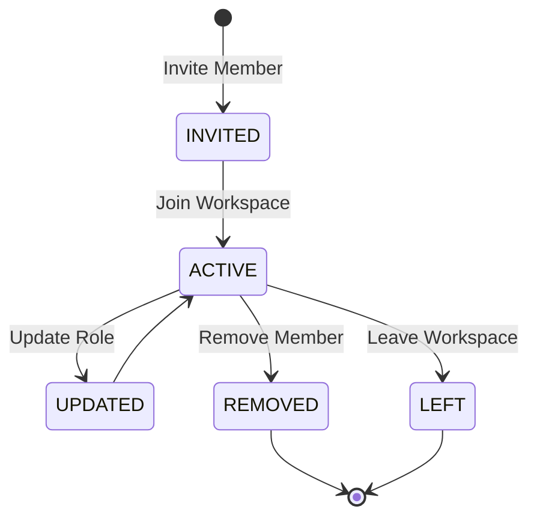

# Workspace Member Lifecycle Design

## Overview

The Workspace Member lifecycle defines the state transitions of a member within a workspace.

A member is created when they join a workspace and remains active until they leave the workspace or are removed by the workspace owner.

The lifecycle ensures consistent permission management and workspace access.

---

# Lifecycle State Diagram



---

# Member States

## INVITED

The member has been invited to join the workspace.

Characteristics

- Invitation exists.
- User has not joined yet.
- No workspace access.
- Invitation may expire in future versions.

> **Note**
>
> With the current implementation, `INVITED` is represented by:
>
> ```
> invitedAt != null
> joinedAt == null
> ```
>
> No additional status field is required.

---

## ACTIVE

The member has successfully joined the workspace.

Characteristics

- Workspace access granted.
- Permissions determined by role.
- Can access workspace resources.
- Can leave the workspace.

---

## UPDATED

The member's role has changed.

Typical changes

```
MEMBER

↓

OWNER
```

or

```
OWNER

↓

MEMBER
```

After the update completes successfully, the member returns to the ACTIVE state.

---

## REMOVED

The member has been removed from the workspace.

Characteristics

- Workspace access revoked.
- Membership record deleted.
- User can no longer access workspace resources.

---

## LEFT

The member voluntarily leaves the workspace.

Characteristics

- Workspace access revoked.
- Membership record deleted.

The workspace owner cannot leave without first transferring ownership.

---

# Lifecycle Events

## Invite Member

```
Request

↓

Validate Workspace

↓

Validate Owner Permission

↓

Validate User

↓

Check Existing Membership

↓

Create Membership

↓

INVITED
```

Conditions

- Workspace exists.
- User exists.
- User is not already a member.
- Requester is the workspace owner.

---

## Join Workspace

```
INVITED

↓

ACTIVE
```

Changes

```
joinedAt = Current Timestamp
```

The invited user becomes an active workspace member.

---

## Update Member Role

```
ACTIVE

↓

UPDATED

↓

ACTIVE
```

Trigger

Workspace owner updates a member's role.

Conditions

- Target member exists.
- New role is valid.
- Owner permissions verified.

---

## Remove Member

```
ACTIVE

↓

REMOVED
```

Trigger

Workspace owner removes a member.

Effects

- Membership deleted.
- Workspace access revoked immediately.

The workspace owner cannot remove themselves.

---

## Leave Workspace

```
ACTIVE

↓

LEFT
```

Trigger

Member chooses to leave the workspace.

Effects

- Membership deleted.
- Workspace access revoked.

Business Rule

The workspace owner must transfer ownership before leaving.

---

# Permission Behavior

| State | Workspace Access |
|---------|------------------|
| INVITED | ❌ |
| ACTIVE | ✅ |
| UPDATED | ✅ |
| REMOVED | ❌ |
| LEFT | ❌ |

---

# Role Behavior

Current supported roles

```
OWNER

MEMBER
```

Permissions

| Action | OWNER | MEMBER |
|---------|:-----:|:------:|
| View Members | ✅ | ✅ |
| Invite Member | ✅ | ❌ |
| Update Roles | ✅ | ❌ |
| Remove Members | ✅ | ❌ |
| Leave Workspace | ❌* | ✅ |

\* The owner must transfer ownership before leaving.

---

# Membership Strategy

Membership is represented by a single record.

```
Workspace

↓

WorkspaceMember

↓

User
```

A user may belong to multiple workspaces.

A workspace may contain multiple users.

A user cannot have multiple memberships within the same workspace.

---

# Delete Strategy

Removing or leaving a workspace deletes the membership record.

Benefits

- Simpler permission checks.
- No inactive memberships.
- Prevent duplicate memberships.
- Keeps the membership table lightweight.

---

# Lifecycle Summary

| State | Workspace Access | Editable | Exists |
|---------|------------------|----------|--------|
| INVITED | ❌ | ❌ | ✅ |
| ACTIVE | ✅ | ✅ | ✅ |
| UPDATED | ✅ | ✅ | ✅ |
| REMOVED | ❌ | ❌ | ❌ |
| LEFT | ❌ | ❌ | ❌ |

---

# Future Enhancements

Possible future lifecycle extensions include

- Invitation Expiration
- Pending Invitation
- Reject Invitation
- Suspend Member
- Temporary Access
- Transfer Ownership
- Workspace Admin Role
- Audit Logs