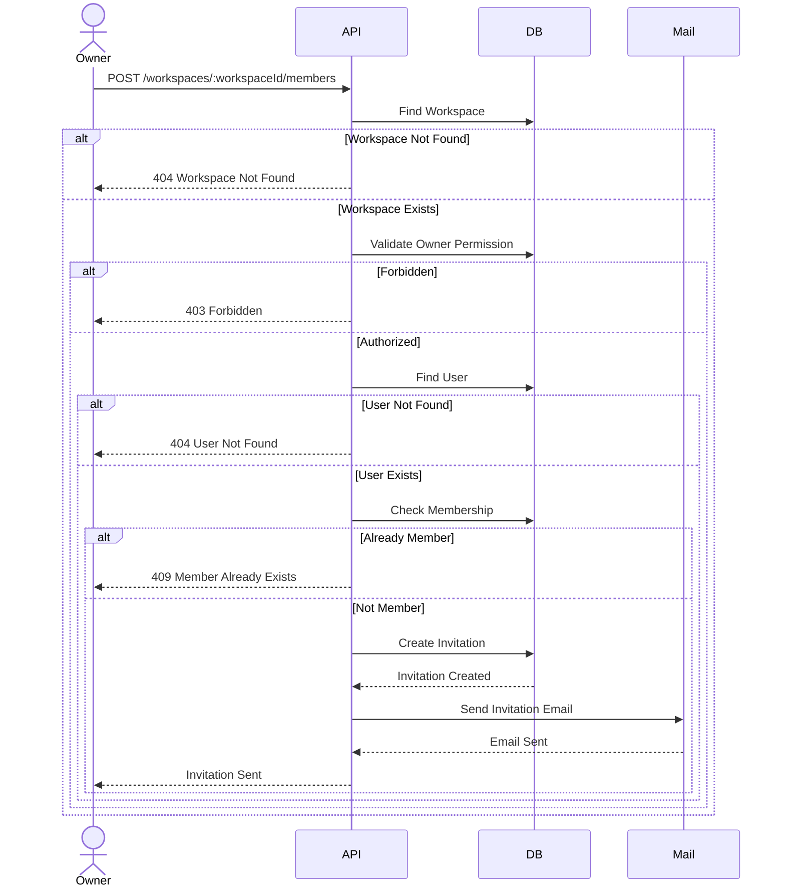
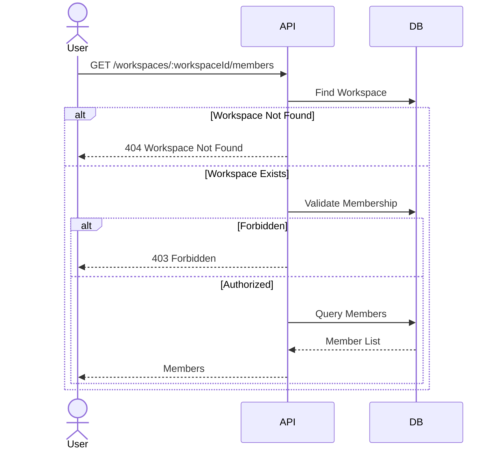
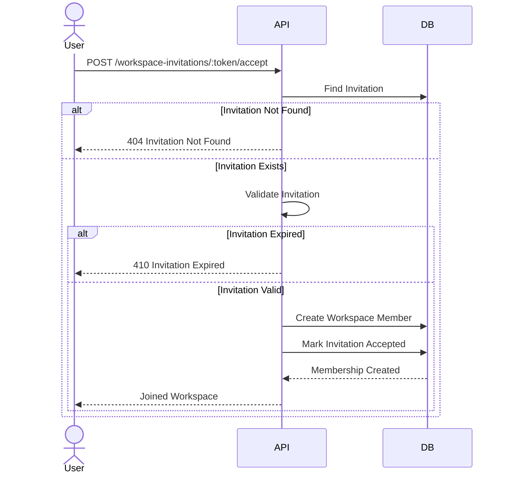
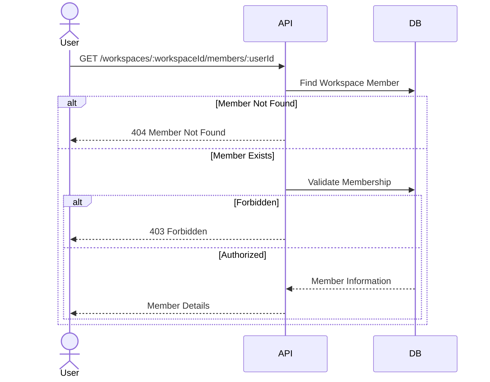
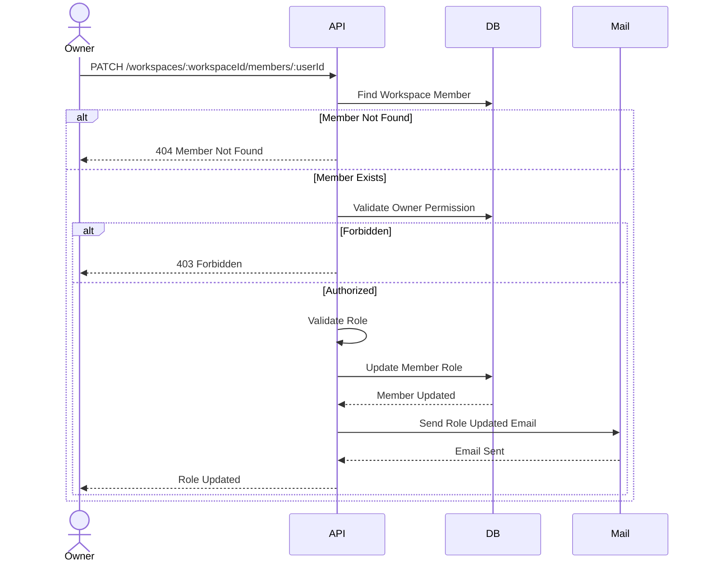
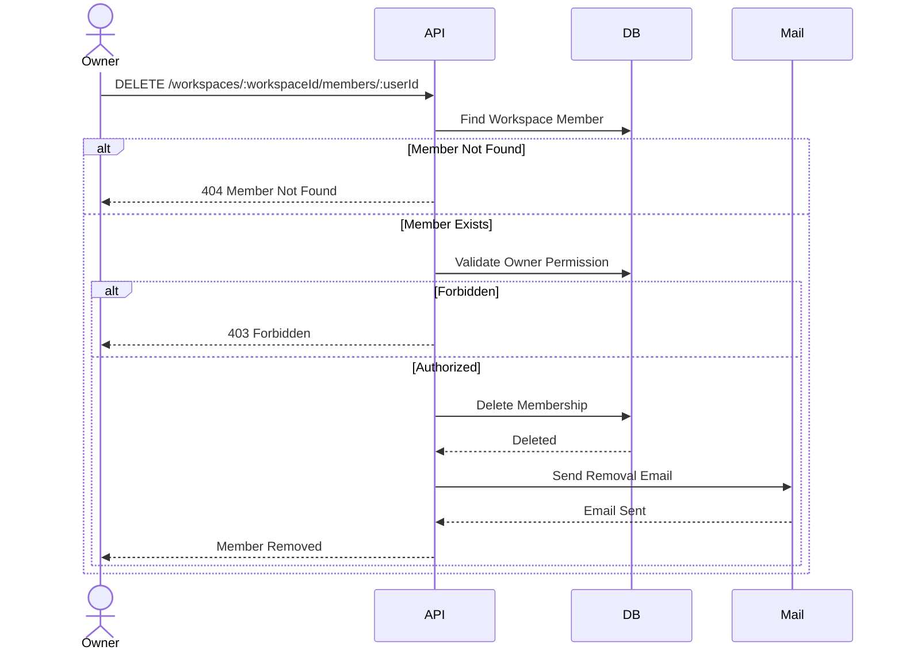
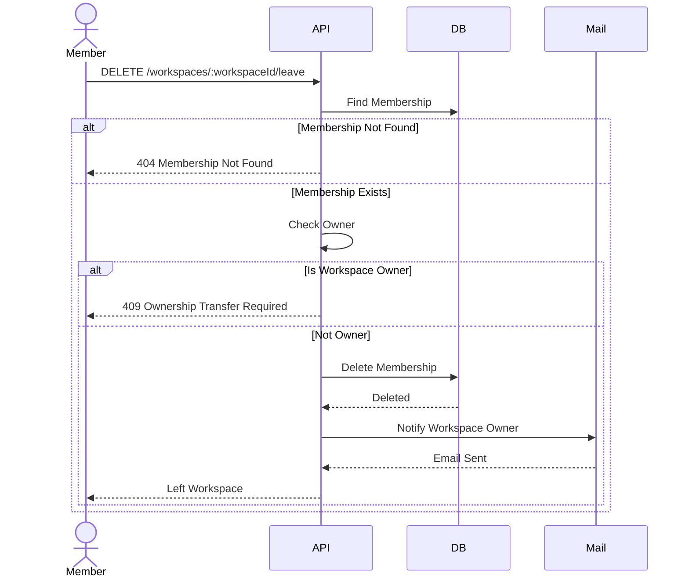

# Workspace Member Sequence Design

## Overview

This document describes the interaction flow between clients, backend services, the database, and the mail service for the Workspace Member module.

The sequence diagrams illustrate how membership requests are processed from start to finish.

---

# Invite Member

## Description

Invites an existing user to join a workspace.

Only the workspace owner can invite new members.

The invited user receives an invitation email and becomes a workspace member only after accepting the invitation.

### Sequence Diagram

---

# List Members

## Description

Returns all members in a workspace.

### Sequence Diagram

---

# Accept Invitation

## Description

Accepts a workspace invitation.

The invitation is validated before creating the workspace membership.

### Sequence Diagram

---

# Get Member Details

## Description

Returns detailed information about a workspace member.

### Sequence Diagram

---

# Update Member Role

## Description

Updates a member's role.

Only the workspace owner can update member roles.

The member is notified via email after the role has been updated.

### Sequence Diagram

---

# Remove Member

## Description

Removes a member from a workspace.

Only the workspace owner can remove members.

The removed member receives a notification email.

### Sequence Diagram

---

# Leave Workspace

## Description

Allows a member to leave a workspace.

The workspace owner is notified by email after the member leaves.

### Sequence Diagram

---

# Sequence Summary

| Feature | Main Components |
|----------|-----------------|
| Invite Member | API → Database → Mail |
| List Members | API → Database |
| Accept Invitation | API → Database |
| Get Member Details | API → Database |
| Update Member Role | API → Database → Mail |
| Remove Member | API → Database → Mail |
| Leave Workspace | API → Database → Mail |