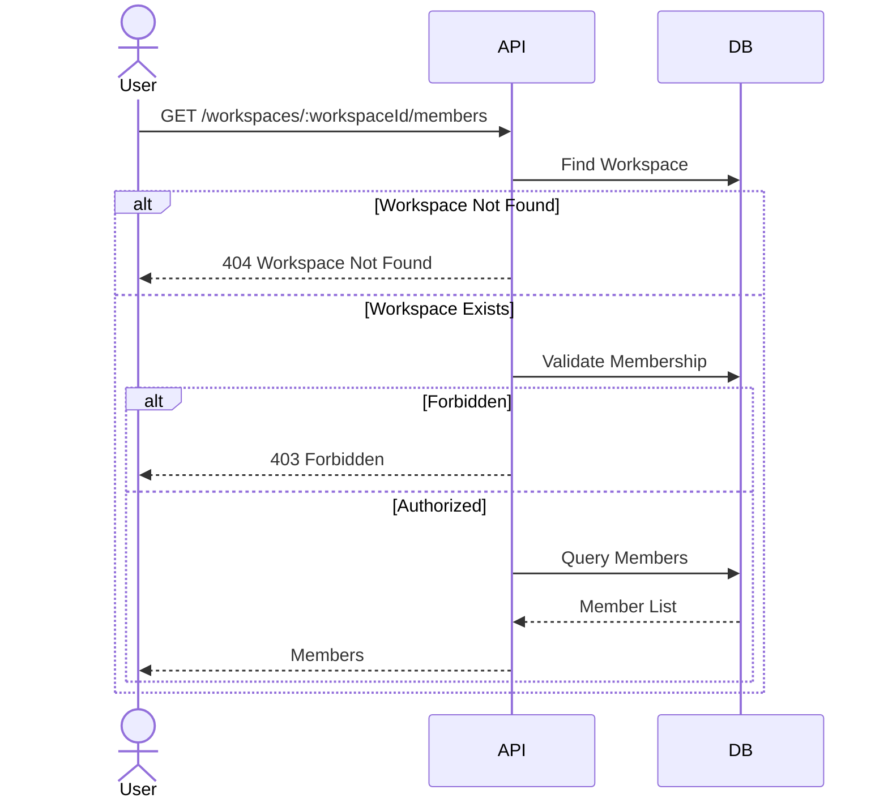
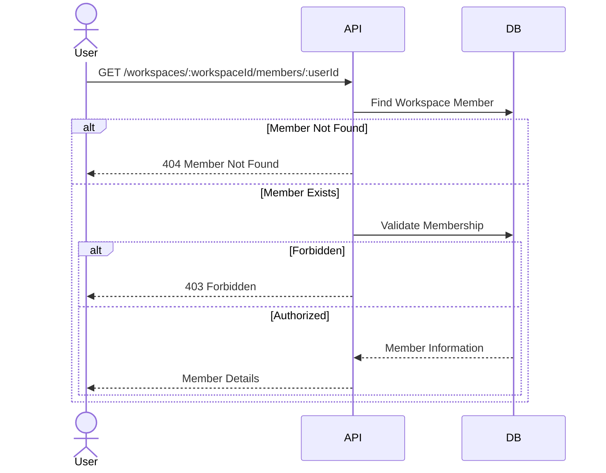
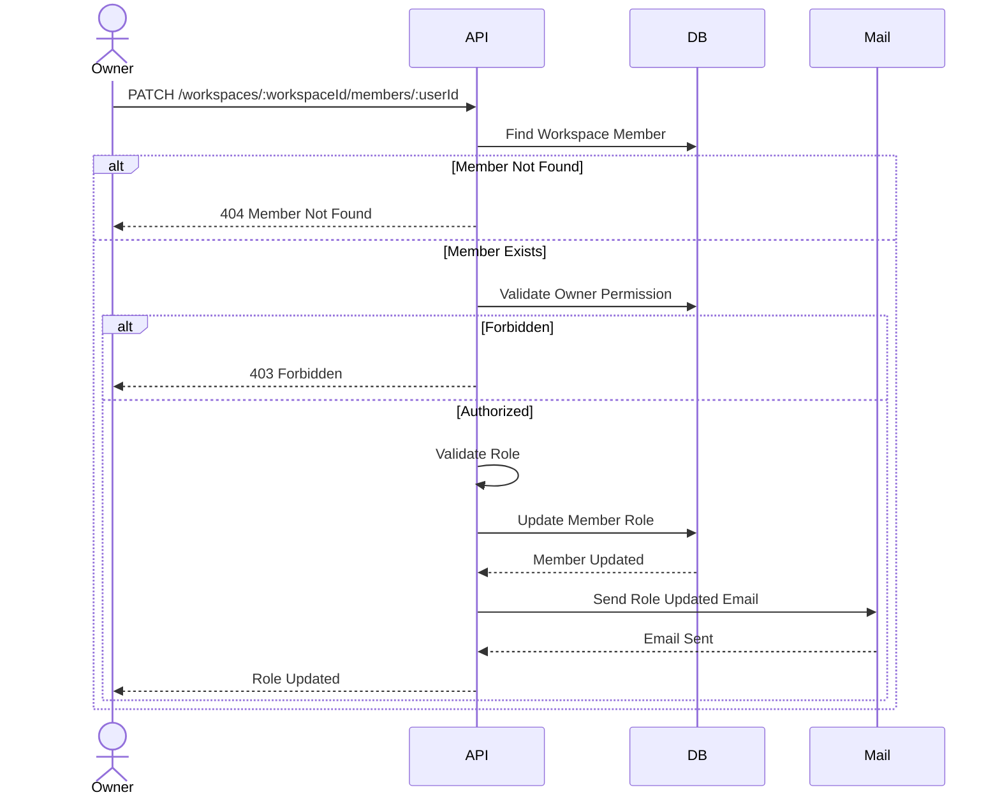
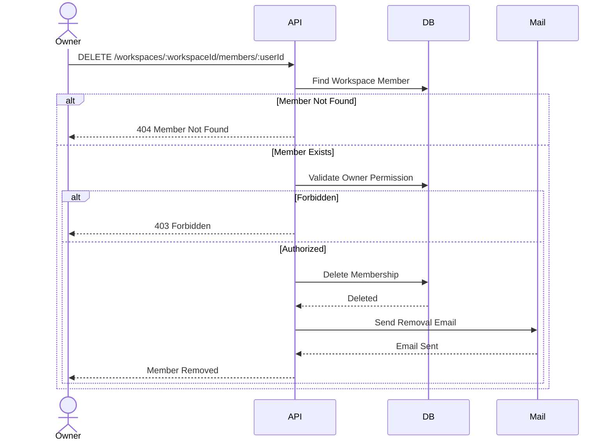
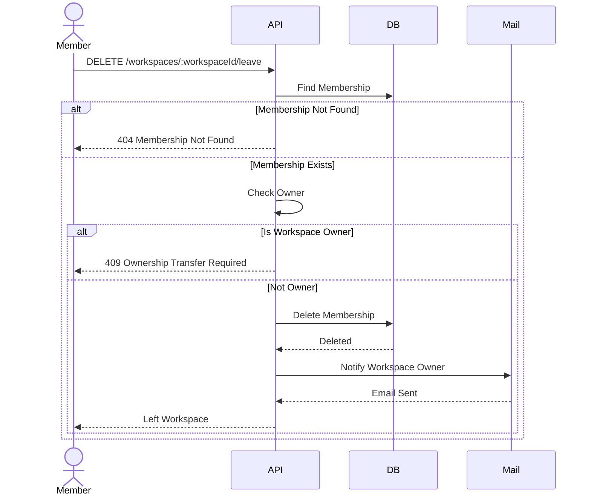
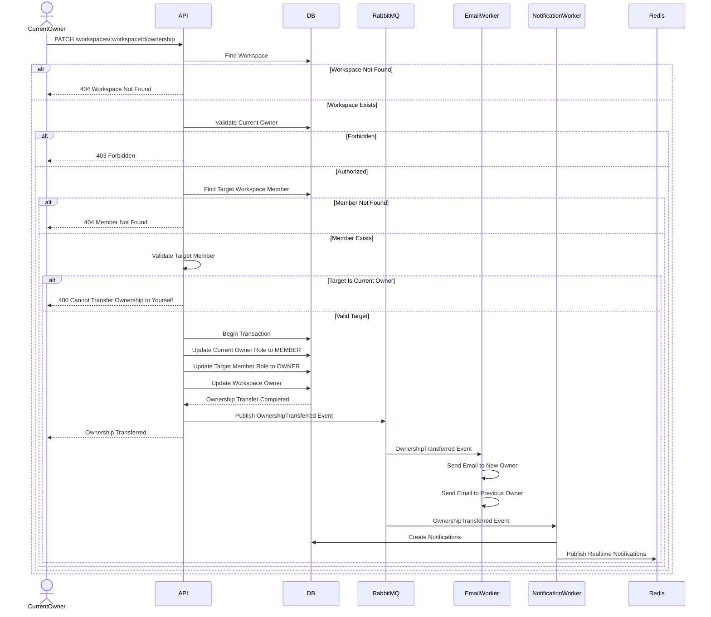

# Workspace Member Sequence Design

## Overview

This document describes the interaction flow between clients, backend services, the database, and the mail service for the Workspace Member module.

The sequence diagrams illustrate how membership requests are processed from start to finish.

---

# List Members

## Description

Returns all members in a workspace.

### Sequence Diagram

---

# Get Member Details

## Description

Returns detailed information about a workspace member.

### Sequence Diagram

---

# Update Member Role

## Description

Updates a member's role.

Only the workspace owner can update member roles.

The member is notified via email after the role has been updated.

### Sequence Diagram

---

# Remove Member

## Description

Removes a member from a workspace.

Only the workspace owner can remove members.

The removed member receives a notification email.

### Sequence Diagram

---

# Leave Workspace

## Description

Allows a member to leave a workspace.

The workspace owner is notified by email after the member leaves.

### Sequence Diagram

---

# Transfer Workspace Ownership
## Description

Transfers workspace ownership from the current workspace owner to another existing workspace member.

Only the current workspace owner can transfer ownership.

After the transfer:

The current owner becomes a MEMBER.
The selected member becomes the new OWNER.
The workspace always has exactly one owner.
Both users receive email notifications.
### Sequence Diagram

---

# Sequence Summary

| Feature | Main Components |
|----------|-----------------|
| List Members | API → Database |
| Get Member Details | API → Database |
| Update Member Role | API → Database → Mail |
| Remove Member | API → Database → Mail |
| Leave Workspace | API → Database → Mail |
| Transfer Workspace Ownership | API → Database → Mail → Notification|
