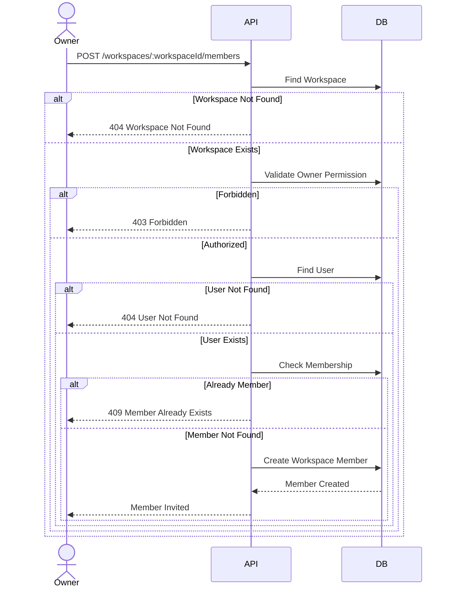
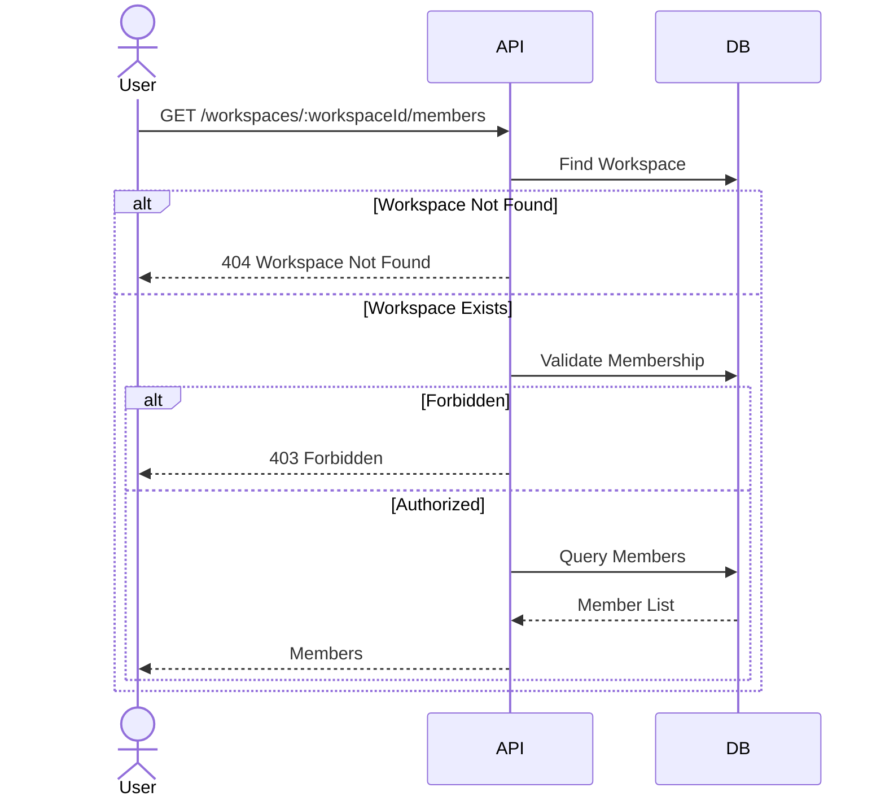
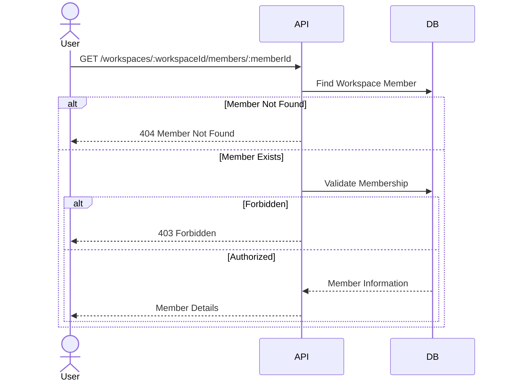
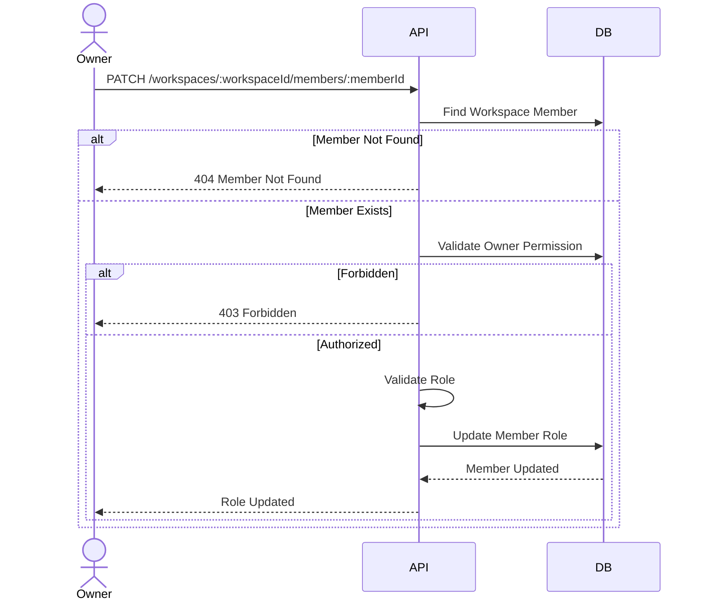
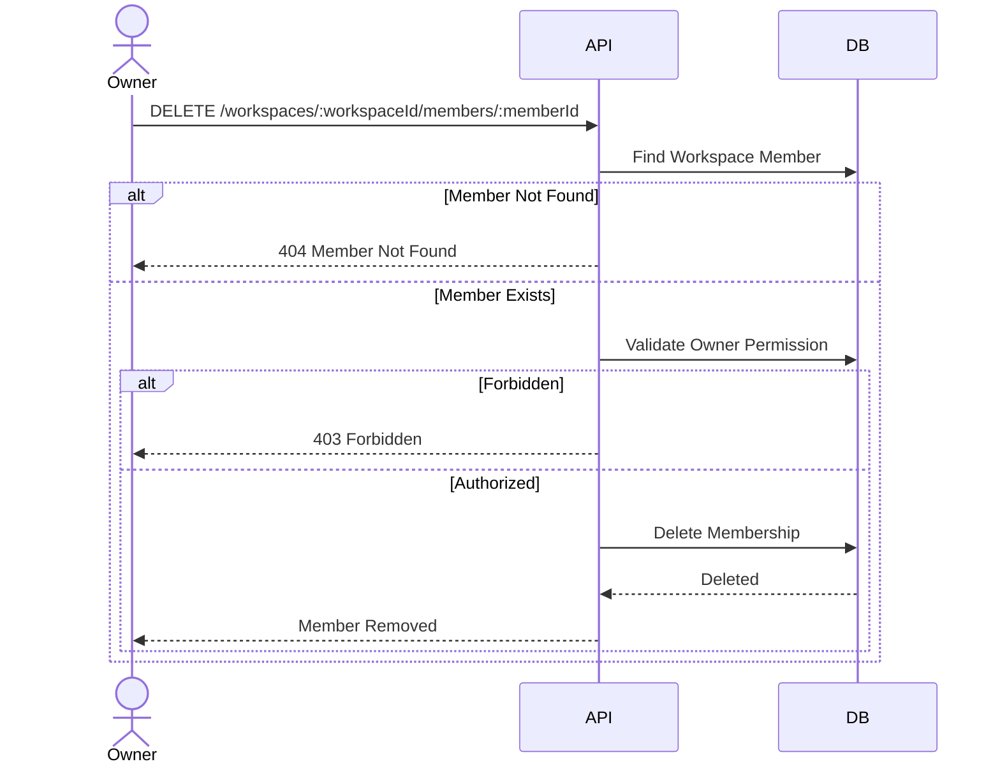
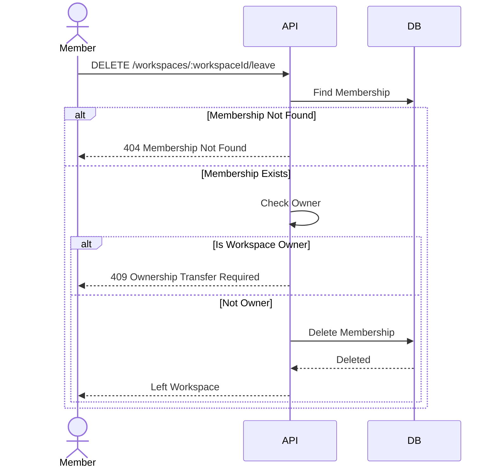

# Workspace Member Sequence Design

## Overview

This document describes the interaction flow between clients, backend services, and the database for the Workspace Member module.

The sequence diagrams illustrate how membership requests are processed from start to finish.

---

# Invite Member

## Description

Invites an existing user to join a workspace.

Only the workspace owner can invite new members.

### Sequence Diagram

---

# List Members

## Description

Returns all members in a workspace.

### Sequence Diagram

---

# Get Member Details

## Description

Returns detailed information about a workspace member.

### Sequence Diagram

---

# Update Member Role

## Description

Updates a member's role.

Only the workspace owner can update member roles.

### Sequence Diagram

---

# Remove Member

## Description

Removes a member from a workspace.

Only the workspace owner can remove members.

### Sequence Diagram

---

# Leave Workspace

## Description

Allows a member to leave a workspace.

### Sequence Diagram

---

# Sequence Summary

| Feature | Main Components |
|----------|-----------------|
| Invite Member | API → Database |
| List Members | API → Database |
| Get Member Details | API → Database |
| Update Member Role | API → Database |
| Remove Member | API → Database |
| Leave Workspace | API → Database |