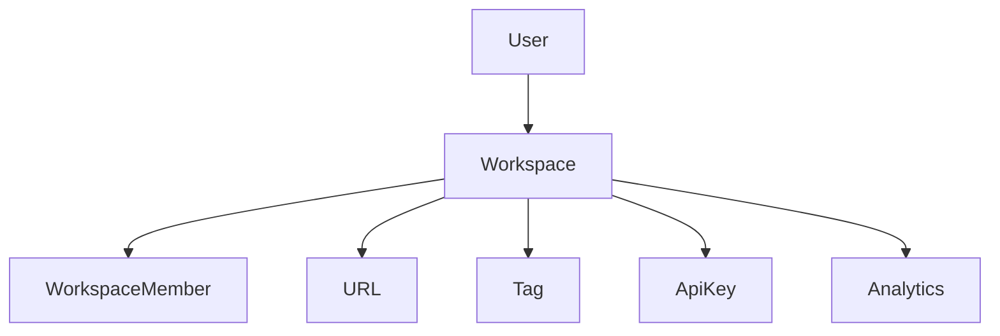
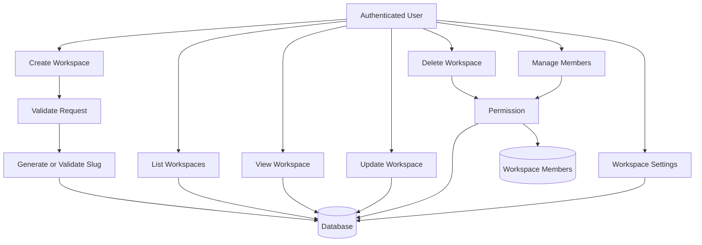
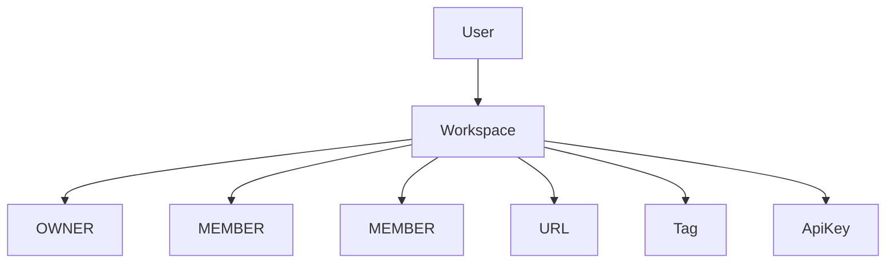

# Workspace Module Design

## Overview

The Workspace module is the foundation of LinkFlow's multi-tenant architecture.

A workspace represents an organization, team, or personal environment where users collaborate and manage resources.

Every business resource in LinkFlow belongs to exactly one workspace, including URLs, Tags, API Keys, Analytics, and future Billing data.

Each workspace has one owner and can contain multiple members with different roles.

Supported features:

- Create Workspace
- List Workspaces
- Get Workspace Details
- Update Workspace
- Delete Workspace
- Manage Workspace Members
- Manage Workspace Settings

All endpoints require authentication.

---

# Module Architecture



---

# Workspace Flow

## Workspace Management Flow



---

# Workspace Ownership



Business Rules:

- A user can own multiple workspaces.
- A user can join multiple workspaces.
- A workspace has exactly one owner.
- A workspace can contain multiple members.
- Every workspace owns its resources.
- Members can only access resources within workspaces they belong to.

---

# Workspace Structure

Each workspace consists of:

```
Workspace

├── Members
├── URLs
├── Tags
├── API Keys
└── Analytics
```

---

# Workspace Features

## Workspace Creation

Users can create their own workspace.

During creation:

```
Create Workspace

↓

Create OWNER Member

↓

Ready to use
```

The creator automatically becomes the workspace owner.

---

## Workspace Members

Each workspace supports multiple members.

Current roles:

```
OWNER

MEMBER
```

Future roles:

```
ADMIN

EDITOR

VIEWER
```

---

## Workspace Settings

Workspace settings include:

- Workspace Name
- Workspace Slug
- Workspace Logo

Additional settings may be added in future releases.

---

## Workspace Isolation

All workspace data is isolated.

Example

```
Workspace A

├── URL A
├── URL B
└── Members


Workspace B

├── URL C
└── Members
```

Members of one workspace cannot access another workspace unless they belong to it.

---

# Workspace Validation

The following validations are performed during workspace creation.

## Name

Requirements

- Required
- 3–50 characters

---

## Slug

Requirements

- Unique
- Lowercase
- Supports

```
a-z

0-9

-
```

Examples

```
marketing

company

engineering-team
```

Reserved slugs cannot be used.

Examples

```
admin

api

login

system

root
```

---

# Workspace Information

| Field | Description |
|---------|-----------------------------|
| id | Workspace identifier |
| ownerId | Workspace owner |
| name | Workspace name |
| slug | Unique workspace slug |
| logoUrl | Workspace logo |
| createdAt | Creation timestamp |
| updatedAt | Last updated |

---

# Security

- JWT Authentication
- Workspace ownership validation
- Workspace membership validation
- Slug uniqueness validation
- Input sanitization
- Role-based authorization

---

# Future Enhancements

Possible future improvements include:

- Workspace Invitation
- Role-Based Access Control (RBAC)
- Workspace Audit Logs
- Workspace Settings
- Billing & Subscription
- Custom Domains
- Organization Support
- SSO Integration

---

# Module Summary

| Feature | Authentication Required |
|-------------------------|-------------------------|
| Create Workspace | ✅ |
| List Workspaces | ✅ |
| Get Workspace Details | ✅ |
| Update Workspace | ✅ |
| Delete Workspace | ✅ |
| Manage Members | ✅ |
| Workspace Settings | ✅ |