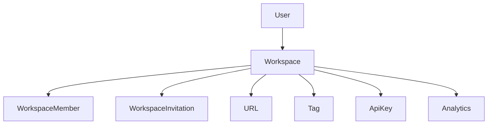
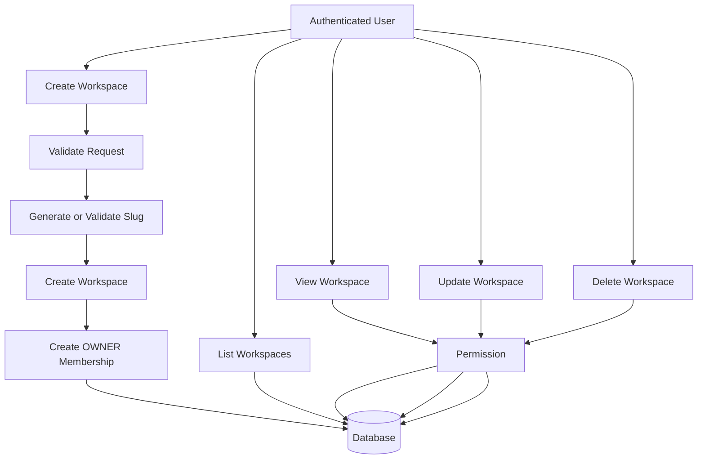
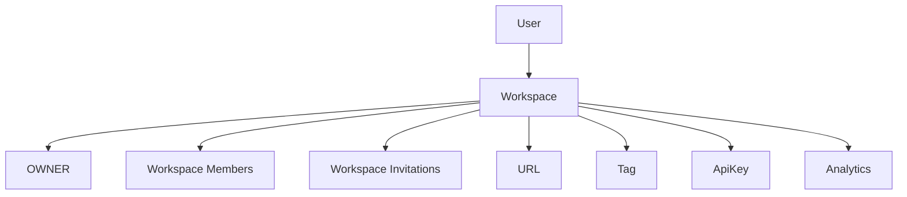

# Workspace Module Design

## Overview

The Workspace module is the foundation of LinkFlow's multi-tenant architecture.

A workspace represents an organization, team, or personal environment where users collaborate and manage resources.

Every business resource in LinkFlow belongs to exactly one workspace, including URLs, Tags, API Keys, Analytics, and future Billing resources.

Each workspace has exactly one owner and may contain multiple members.

Workspace membership and invitation management are handled by dedicated modules.

Supported features:

- Create Workspace
- List Workspaces
- Get Workspace Details
- Update Workspace
- Delete Workspace

All endpoints require authentication.

---

# Module Architecture



---

# Workspace Flow

## Workspace Management Flow



---

# Workspace Ownership



Business Rules

- A user can own multiple workspaces.
- A user can join multiple workspaces.
- A workspace has exactly one owner.
- A workspace can contain multiple active members.
- A workspace can have multiple pending invitations.
- Every resource belongs to exactly one workspace.
- Members may only access resources within workspaces they belong to.

---

# Workspace Structure

Each workspace serves as the root container for all business resources.

```
Workspace

├── Members
├── Invitations
├── URLs
├── Tags
├── API Keys
└── Analytics
```

---

# Workspace Features

## Workspace Creation

Authenticated users can create new workspaces.

During creation

```
Create Workspace

↓

Create OWNER Membership

↓

Workspace Ready
```

The creator automatically becomes

- Workspace Owner
- First Workspace Member

---

## Workspace Ownership

Each workspace has exactly one owner.

The owner is responsible for

- Updating workspace information
- Deleting the workspace
- Managing members
- Managing invitations

Ownership is stored using

```
Workspace.ownerId
```

---

## Workspace Resources

Each workspace owns all business resources.

Examples

- Members
- Invitations
- URLs
- Tags
- API Keys
- Analytics

All resources are isolated between workspaces.

---

## Workspace Settings

Workspace settings include

- Workspace Name
- Workspace Slug
- Workspace Logo

Additional settings may be introduced in future releases.

---

## Workspace Isolation

All data is isolated by workspace.

Example

```
Workspace A

├── Members
├── URLs
├── Tags


Workspace B

├── Members
├── URLs
├── Tags
```

Members of one workspace cannot access resources belonging to another workspace.

---

# Workspace Validation

The following validations are performed during workspace creation.

## Workspace Name

Requirements

- Required
- 3–50 characters

---

## Workspace Slug

Requirements

- Required
- Globally unique
- Lowercase only

Supported characters

```
a-z

0-9

-
```

Examples

```
marketing

engineering

company-team
```

Reserved slugs cannot be used.

Examples

```
admin

api

login

system

root
```

---

# Workspace Information

| Field | Description |
|---------|-----------------------------|
| id | Workspace identifier |
| ownerId | Workspace owner |
| name | Workspace name |
| slug | Unique workspace slug |
| logoUrl | Workspace logo |
| createdAt | Creation timestamp |
| updatedAt | Last updated |

---

# Security

- JWT Authentication
- Workspace ownership validation
- Workspace membership validation
- Slug uniqueness validation
- Input sanitization
- Role-based authorization

---

# Future Enhancements

Possible future improvements include

- Workspace Audit Logs
- Role-Based Access Control (RBAC)
- Billing & Subscription
- Workspace Settings
- Custom Domains
- Organization Policies
- SSO Integration

---

# Module Summary

| Feature | Authentication Required |
|-------------------------|-------------------------|
| Create Workspace | ✅ |
| List Workspaces | ✅ |
| Get Workspace Details | ✅ |
| Update Workspace | ✅ |
| Delete Workspace | ✅ |