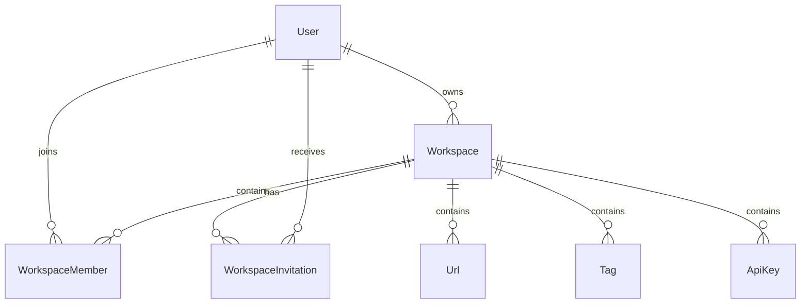

# Workspace Database Design

## Overview

The Workspace module is the tenant boundary of LinkFlow.

A workspace groups users and all business resources into an isolated environment. Every URL, Tag, API Key, Invitation, and future resources belong to exactly one workspace.

Each workspace has exactly one owner and may contain multiple members. Collaboration is managed through the WorkspaceMember table, while invitations are handled separately by the WorkspaceInvitation table.

---

# Entity Relationship Diagram



---

# Relationship Overview

## User → Workspace

Relationship

```
One-to-Many
```

A user can own multiple workspaces.

Each workspace has exactly one owner.

Purpose

- Workspace ownership
- Administration
- Billing
- Organization management

---

## User → WorkspaceMember

Relationship

```
One-to-Many
```

A user can belong to multiple workspaces.

Membership determines which workspaces the user can access.

Each membership belongs to exactly one workspace.

---

## Workspace → WorkspaceMember

Relationship

```
One-to-Many
```

A workspace may contain multiple members.

Each member has a single role.

Current roles

```
OWNER

MEMBER
```

WorkspaceMember only stores users that have accepted the invitation and joined the workspace.

---

## Workspace → WorkspaceInvitation

Relationship

```
One-to-Many
```

A workspace may create multiple invitations.

Each invitation belongs to exactly one workspace.

Invitations exist independently from memberships.

Purpose

- Email invitation
- Invitation acceptance
- Invitation tracking
- Invitation expiration

---

## User → WorkspaceInvitation

Relationship

```
One-to-Many
(Optional)
```

If the invited email already belongs to a registered user, the invitation references that user.

Otherwise the invitation is linked only by email.

This supports both scenarios:

- Existing user
- User not yet registered

---

## Workspace → URL

Relationship

```
One-to-Many
```

Each workspace manages multiple shortened URLs.

Every URL belongs to exactly one workspace.

---

## Workspace → Tag

Relationship

```
One-to-Many
```

Tags are isolated inside a workspace.

Tag names are unique only within the same workspace.

---

## Workspace → API Key

Relationship

```
One-to-Many
```

API Keys belong to a workspace.

They authenticate external applications.

---

# Database Tables

## Workspace

Purpose

Stores workspace information.

Primary Key

```
id
```

Important Fields

- ownerId
- name
- slug
- logoUrl

Relations

- Owner
- Members
- Invitations
- URLs
- Tags
- API Keys

---

## WorkspaceMember

Purpose

Stores active workspace members.

Primary Key

```
id
```

Important Fields

- workspaceId
- userId
- role
- joinedAt

Relations

- Workspace
- User

Unique Constraint

```
(workspaceId, userId)
```

Only users who have joined the workspace are stored here.

---

## WorkspaceInvitation

Purpose

Stores pending and accepted workspace invitations.

Primary Key

```
id
```

Important Fields

- workspaceId
- invitedBy
- userId (nullable)
- email
- role
- token
- status
- expiresAt
- acceptedAt

Relations

- Workspace
- Inviter
- User (optional)

Status

```
PENDING

ACCEPTED

DECLINED

EXPIRED

CANCELLED
```

---

# Invitation Strategy

Invitations are stored separately from memberships.

```
Workspace

↓

WorkspaceInvitation

↓

Accept Invitation

↓

WorkspaceMember
```

Benefits

- Invite users without accounts
- Track invitation history
- Support email verification
- Prevent duplicate invitations
- Allow invitation expiration

---

# Foreign Key Strategy

| Child Table | Parent Table | Delete Strategy |
|-------------|--------------|-----------------|
| Workspace | User | Cascade |
| WorkspaceMember | Workspace | Cascade |
| WorkspaceMember | User | Cascade |
| WorkspaceInvitation | Workspace | Cascade |
| WorkspaceInvitation | User | Set Null |
| URL | Workspace | Cascade |
| Tag | Workspace | Cascade |
| ApiKey | Workspace | Cascade |

Deleting a workspace automatically removes all members, invitations, and related resources.

---

# Constraint Strategy

## Workspace

Unique Constraint

```
slug
```

Each workspace slug must be globally unique.

---

## WorkspaceMember

Composite Unique Constraint

```
(workspaceId, userId)
```

Prevents duplicate memberships.

---

## WorkspaceInvitation

Recommended Constraints

```
token
```

Unique

```
(workspaceId, email)
```

Unique only while the invitation is pending.

This prevents sending multiple active invitations to the same email.

---

# Index Strategy

## Workspace

Indexes

- ownerId
- slug

Purpose

- Fast owner lookup
- Fast workspace lookup

---

## WorkspaceMember

Indexes

- workspaceId
- userId

Purpose

- Member listing
- Permission validation
- Workspace lookup

---

## WorkspaceInvitation

Indexes

- workspaceId
- email
- token
- status
- expiresAt

Purpose

- Invitation lookup
- Accept invitation
- Expired invitation cleanup
- Notification queries

---

# Workspace Isolation

Every business resource belongs to exactly one workspace.

```
Workspace A

├── Members
├── Invitations
├── URLs
├── Tags
└── API Keys


Workspace B

├── Members
├── Invitations
├── URLs
├── Tags
└── API Keys
```

Users can only access workspaces where they are active members.

Pending invitations do not grant workspace access.

---

# Ownership Strategy

Workspace ownership is stored independently.

```
Workspace

↓

ownerId

↓

User
```

The owner is also inserted into WorkspaceMember during workspace creation.

Ownership determines administrative authority, while authorization is performed through WorkspaceMember roles.

---

# Design Decisions

## Multi-Tenant Architecture

Workspace is the tenant boundary.

Benefits

- Resource isolation
- Team collaboration
- Enterprise scalability
- Future billing support

---

## Membership-Based Authorization

Permissions are determined through WorkspaceMember.

Benefits

- Fast authorization
- Flexible RBAC
- Consistent permission checks

---

## Invitation-Based Onboarding

WorkspaceInvitation manages the invitation lifecycle.

Benefits

- Invite by email
- Invite existing users
- Email verification
- Notification support
- Invitation history
- Invitation expiration

---

## Separate Membership and Invitation

WorkspaceMember stores active users.

WorkspaceInvitation stores pending invitations.

Benefits

- Cleaner data model
- Simpler authorization
- Easier invitation management
- Better auditability

---

# Summary

The Workspace database design establishes the tenant architecture for LinkFlow. Workspaces isolate business resources, WorkspaceMember manages active collaboration, and WorkspaceInvitation handles the complete invitation lifecycle for both existing and new users. Together they provide a scalable foundation for secure collaboration, permission management, and future enterprise features such as RBAC, billing, organizations, and audit logging.