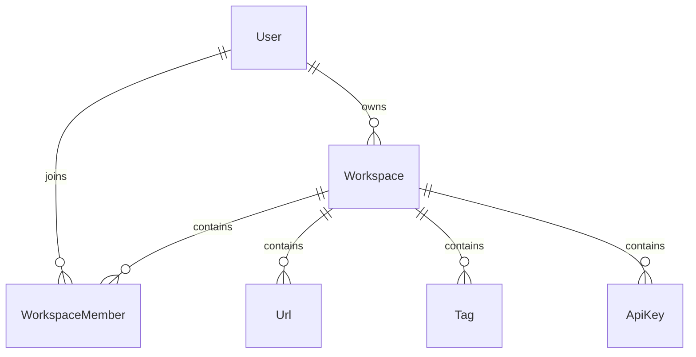

# Workspace Database Design

## Overview

The Workspace module is the foundation of LinkFlow's multi-tenant architecture.

It provides logical isolation between organizations, teams, and users by grouping business resources into independent workspaces.

Each workspace has exactly one owner and can contain multiple members. Every business resource, including URLs, Tags, and API Keys, belongs to a workspace.

---

# Entity Relationship Diagram



---

# Relationship Overview

## User → Workspace

Relationship

```
One-to-Many
```

A user can own multiple workspaces.

Each workspace has exactly one owner.

Purpose

- Ownership
- Billing
- Administration

---

## User → WorkspaceMember

Relationship

```
One-to-Many
```

A user may belong to multiple workspaces.

Membership determines which workspaces the user can access.

---

## Workspace → WorkspaceMember

Relationship

```
One-to-Many
```

A workspace may contain multiple members.

Each member has a role that defines their permissions.

Current roles

```
OWNER

MEMBER
```

---

## Workspace → URL

Relationship

```
One-to-Many
```

A workspace can contain multiple shortened URLs.

Every URL belongs to exactly one workspace.

---

## Workspace → Tag

Relationship

```
One-to-Many
```

Tags are isolated within a workspace.

Tag names are unique only inside the same workspace.

---

## Workspace → API Key

Relationship

```
One-to-Many
```

API Keys belong to a workspace.

They are used to authenticate external integrations.

---

# Database Tables

## Workspace

Purpose

Stores workspace information.

Primary Key

```
id
```

Important Fields

- ownerId
- name
- slug
- logoUrl

Relations

- Owner
- Members
- URLs
- Tags
- API Keys

---

## WorkspaceMember

Purpose

Stores workspace membership.

Primary Key

```
id
```

Important Fields

- workspaceId
- userId
- role
- invitedAt
- joinedAt

Relations

- Workspace
- User

Unique Constraint

```
(workspaceId, userId)
```

This prevents duplicate memberships.

---

# Foreign Key Strategy

| Child Table | Parent Table | Delete Strategy |
|-------------|--------------|-----------------|
| Workspace | User | Cascade |
| WorkspaceMember | Workspace | Cascade |
| WorkspaceMember | User | Cascade |
| URL | Workspace | Cascade |
| Tag | Workspace | Cascade |
| ApiKey | Workspace | Cascade |

Deleting a workspace automatically removes all dependent resources.

---

# Index Strategy

## Workspace

Indexes

- ownerId
- slug

Purpose

- Fast owner lookup
- Fast workspace lookup by slug

---

## WorkspaceMember

Indexes

- workspaceId
- userId

Purpose

- Fast member listing
- Fast workspace lookup for a user
- Permission validation

---

# Constraint Strategy

## Workspace

Unique Constraint

```
slug
```

Each workspace slug must be globally unique.

Examples

```
marketing

engineering

my-company
```

---

## WorkspaceMember

Composite Unique Constraint

```
(workspaceId, userId)
```

Ensures that a user cannot join the same workspace more than once.

---

# Cascade Delete Strategy

Workspace is the root aggregate of tenant data.

```
Workspace

├── Workspace Members

├── URLs

├── Tags

└── API Keys
```

Deleting a workspace automatically deletes all owned resources through foreign key cascade.

Benefits

- No orphan records
- Consistent data
- Simpler cleanup
- Referential integrity

---

# Workspace Isolation

Every business resource belongs to exactly one workspace.

```
Workspace A

├── URLs
├── Tags
└── Members


Workspace B

├── URLs
├── Tags
└── Members
```

Resources from one workspace cannot be accessed by members of another workspace unless they are explicitly added.

---

# Ownership Strategy

Workspace ownership is stored separately from membership.

```
Workspace

↓

ownerId

↓

User
```

The owner is also automatically inserted into the WorkspaceMember table with the OWNER role.

Benefits

- Simpler permission checks
- Consistent role management
- Easier future RBAC implementation

---

# Design Decisions

## Multi-Tenant Design

Workspace acts as the tenant boundary.

Benefits

- Resource isolation
- Team collaboration
- Future billing support
- Enterprise scalability

---

## Membership-Based Authorization

Permissions are determined through WorkspaceMember rather than direct ownership.

Benefits

- Flexible role management
- Easy invitation system
- Supports future RBAC

---

## Globally Unique Slug

Workspace slugs are globally unique.

Benefits

- Human-readable URLs
- Easy workspace identification
- Simple routing

Example

```
https://app.linkflow.io/marketing

https://app.linkflow.io/company
```

---

# Summary

The Workspace database design establishes the tenant boundary for LinkFlow. It separates organizations through isolated workspaces, manages membership using role-based relationships, and provides a scalable foundation for URLs, Tags, API Keys, Analytics, Billing, and future enterprise features. Foreign keys, unique constraints, indexes, and cascade deletion ensure consistency, performance, and maintainability.