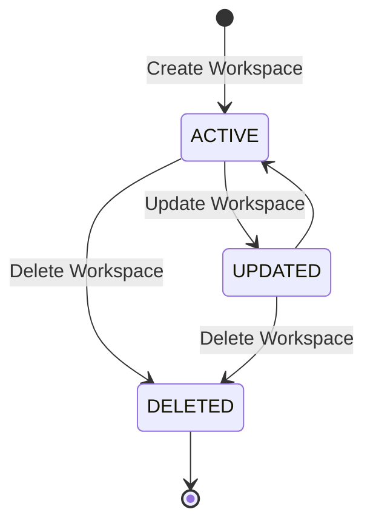

# Workspace Lifecycle Design

## Overview

The Workspace lifecycle defines the state transitions of a workspace throughout its lifetime.

A workspace is created by an authenticated user and remains ACTIVE until it is deleted. During its lifetime, the workspace manages members, URLs, tags, API keys, and other resources.

Deleting a workspace removes all associated resources through cascading deletion.

---

# Lifecycle State Diagram



---

# Workspace States

## ACTIVE

The workspace is available for normal use.

Characteristics

- Members can access the workspace.
- URLs can be created and managed.
- Tags can be managed.
- API Keys can be created.
- Analytics are available.
- Workspace settings can be updated.

---

## UPDATED

The workspace information has been modified.

Typical changes

- Workspace name
- Workspace logo
- Workspace slug

After the update completes successfully, the workspace returns to the ACTIVE state.

---

## DELETED

The workspace has been permanently removed.

Characteristics

- Members lose access immediately.
- All URLs become unavailable.
- All API Keys are revoked.
- Tags are removed.
- Workspace members are removed.
- Analytics are no longer accessible.

Deletion is performed through database cascading relationships.

---

# Lifecycle Events

## Create Workspace

```
Request

↓

Validate

↓

Check Slug

↓

Create Workspace

↓

Create OWNER Member

↓

ACTIVE
```

Conditions

- User is authenticated.
- Workspace name is valid.
- Workspace slug is unique.

---

## Update Workspace

```
ACTIVE

↓

UPDATED

↓

ACTIVE
```

Trigger

Workspace owner updates workspace information.

Editable fields

- Name
- Slug
- Logo

Conditions

- User is the workspace owner.
- Slug remains unique.

---

## Delete Workspace

```
ACTIVE

↓

DELETED
```

Trigger

Workspace owner deletes the workspace.

Effects

- Remove Workspace
- Remove Workspace Members
- Remove URLs
- Remove Tags
- Remove API Keys

All related resources are deleted through cascading relations.

---

# Member Lifecycle

When a workspace is created

```
Workspace

↓

Create OWNER Member
```

Initial role

```
OWNER
```

Additional members may join later through the Workspace Member module.

---

# Resource Lifecycle

A workspace owns multiple business resources.

```
Workspace

├── Members

├── URLs

├── Tags

├── API Keys

└── Analytics
```

Resources cannot exist without their parent workspace.

Deleting the workspace automatically removes all owned resources.

---

# Access Behavior

| State | Accessible |
|---------|------------|
| ACTIVE | ✅ |
| UPDATED | ✅ |
| DELETED | ❌ |

Only authenticated users who belong to the workspace may access its resources.

---

# Update Behavior

| State | Editable |
|---------|----------|
| ACTIVE | ✅ |
| UPDATED | ✅ |
| DELETED | ❌ |

Editable fields include

- Workspace Name
- Workspace Slug
- Workspace Logo

---

# Delete Strategy

Workspace deletion is permanent.

The system relies on database cascade deletion.

Affected resources

```
Workspace

↓

Workspace Members

↓

URLs

↓

Tags

↓

API Keys
```

Historical analytics are removed together with their related URLs.

---

# Lifecycle Summary

| State | Accessible | Editable | Create Resources |
|---------|------------|----------|------------------|
| ACTIVE | ✅ | ✅ | ✅ |
| UPDATED | ✅ | ✅ | ✅ |
| DELETED | ❌ | ❌ | ❌ |

---

# Future Enhancements

Possible future lifecycle extensions include

- Workspace archive
- Workspace restore
- Transfer workspace ownership
- Suspend workspace
- Scheduled deletion
- Soft delete
- Workspace export
- Organization migration