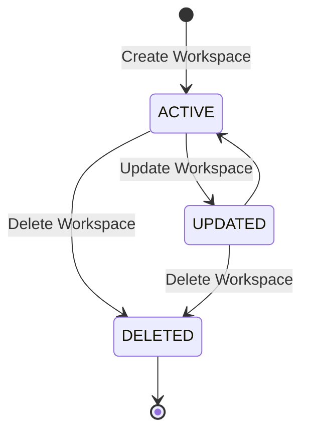

# Workspace Lifecycle Design

## Overview

The Workspace lifecycle defines the state transitions of a workspace throughout its lifetime.

A workspace is created by an authenticated user and becomes the root container for all business resources in LinkFlow. During its lifetime, the workspace manages members, invitations, URLs, tags, API keys, analytics, and future modules.

Deleting a workspace permanently removes all associated resources through cascading deletion.

---

# Lifecycle State Diagram



---

# Workspace States

## ACTIVE

The workspace is fully operational.

Characteristics

- Members can access the workspace.
- Pending invitations can be accepted.
- New members can be invited.
- URLs can be created and managed.
- Tags can be managed.
- API Keys can be created.
- Analytics are available.
- Workspace settings can be updated.

---

## UPDATED

Workspace information has been modified.

Typical changes

- Workspace name
- Workspace slug
- Workspace logo

After the update completes successfully, the workspace returns to the ACTIVE state.

---

## DELETED

The workspace has been permanently removed.

Characteristics

- All members lose access immediately.
- All pending invitations are deleted.
- URLs become unavailable.
- API Keys are revoked.
- Tags are deleted.
- Workspace members are deleted.
- Analytics are deleted together with their URLs.

Deletion is handled through database cascade rules.

---

# Lifecycle Events

## Create Workspace

```
Request

↓

Validate

↓

Check Slug

↓

Create Workspace

↓

Create OWNER Membership

↓

ACTIVE
```

Conditions

- User is authenticated.
- Workspace name is valid.
- Workspace slug is unique.

The creator automatically becomes the workspace owner and the first active member.

---

## Update Workspace

```
ACTIVE

↓

UPDATED

↓

ACTIVE
```

Trigger

Workspace owner updates workspace information.

Editable fields

- Name
- Slug
- Logo

Conditions

- User is the workspace owner.
- Slug remains globally unique.

---

## Invite Member

Inviting members does **not** change the workspace lifecycle.

Instead, it creates a new Workspace Invitation.

```
Workspace

↓

Create Invitation

↓

Send Email

↓

Pending Invitation
```

If the invited email already belongs to a registered user:

- An in-app notification is created.
- An invitation email is sent.

If the email has not registered yet:

- Only the invitation email is sent.

Workspace access is **not** granted until the invitation is accepted.

---

## Accept Invitation

Accepting an invitation does **not** change the workspace lifecycle.

```
Pending Invitation

↓

Validate Invitation

↓

Create Workspace Member

↓

Mark Invitation Accepted
```

Effects

- Member joins the workspace.
- Invitation becomes ACCEPTED.
- Workspace member is created.
- Access is granted immediately.

---

## Delete Workspace

```
ACTIVE

↓

DELETED
```

Trigger

Workspace owner deletes the workspace.

Effects

- Delete Workspace
- Delete Workspace Members
- Delete Workspace Invitations
- Delete URLs
- Delete Tags
- Delete API Keys
- Delete Analytics

All related resources are removed through cascading foreign key relationships.

---

# Member Lifecycle

Creating a workspace automatically creates the first membership.

```
Workspace

↓

OWNER Member
```

Additional members join only after accepting a valid invitation.

```
Invitation

↓

Accepted

↓

Workspace Member
```

---

# Invitation Lifecycle

Invitations are managed independently from the workspace lifecycle.

```
Create Invitation

↓

PENDING

↓

Accepted

↓

Workspace Member
```

Possible future states

```
PENDING

↓

DECLINED

↓

EXPIRED

↓

CANCELLED
```

---

# Resource Lifecycle

Every workspace owns its business resources.

```
Workspace

├── Members

├── Invitations

├── URLs

├── Tags

├── API Keys

└── Analytics
```

Resources cannot exist without their parent workspace.

Deleting the workspace automatically removes all owned resources.

---

# Access Behavior

| State | Accessible |
|---------|:----------:|
| ACTIVE | ✅ |
| UPDATED | ✅ |
| DELETED | ❌ |

Only active workspace members may access workspace resources.

Pending invitations do not grant access.

---

# Update Behavior

| State | Editable |
|---------|:--------:|
| ACTIVE | ✅ |
| UPDATED | ✅ |
| DELETED | ❌ |

Editable fields include

- Workspace Name
- Workspace Slug
- Workspace Logo

Only the workspace owner may update workspace settings.

---

# Delete Strategy

Workspace deletion is permanent.

The database automatically removes dependent resources.

```
Workspace

├── Members

├── Invitations

├── URLs

├── Tags

├── API Keys

└── Analytics
```

Benefits

- No orphan records
- Referential integrity
- Simplified cleanup
- Consistent tenant isolation

---

# Lifecycle Summary

| State | Accessible | Editable | Invite Members | Create Resources |
|---------|:----------:|:--------:|:--------------:|:----------------:|
| ACTIVE | ✅ | ✅ | ✅ | ✅ |
| UPDATED | ✅ | ✅ | ✅ | ✅ |
| DELETED | ❌ | ❌ | ❌ | ❌ |

---

# Future Enhancements

Possible future lifecycle extensions include

- Workspace Archive
- Workspace Restore
- Soft Delete
- Scheduled Deletion
- Transfer Ownership
- Organization Support
- Billing Suspension
- Workspace Export
- Organization Migration
- Invitation Expiration
- Invitation Reminder
- Invitation Cancellation