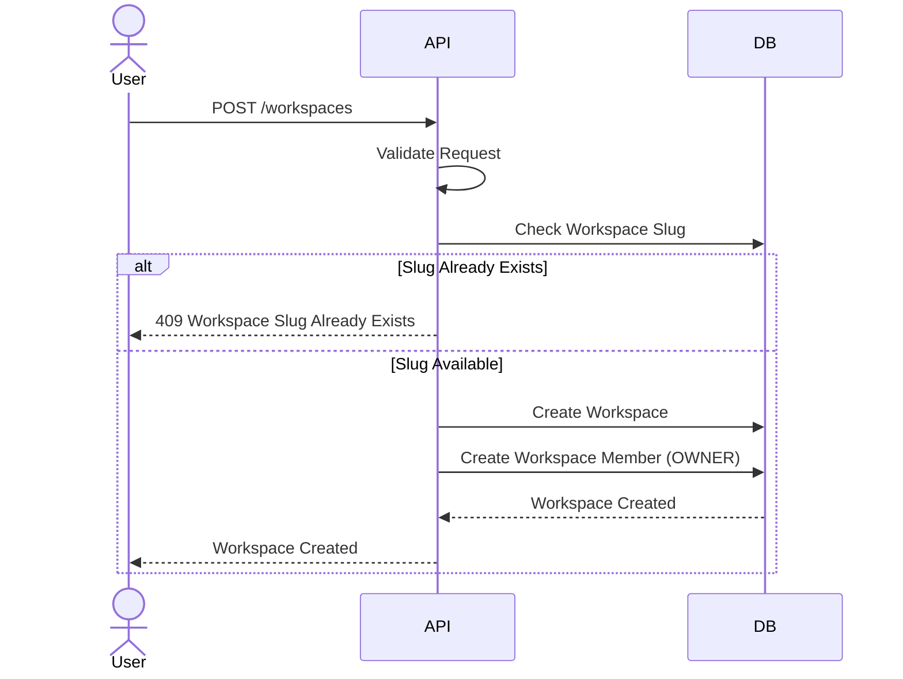
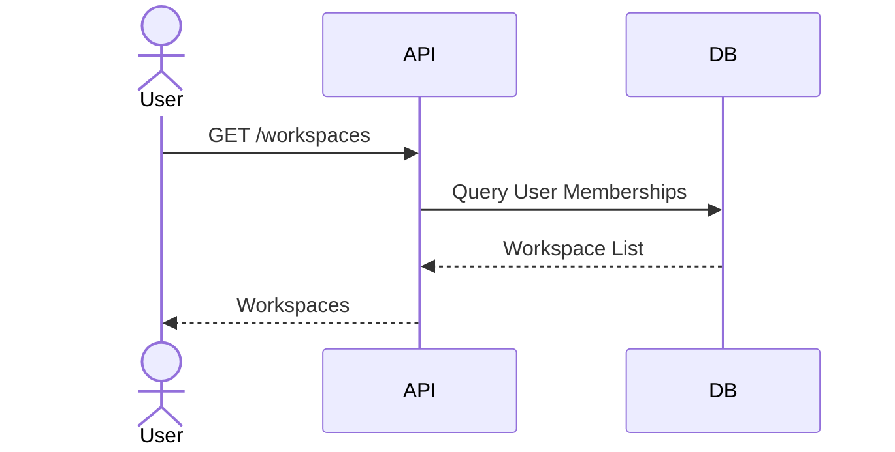
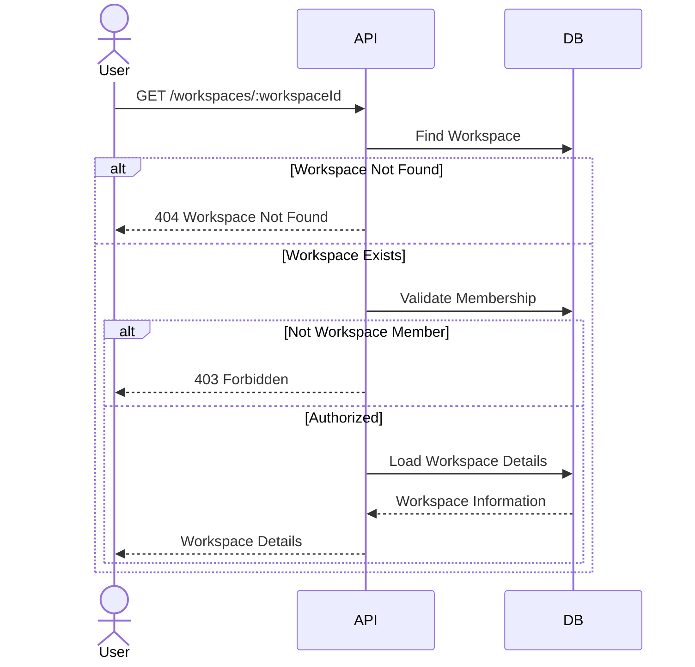
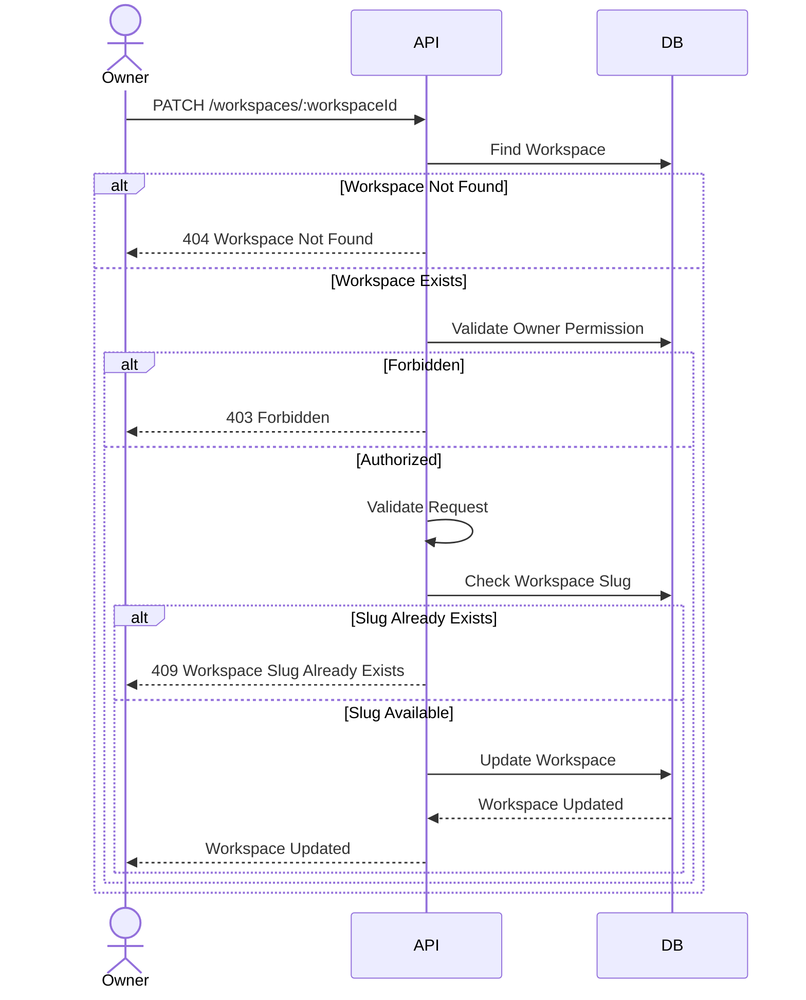
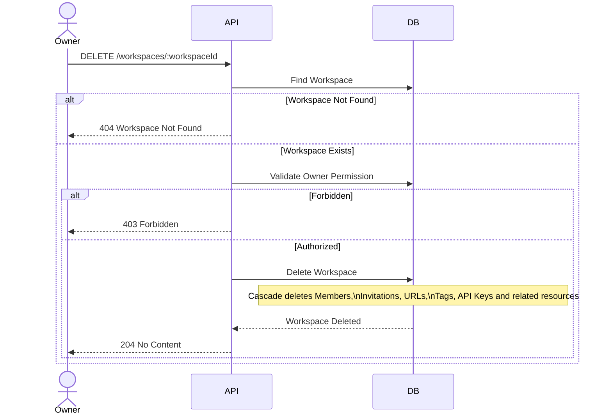
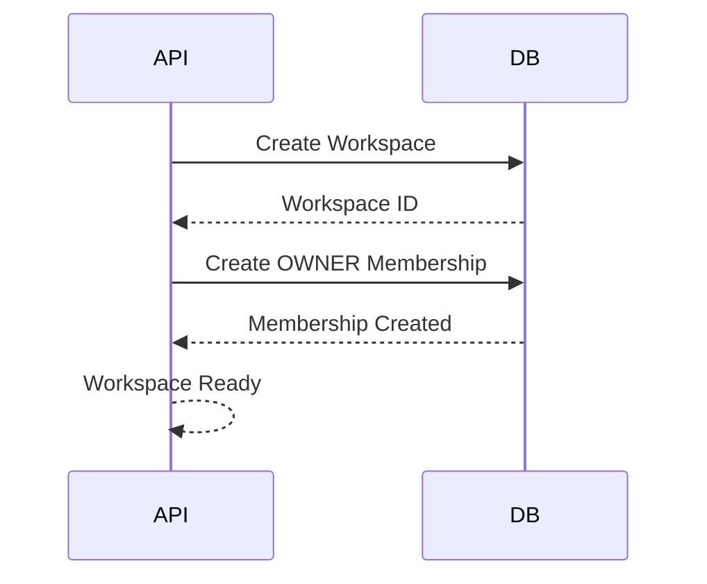
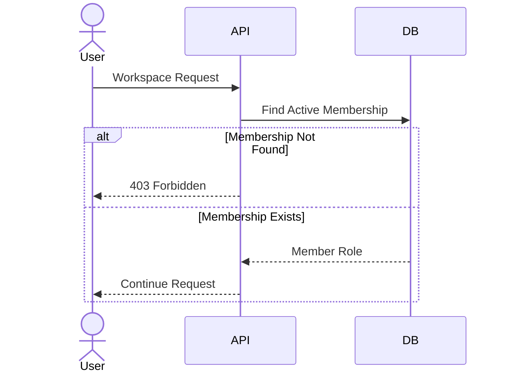
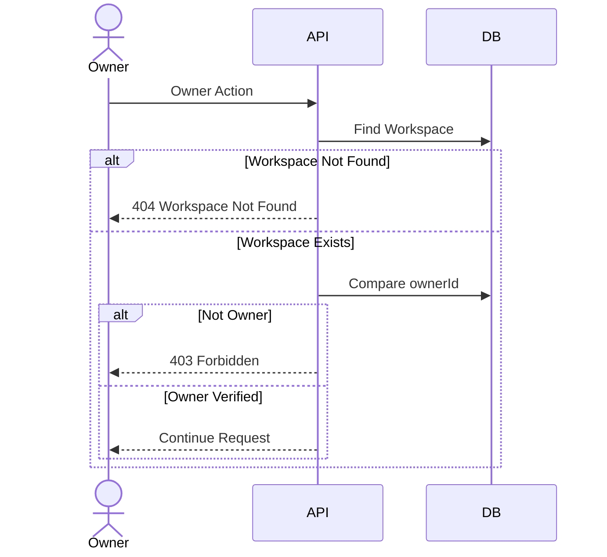

# Workspace Sequence Design

## Overview

This document describes the interaction flow between clients, backend services, email services, notification services, and the database for the Workspace module.

The sequence diagrams illustrate how workspace requests are processed throughout the workspace lifecycle.

---

# Create Workspace

## Description

Creates a new workspace for the authenticated user.

The creator automatically becomes the workspace owner and the first active workspace member.

### Sequence Diagram

---

# List My Workspaces

## Description

Returns all workspaces where the authenticated user is an active member.

### Sequence Diagram

---

# Get Workspace Details

## Description

Returns detailed information about a workspace.

Only active workspace members can access workspace details.

### Sequence Diagram

---

# Update Workspace

## Description

Updates workspace information.

Only the workspace owner can update workspace settings.

### Sequence Diagram

---

# Delete Workspace

## Description

Deletes a workspace and all associated resources.

Only the workspace owner can perform this operation.

### Sequence Diagram

---

# Workspace Initialization

## Description

Initializes a newly created workspace.

### Sequence Diagram

---

# Workspace Authorization

## Description

Validates whether the authenticated user can access workspace resources.

### Sequence Diagram

---

# Workspace Ownership Validation

## Description

Validates whether the authenticated user is the workspace owner before executing administrative operations.

### Sequence Diagram

---

# Sequence Summary

| Feature | Main Components |
|----------|-----------------|
| Create Workspace | API → Database |
| List My Workspaces | API → Database |
| Get Workspace Details | API → Database |
| Update Workspace | API → Database |
| Delete Workspace | API → Database |
| Workspace Initialization | API → Database |
| Workspace Authorization | API → Database |
| Workspace Ownership Validation | API → Database |