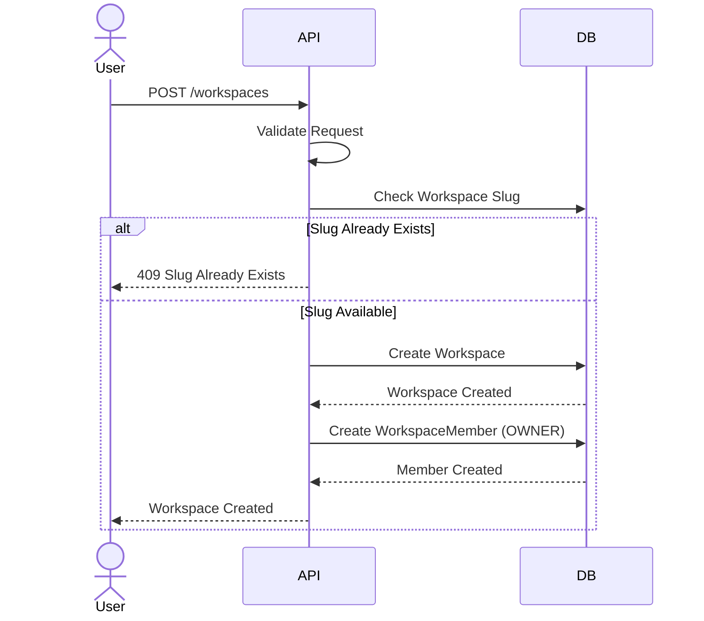
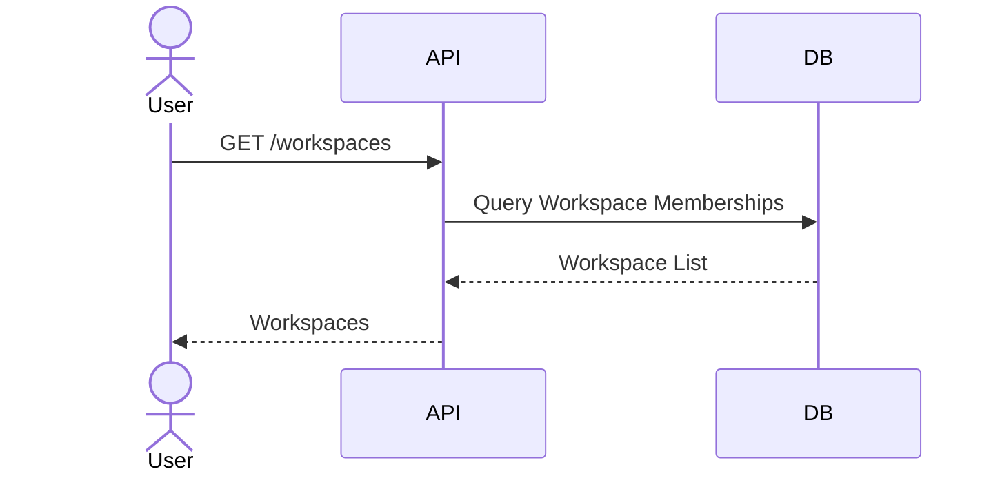
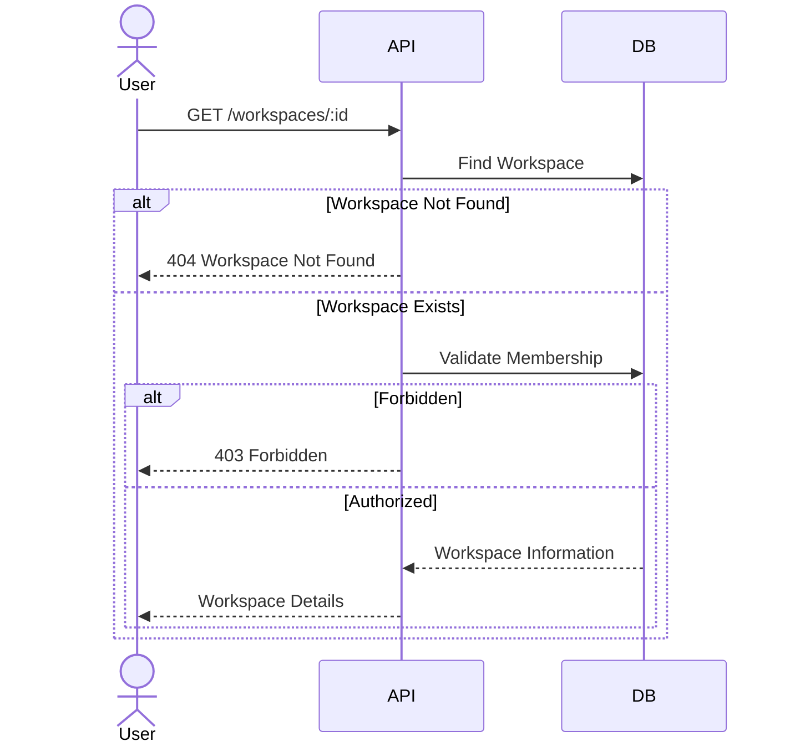
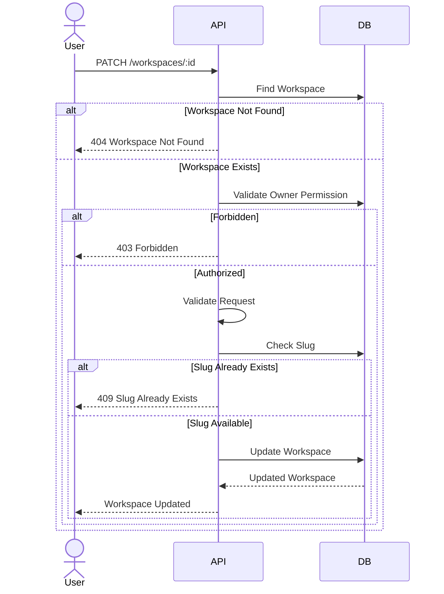
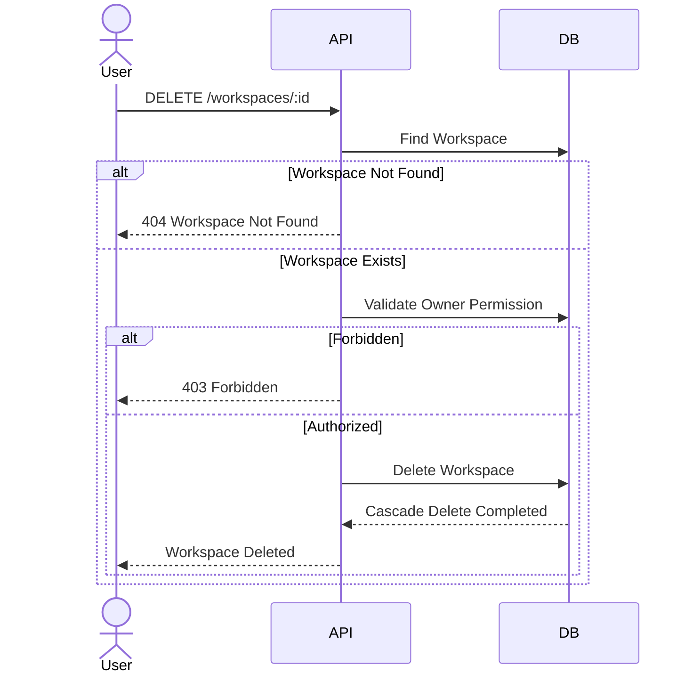
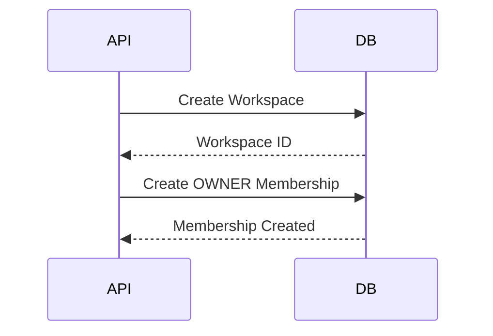
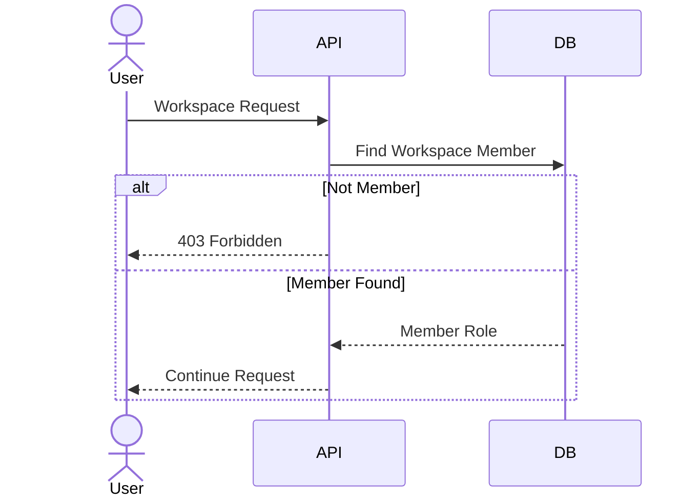

# Workspace Sequence Design

## Overview

This document describes the interaction flow between clients, backend services, and the database for the Workspace module.

The sequence diagrams illustrate how workspace requests are processed from start to finish.

---

# Create Workspace

## Description

Creates a new workspace for the authenticated user.

The creator automatically becomes the workspace owner and is added as the first workspace member.

### Sequence Diagram

---

# Get My Workspaces

## Description

Returns all workspaces that the authenticated user belongs to.

### Sequence Diagram

---

# Get Workspace Details

## Description

Returns detailed information about a workspace.

### Sequence Diagram

---

# Update Workspace

## Description

Updates workspace information.

### Sequence Diagram

---

# Delete Workspace

## Description

Deletes a workspace and all related resources.

### Sequence Diagram

---

# Workspace Initialization

## Description

Initializes a newly created workspace.

### Sequence Diagram

---

# Workspace Authorization

## Description

Validates whether the authenticated user can access a workspace.

### Sequence Diagram

---

# Sequence Summary

| Feature | Main Components |
|----------|-----------------|
| Create Workspace | API → Database |
| Get My Workspaces | API → Database |
| Get Workspace Details | API → Database |
| Update Workspace | API → Database |
| Delete Workspace | API → Database |
| Workspace Initialization | API → Database |
| Workspace Authorization | API → Database |